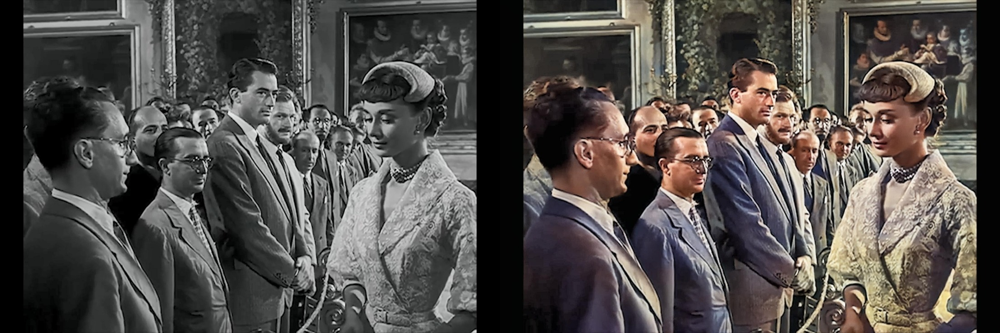

Recently I found a website which is described to be an advanced coloring tool for black&white photos.

I happened to have just finished watching the movie *Roman Holiday*, so I used an image cut from it to test the effect.

The result turns out to be amazing, although not perfect, but it's all on the right track!

website: https://colourise.sg/