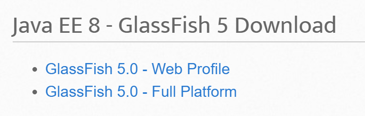
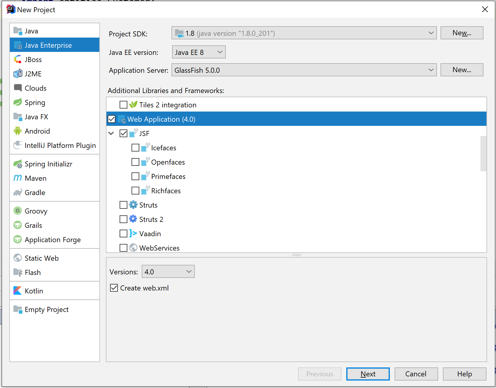
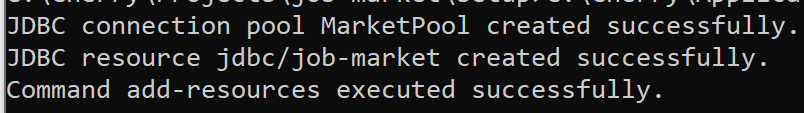
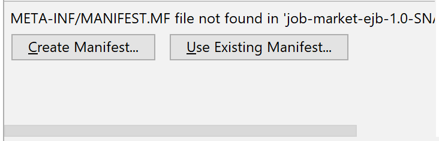
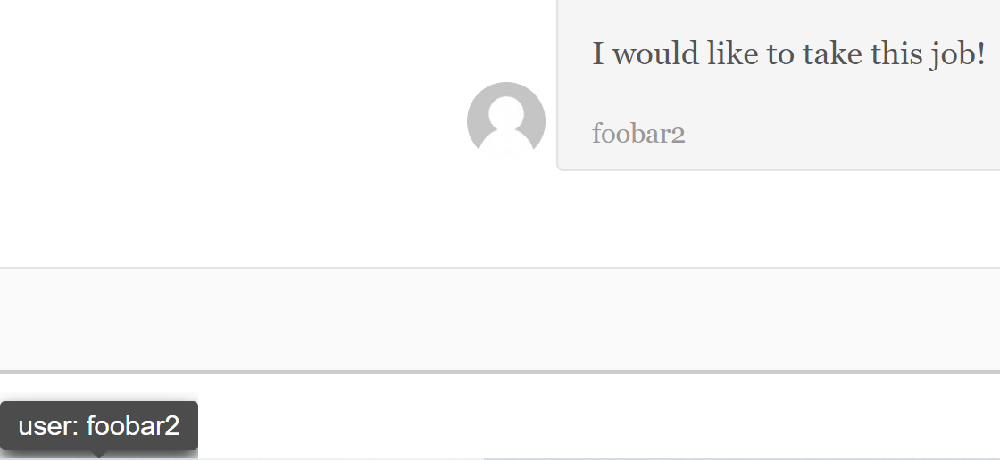
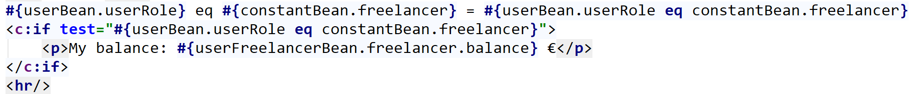
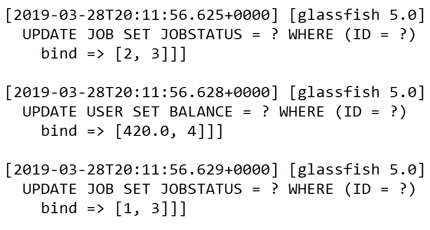
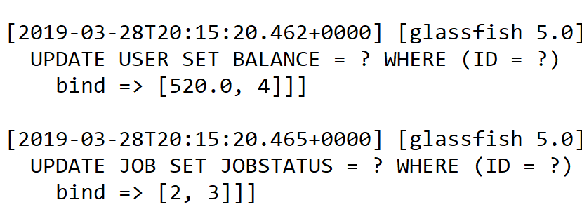
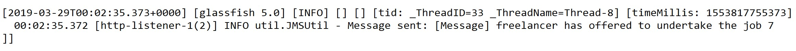
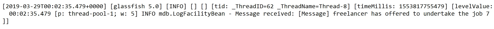

本文撰写前提为无任何EJB开发经验，在一周的时间要求下，快速开发完成了一个基于ejb栈的在线劳务市场，前端借用了一个博客模版。先在未使用maven管理项目的情况下进行了尝试，然后重新创建了新的maven项目以方便开发。文后有对相关概念的简单记录。此文参考价值不大，很散乱。单纯的一个记录。

## 安装Glassfish

博主安装时选用了最新的稳定版本 Glassfish 5.



有两个版本，选用Full Platform版本。

## 初步尝试
### 创建Java EE项目（无Maven）



选择 `Web Application`、`JSF`、`EJB: Enterprise Java Beans` 后新建项目。

### 尝试运行现有项目遇到的问题

#### 在Glassfish5上运行时，出现arget Unreachable, identifier 'bean' resolved to null错误

时间关系没有深入探究，在[Github Issues](https://github.com/javaserverfaces/mojarra/issues/4264)，[Github Issues](<https://github.com/eclipse-ee4j/glassfish/issues/22094>)中找到解决方法，须在Bean中标注FacesConfig。

```java
package configuration;

import static javax.faces.annotation.FacesConfig.Version.JSF_2_3;
import javax.faces.annotation.FacesConfig;

@FacesConfig(
	// Activates CDI build-in beans
	version = JSF_2_3 
)
public class ConfigurationBean {
}
```

#### Unable to retrieve EntityManagerFactory for unitName xxx

无persistence.xml文件或文件路径错误，最好使用IDEA的Add framework Support功能，自动生成META-INF下的persistence.xml文件。

#### View /example.xhtml could not be restored.

session过期。

#### JNDI lookup failed for the resource: Name: [], Lookup: [jdbc/ ], Type:

在 `localhost:4848 ` 中新建data source.

asadmin add-resources glassfish-resources.xml



还需要把数据库驱动文件放到此目录下：`glassfish5\glassfish\domains\domain1\lib\ext`

网上的已过时，现在的datasource Classname为: `com.mysql.cj.jdbc.MysqlDataSource`


## 创建 Maven 项目

### 添加依赖

添加 Javaee-api 依赖如下

```xml
<!-- https://mvnrepository.com/artifact/javax/javaee-api -->
<dependency>
    <groupId>javax</groupId>
    <artifactId>javaee-api</artifactId>
    <version>8.0</version>
    <scope>provided</scope>
</dependency>
```

### 创建两个Module

可分别命名为`xxx-ejb`、`xxx-war`，创建后在`Pom.xml`文件中分别输入`<packaging>ejb</packaging>`, `<packaging>war</packaging>`。完成后即可在idea的项目设置（`Ctrl+Alt+shift+S`）->Artifacts中看到4个artifact。并可看到提示如下，



创建Manifest即可。

之后可在Idea的Run Configurations中添加Glassfish Server，Deployment中注意添加ejb和war包。

### 遇到的问题

#### Error while binding JNDI name dao.UserDao#dao.UserDao for EJB UserDaoImpl,javax.naming.NameAlreadyBoundException: Use rebind to override

解决方法：关闭Glassfish的nonportable-jndi-names功能，命令如下
`asadmin set server.ejb-container.property.disable-nonportable-jndi-names="true"`

#### javax.el.PropertyNotFoundException: The class '\<name\>' does not have the property '\<name\>'. 

方法明明是有的，很大可能性是服务器没有更新。只能重启。

#### 使用set方法为backing bean设定值

用到的情景是让Role选择框具有不确定的默认值。

```jsp
<c:set target="#{userBean.user}" property="role" value="#{constantBean.userRoleList.get(0)}"/>
```

#### 地址栏地址和实际文件路径不同步

方法1：在`faces-config.xml`中进行配置。

方法2：Backing Bean 返回地址时加上`?faces-redirect=true`。

```xml
<navigation-rule>
	<from-view-id>/welcome.xhtml</from-view-id>
	<navigation-case>
		<from-outcome>logout</from-outcome>
		<to-view-id>login</to-view-id>
		<redirect/>
	</navigation-case>
</navigation-rule>
```

#### test 判断离奇失效

单个test无分支语句应该用

```jsp
 <c:if test="? eq ?">
     ...
 </c:if>
```

在我之前的用法中是如下的嵌套结构，无法正确运行。

```jsp
 <c:choose>
     <c:when test="#{userBean.currentUser != null}">
          <c:when test="">
          </c:when>
     </c:when>
     <c:otherwise>
     </c:otherwise>
 </c:choose>
```

我就纳闷为什么我用的c:when死也不触发test条件，不知道到底哪里错了。还以为哪里的问题导致Bean值无法或许到。坑了我大半天的时间！现在这代码放这一看一眼就发现指定是傻子写出来的。

#### @EJB注入不上一直报DAO空指针异常

千万不要在类构造函数中搞这种初始化操作，要如下所示：

```java
    @PostConstruct
    public void init() {
        ...
    }
```

#### 在JSF中导入并使用Enum

要用到Primefaces，

```xml
<dependency>
    <groupId>org.primefaces</groupId>
    <artifactId>primefaces</artifactId>
    <version>6.2</version>
</dependency>
```

namespace：`xmlns:p="http://primefaces.org/ui"`

示例：

```jsp
<p:importEnum type="javax.faces.application.ProjectStage" var="JsfProjectStages" allSuffix="ALL_ENUM_VALUES" />  
 
Development: #{JsfProjectStages.Development}
 
<br/>  
 
ALL:   
<ui:repeat var="current" value="#{JsfProjectStages.ALL_ENUM_VALUES}">  
    <h:outputText value="#{current}" /> &#160;  
</ui:repeat>
```

注意这里出现了`Classnotfound`的死问题，怎么重启也不好使。所以博主转为另一种解决方案：

```java
    public Job.JobStatus jobStatus(String name) {
       return Job.JobStatus.valueOf(name);
    }
```

```jsf
test="#{jobBean.job.jobStatus ne constantBean.jobStatus('Open')}"
```

#### c:choose中有其他分支会造成错误

```jsp
<c:choose>
    <p:importEnum/>
    <c:when>
    </c:when>
    <c:when>
    </c:when>
    <c:otherwise>
    </c:otherwise>
</c:choose>
```

等着出错吧。

#### 获取Entity的Id一直为null

因为我拷贝了Entity后将拷贝后的Entity持久化，而返回时又返回了原先传递过来的Entity。故造成长时间没有找到原因，怎么查怎么改都是NullpointerException。

```java
    @Override
    public T save(T entity) {
        em.persist(entity);
        flush();
        return entity;
    }
```

正确打开方式。

#### action/test方法调用时出现的异常不会被抛出

明明没有按预期工作，比如方法里的Log都没有输出，但就是没有任何错误迹象。不知道如何让JSF把错误给特喵的稍微输出一下啊/(ㄒoㄒ)/。遇到过多次了。这次的原因是更新entity用了save方法，该用**update**。

*更新，这次的原因是当前用户放在了RequestScoped的Bean中，当action动作要获取当前用户的时候，当然是空值了！

*更新2，不是不抛出异常，而是遇到[11] [12]描述的问题，导致默认情况下没有任何提示的失效。

```xml
<context-param>
    <param-name>javax.faces.PROJECT_STAGE</param-name>
    <param-value>Development</param-value>
</context-param>
```

配置为开发模式以显示错误。

#### JPA不保存Manytomany关系到数据库中

```java
@Entity
public class User {
    @ManyToMany(cascade = CascadeType.ALL, fetch = FetchType.EAGER)
    private List<User> lanaguages = new ArrayList<User>();
}

@Entity
public class Language {
    @ManyToMany(mappedBy = "languages")
    private List<User> users = new ArrayList<User>();
}
```

> Tip: Replace `CascadeType.ALL` with `CascadeType.MERGE`.

#### 保存大字符串

```java
@Lob 
@Column(name="CONTENT", length=512)
private String content;
```

#### Primeface Tooltip显示位置错误，未解决

```html
<h:graphicImage id="comment-item-#{loop.index}">
    <pf:tooltip for="comment-item-#{loop.index}" position="top">
        <h:outputText escape="false" value="user: #{comment.username}"/>
    </pf:tooltip>
</h:graphicImage>
```



primeface我就没用成功过到现在，你开心就好。。

#### Manytomany关系保存主实体后，查询从实体并没有更新

查看数据库可以发现已经保存到数据库，但是从实体没有刷新。还是保存之前的数据。只有重启服务器后才会更新状态。

搜了半天没找到什么有用的解决方案，但是给了一些启发。解决方法即是更新到所有相关的entity。如下：

```java
  public String revoke(Job job) {
        UserFreelancer freelancer = getFreelancer();

        freelancer.getRequestedJobs().stream()
                .filter(v -> v.getId().equals(job.getId())).findFirst()
                .ifPresent(j -> freelancer.getRequestedJobs().remove(j));

        job.getRequestedFreelancers().stream()
                .filter(v -> v.getId().equals(freelancer.getId())).findFirst()
                .ifPresent(f -> job.getRequestedFreelancers().remove(f));

        jobDao.update(job);
        userDao.update(freelancer);
        return HTTPUtil.returnUrl("job?id=" + job.getId());
    }

    public String undertake(Job job) {
        UserFreelancer freelancer = getFreelancer();

        freelancer.getRequestedJobs().add(job);
        job.getRequestedFreelancers().add(freelancer);

        userDao.update(freelancer);
        return HTTPUtil.returnUrl("job?id=" + job.getId());
    }

```

#### 简单直接实现搜索框

```html
<div class="sidebar-module">
            <h4>Search</h4>
            <input class="form-control" placeholder="Press enter for searching..."
                   onkeypress="if (event.keyCode === 13) {location.href='jobs.xhtml?s='+this.value;}"/>
        </div>
```

效果：


#### Test失效错误




重启刷新都不管用。也没有任何错误提示。

到最后终于发现问题：if test中的bean取值和上面看似相同实则不同。只能这么解释了。但经过输出日志发现这页面渲染是只有一个Request的，如果说Request已经销毁，if test是新的RequestScope也完全说不通。未解之谜。

#### SPA 多对多关系保存趣事

当代码这样写时，结果如下：

```java
        jobDao.update(job);
        userDao.update(freelancer);
```



当代码这样写时，结果如下：

```java
        userDao.update(freelancer);
        jobDao.update(job);
```



#### 显示SQL语句以及相应参数

在`persistence.xml`文件中指定如下设置：

```xml
        <properties>
            <property name="javax.persistence.schema-generation.database.action" value="create"/>
            <property name="eclipselink.logging.level.sql" value="FINE" />
            <property name="eclipselink.logging.parameters" value="true" />
        </properties>
```

#### JMS收到了消息我好快乐。。





#### slf4j保存日志文件

```xml
        <dependency>
            <groupId>org.slf4j</groupId>
            <artifactId>slf4j-api</artifactId>
            <version>1.7.21</version>
        </dependency>
        <dependency>
            <groupId>ch.qos.logback</groupId>
            <artifactId>logback-core</artifactId>
            <version>1.1.7</version>
        </dependency>
        <dependency>
            <groupId>ch.qos.logback</groupId>
            <artifactId>logback-classic</artifactId>
            <version>1.1.7</version>
        </dependency>
```

日志文件保存在对应domain文件夹下的logs文件夹中。

## 概念梳理

EJB(Enterprise JavaBean)是J2EE(javaEE)的一部分，定义了一个用于开发基于组件的企业多重应用程序的标准。其特点包括网络服务支持和核心开发工具(SDK)。 在J2EE里，Enterprise Java Beans(EJB)称为Java 企业Bean，是Java的核心代码，分别是无状态会话Bean（Stateless Session Beans），有状态会话 Bean（Stateful Session Beans）、实体Bean（Entity Bean）和消息驱动Bean（MessageDriven Bean）。

1. 什么是"服务集群"？什么是"企业级开发"？ 

    既然说了EJB 是为了"服务集群"和"企业级开发"，那么，总得说说什么是所谓的"服务集群"和"企业级开发"吧！        这个问题其实挺关键的，因为J2EE 中并没有说明白，也没有具体的指标或者事例告诉广大程序员什么时候用EJB 什么时候不用。于是大家都产生一些联想，认为EJB"分布式运算"指得是"负载均衡"提高系统的运行效率。然而，估计很多人都搞错了，这个"服务群集"和"分布式运算"并没有根本解决运行负载的问题，尤其是针对数据库的应用系统。为什么？我们先把EJB打回原形给大家来慢慢分析。

2. 什么是EJB?

    1) EJB 概念的剖析

    我们先看一下，EJB 的官方解释：
    
    “商务软件的核心部分是它的业务逻辑。业务逻辑抽象了整个商务过程的流程，并使用计算机语言将他们实现。……J2EE 对于这个问题的处理方法是将业务逻辑从客户端软件中抽取出来，封装在一个组件中。这个组件运行在一个独立的服务器上，客户端软件通过网络调用组件提供的服务以实现业务逻辑，而客户端软件的功能单纯到只负责发送调用请求和显示处理结果。在J2EE 中，这个运行在一个独立的服务器上，并封装了业务逻辑的组件就是EJB（Enterprise JavaBean）组件。”
    这其中我们主要关注这么几点，我们来逐条剖析：
    
    剖析1："业务逻辑" ：我们注意到在EJB 的概念中主要提到的就是"业务逻辑"的封装，而这个业务逻辑到底是什么？说的那么悬乎，其实这个所谓的"业务逻辑"我们完全可以理解成执行特定任务的"类"。
    
    剖析2："将业务逻辑从客户端软件中抽取出来，封装在组件中……运行在一个服务器上"：既然我们知道了"业务逻辑"的概念就是执行特定任务的"类"，那么，什么叫"从客户端软件中抽取出来"？其实，这个就是把原来放到客户端的"类"，拿出来不放到客户端了，放到一个组件中，并将这个组件放到一个服务器上去运行。
    
    2)把EJB 这个概念变成大白话就是：“把你编写的软件中那些需要执行制定的任务的类，不放到客户端软件上了，而是给他打成包放到一个服务器上了”。其中有个词——"客户端软件"，"客户端软件"？难道EJB 的概念中说的是C/S 软件？是的，没错！EJB 就是将那些"类"放到一个服务器上，用C/S 形式的软件客户端对服务器上的"类"进行调用。EJB和JSP 有什么关系？EJB 和JSP 有关系，但是关系还真不怎么大，至多是在JSP 的服务器端调用远端服务上的EJB 类，仅此而已。

3. EJB 的最底层究竟是什么？

  1) EJB 的实现技术

  EJB 是运行在独立服务器上的组件，客户端是通过网络对EJB 对象进行调用的。在Java中，能够实现远程对象调用的技术是RMI，而EJB 技术基础正是RMI。通过RMI 技术，J2EE将EJB 组件创建为远程对象，客户端就可以通过网络调用EJB 对象了。

  2)RMI 是什么

  RMI 英文全称是"Remote Method Invocation"，它的中文名称是"远程方法调用"。它是一种机制，能够让在某个 Java 虚拟机上的对象调用另一个 Java 虚拟机中的对象上的方法。可以用此方法调用的任何对象必须实现该远程接口。

  J2EE 将EJB 组件创建为远程对象，EJB 虽然用了RMI 技术，但是却只需要定义远程接口而无需生成他们的实现类，这样就将RMI 技术中的一些细节问题屏蔽了。但不管怎么说，EJB 的基础仍然是RMI，所以，如果你想了解EJB 的原理，只要把RMI的原理搞清楚就行了。你也就弄清楚了什么时候用EJB 什么时候不需要用EJB 了。


### Persistence.xml 文件

persistence.xml文件要打包到EJB Jar文件的META-INF目录。

persistence.xml文件用于指定实体Bean使用的数据源及EntityManager对象的默认行为。

persistence-unit节点可以有一个或多个，每个persistence-unit节点定义了持久化内容名称、使用的数据源及持久化产品专有属性。name 属性定义持久化名称。jta-data-source 节点指定实体Bean使用的数据源JNDI 名称，如果应用发布在jboss下数据源名称必须带有java:/前缀，数据源名称大小写敏感。properties节点用作指定持久化产品的各项属性，各个应用服务器使用的持久化产品都不一样如Jboss使用 Hibernate，weblogic10使用Kodo，glassfish/sun application server/Oralce使用Toplink。

因为jboss 采用Hibernate，Hibernate 有一项属性hibernate.hbm2ddl.auto，该属性指定实体Bean发布时是否同步数据库结构，如果 hibernate.hbm2ddl.auto的值设为create-drop，在实体Bean发布及卸载时将自动创建及删除相应数据库表(注意：Jboss 服务器启动或关闭时也会引发实体Bean 的发布及卸载)。TopLink产品的toplink.ddl-generation属性也起到同样的作用。

小提示：如果你的表已经存在,并且想保留数据，发布实体bean 时可以把hibernate.hbm2ddl.auto 的值设为none或update,以后为了实体bean的改动能反应到数据表，建议使用update，这样实体Bean 添加一个属性时能同时在数据表增加相应字段。 

## 参考

1. https://www.jetbrains.com/help/idea/creating-and-running-your-first-java-ee-application.html
2. https://blog.csdn.net/qq_27816307/article/details/54670678
3. www.qingpingshan.com/rjbc/java/136555.html
4. https://github.com/YouthLin/JBlog
5. http://www.cnblogs.com/yangyquin/p/5328344.html
6. https://github.com/YouthLin/Library-with-JSF-EJB-JPA
7. what's a message-driven bean? - oracle https://docs.oracle.com/javaee/7/tutorial/ejb-intro003.htm
8. [EJB到底是什么，真的那么神秘吗？？- https://blog.csdn.net/jojo52013145/article/details/5783677](https://blog.csdn.net/jojo52013145/article/details/5783677)
9. [JSF 2 Redirect Navigation Example - https://javabeat.net/jsf-2-redirect-navigation/](https://javabeat.net/jsf-2-redirect-navigation/)
10. https://stackoverflow.com/questions/38742749/show-logging-parameter-for-insert-update-select-in-eclipselink-jpa
11. https://www.primefaces.org/showcase/ui/misc/importEnum.xhtml
12. [commandLink action not performed](https://stackoverflow.com/questions/14077155/commandlink-action-not-performed), [commandButton/commandLink/ajax action/listener method not invoked or input value not set/updated](https://stackoverflow.com/questions/2118656/commandbutton-commandlink-ajax-action-listener-method-not-invoked-or-input-value)
13. [JPA: how to persist many to many relation](https://stackoverflow.com/questions/39802264/jpa-how-to-persist-many-to-many-relation)
14. [How to choose the right bean scope?](https://stackoverflow.com/questions/7031885/how-to-choose-the-right-bean-scope)
15. [Complete Guide: Inheritance strategies with JPA and Hibernate](<https://thoughts-on-java.org/complete-guide-inheritance-strategies-jpa-hibernate/>)
16. [https://github.com/eugenp/tutorials](https://github.com/eugenp/tutorials/tree/master/spring-ejb/wildfly/wildfly-mdb)
17. [A Guide to Message Driven Beans in EJB](<https://www.baeldung.com/ejb-message-driven-beans>)
18. 还有很多参考地址疏忽遗漏，太感谢丰富的互联网资源拯救了一星期开发JOB-MARKET项目。


