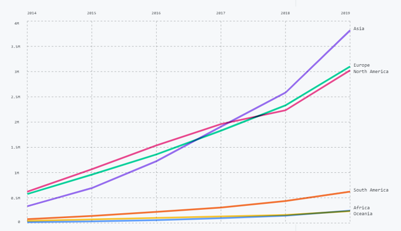

我不知道我们每个人是否天生带有使命，还是只是单纯的随风四处飘动。也可能两者皆有吧，使命和随风摇摆同时在每个人身上发生。 - 阿甘*《阿甘正传》Forrest Gump*

# 一些琐碎的零星片段

> 加上拖延症，终于在临近年关12.10发布了

**基因与技术** 几天前某基因产品突然弹出个提醒，心理特质报告增添了很多内容，不禁让人想要打开看看究竟。浏览的时候的确有些惊讶，各项指标先不管准确性到底有多少，当真的开始审视自己天生的特质时足以让人心中波澜起伏。这些刻在基因里的特征，就像阿甘所说的天命。祖源、运动能力、代谢能力、遗传疾病、心理特质以及外表特征等等，都通过基因解读的方法给你列出来的时候，怎么不让人感叹呢。每个项目下面还有人整理好的参考文献，相关知识，改进建议。大五人格基因检测和量表测试结果的对比雷达图更是有意思极了。现在人们还只能通过类似于统计对比的方法来解释基因的含义，但已经十分奏效了。基因解读在飞速发展，这是不可小觑的一个发展方向，没有人知道它会把人类带向哪里。基因设计婴儿已经就在不远处了。

今天看了一篇[报道](https://www.infoq.cn/article/bWhDOufOZrL7r3ZuBopy )，看着技术在井喷，技术在爆发，技术在日新月异，变得越来越合理，越来越美好，越来越理想，为人类的前程点燃了一盏希望的灯光，跟科学一样，从人类中走出来，脱掉了一些缺点，具有自己强壮的生命力。过去的一个世纪史无前例的全球联系也是技术和科学的黄金发展窗口，一切人类的创造物都抓紧了这个机会更新换代，朝夕之间就可以变好几回眉目，技术也不例外。唯独人类自身，还深陷在泥坑里，与自己的斗争还远没有结束，任重而道远。

**双十一** 没有提前投入时间，临时起意买了些东西，竟然占到了这些便宜：图书每满100减50，图书满100减20，白条满99减15，白条满99减5，全品类满100减12，京贴28.67，满200减40，满100减5。除此之外，今天买的东西无一加价，有一半是史低价格，它们都是平台自营或官方店铺。这个消费狂欢的名头，从前我很不喜欢，现在却有些许感触，不再那么厌恶，起码他们不是玩虚假的价格游戏，而是真的让利。这个盛大的游戏，除了平台狂轰滥炸一番，卖家真的做出了让利，买家真的赚到了便宜。

**飘** 有时脑壳里会突然存在几秒钟的停歇。偶然掏出一根烟的时候，躺在床上思绪好不容易安静下来，聆听自己呼吸的时候。那几秒钟感觉是那么真实，我认为那可能是正常人的心智模式。那种感觉好像是世界突然安静下来了，噪音消退，听到了不存在的秒针舒缓轻柔地滴答作响，我不愿承认的对友人的挂念在脑海中清晰的浮现出来，我记起来了我还活着。不等我感叹完此刻，又会回到从前。在无止尽的纷扰和混乱无章的思绪中，那个有感受的我再度昏沉过去，与清醒和心里的片刻安宁匆匆告别。

为什么要思考，因为想要得到答案，想要内心认同的真理。问题太多，多到分不清问题是什么，更找不到答案是什么。生命一个奇特的地方在于，时间真的会给许多问题以答案，当然不是时间本身，而是用时间淌过的经历。

**现在和过去** 生活在现代，着实享受着无可挑剔的生活便利，但一个最可恶的亟待消除的小恶魔也在这里：无尽的层出不迭的物质诱惑，相比之下相互沟通和联系反而变得随意和廉价。现代和过去在这两方面几乎颠倒了过来，彷佛也是不可避免的——由于对过去物质的极度贫乏的恐惧，现在正在历经过度反应，攀登物质极度丰富的巅峰。最终不知何时，社会几经跌宕才能整体上回归到一个理性的阶段。物质诱惑侵蚀人的身心健康，毒害社会环境。还害得地球上所有的生物和大自然跟着一起因不负责任的行为而遭殃——快醒醒，我们人类忘记了还有些责任要学会承担。

我靠在树上，目光模糊地望着不知道为何从此经过，但仍旧络绎不绝的人群，一阵风吹过来，树使劲的摇晃。它在说：你走开，靠着我我很累你知道吗。还是在说：好冷的天啊，请靠我再紧点可以吗。

从无耻之徒第二集学到了一个词，self-loathing，自我厌恶。自我厌恶导致自我毁灭。

人无可避免活在自己过去的阴影里。过去具有强大的惯性，过去无法在睡一觉之后就可以随意的忘记，过去使自己可以不费心的朝着习惯的方向去走。

抱歉，该款机型暂时不具备与人建立联系的功能。我们的工程师正在加紧努力工作，争取功能早日上线~后续可能会通过系统固件升级的方式免费开放给亲测试与使用，具体什么时候上线请留意后续官网的通知呢~💗💗

**生命** 一滩诞生生命前的湖水。要说起来，真是巧合，某天突然一颗满是冰块的彗星划破天空，撞出了一个坑，融化出了一湖水。随后在漫长的时光里，陆陆续续陨落的彗星带来了一些其他不曾有过的元素。像一棵树吸收着阳光和养料只待开花结果，彷佛已万事俱备，静待生命诞生。但这湖水就是一片死寂，十分安宁，奔向天空、翻过山岭的浪花也不存在。放大了多少倍后能看到原始细微的物质相互的撞击合并分裂，正是它们让湖水都变得焦躁温热。但表面还是一片死寂，像是没有希望存在的虚空。这方水坑在茫茫宇宙中微不足道，没有一条记录，从没有被观察，从没有孕育出任何新的因子对外界产生一丝新的变化。风吹带起一丝涟漪，日晒蒸发一些水分，终日与四周和湖底的岩石作伴，万年的时间淌过，未曾有过改变。

**何似在人间** 人间烟火多有意思，谁想远离呢。尤其在我的年纪，以我浅薄的阅历，总能看到新的人事物，倒不是说因为时代的关系科技发展日新月异，而是人本质或称之为人格的细微之处以及各种特质的组合，总会让我在下一个遇到的人身上惊奇的发现有些东西前所未见。每个人身上都有好多故事，多到有些他们自己都不知道。内敛的人，张扬的人，面对生活缓慢迟钝的人，处世老练迅速果断的人，应有尽有。有些人，游刃有余，尽情享乐之余还能望望天，斟酌下未来，有些人，目无远见，也是纵情享乐，却不知道为什么得不到心底的满足，总是除不尽痛苦。

