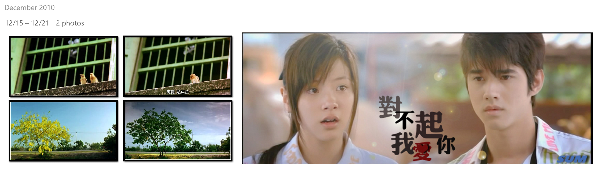

忙碌无绪的生活中不时会涌现许多的想法，但不勤于动笔的我，转身就忘掉了。其中一些我是觉得十分有价值写下来再回看的，丢掉了很可惜。又到年关。

# 美好是一个遥远的向往

疏忽间，一生中第三次抓住了一个十年的尾巴，99、09、19，跨越了两个世纪。纽约时报的一篇十年总结提醒了我这件事我才恍然醒悟，生活到底有多忙碌，自己连这都能遗忘，也许是时事沧桑，并不是那么愉快，促使人本能的去躲避和麻木自己。不同于以往，一个人曾经只有眼前的信息量，远方的书信罕见而珍贵。如今每个人淹没在全世界的信息里，当回事让自己疲惫，不当回事让自己厌倦，总归是让人烦恼。

当把时间按照十年一节来看的时候，世间变化和个人成长都变得清晰可见，和日常生活的感受判若不同时空。日常生活有日常生活的重要性，宏大时空有宏大时空的趣味。反过来，体验日常生活也饶有趣味，洞察历史进程对于个人也十分重要。唯叹少年不读书，任由活跃的思维在杂草堆里胡乱生长也长成了杂草。生在这二十年中，活在这二十年中，所见所感只囊括了这么短暂的时间，那么的不经意，那么的沉溺其间，在找不到答案的空间里寻找着答案，被庞大无形的力量、文化、进程所裹挟，自己是无力的。

活在不同的时代，出生时便背上了当时的命运。小人物能够做选择的空间不大，大人物也不过尔尔。不管在什么大小人物身上，一个人大部分的意识组成都是成长过程中所听所见的延续，唯有独立和叛逆的精神，学来也好，天性也罢，值得称道，改变这个世界的面貌。如若不然，新的生命没有带来什么新的精彩，只是对死去的个体的简单重复、代替和补充，毫无新意。

人类的现代文明最令人值得骄傲之处正在于此，现代社会的模型诞生在科学的基础之上，讲究理性和平等。人与人之间可以用理性来交换知识和想法，新的观点和思维便被自然的尊重，广泛认可的观点便被广泛的接受。这是顺应经物质和精神文明发展自然而然的发展趋势，每个人应享受平等的自由意志、机会和地位，法律则是每个人的权利的保障。民主让群体意志得到表达，个人意志得到尊重和体现。人们和社会得以一起进步成长。过去的那一套我们现在有个名词来称呼它：野蛮。

现代文明的内涵包括对个体、对所有人、对所有世间存在、对所有世间存在的思想的存在的尊重。自由与包容，是人类一直以来的梦想，但与过去不同的是：自由不再是少数人的自由，包容不再是对少数人的包容。一切权利平等共享。只是称之为现代使得人容易误会成：我所在所生活的地方与时代不就是现代么，那我就生存在现代文明社会中。很不幸，人类的现代化进程，还有遥远的路要走。西方踏着创造科学的早班车先行一步，其他地区还有一段绕不开的漫漫长路。

全球化的出现初期让人看到无限美好和希望，可以发现不需要去教人乐观的，乐观是人类的本能。可如今的全球化显然不容乐观，商品经济得到了巨大的发展，给发展中国家带来了好处，给发达国家创造了更多的利润；而更重要的文化和知识交流面临着语言隔阂的严峻挑战，人为还在不断建立的墙壁更是令人震惊。很可惜，我们正处在全球化刚迈出了两步，分裂和纷争又回家探亲的阶段。就在今天，俄罗斯成功测试了切开与国际互联网的链接并维持国内网络的正常运转。在今年，抗议活动在全球落地生花。未来会走向哪里？我们是否即将成为新阶段历史的见证人？

不知道地球或是更沉默而广阔的星际还肯不肯给人类从摇篮走出去的时间。人类的命运并不能简单的保持乐观，就算是能熬过去，也是无数人的付出，血和泪。有理由相信这个茫茫宇宙间有许多文明葬送在这条路上，不管是哪个文明的进化，总要经历物质贫乏，思想浅薄，社会构造简单，少数人统治筹划掌握特权的阶段，而当物质丰富，而精神匮乏，个人开始思考和表达，观点爆发，知识共享的时候，便自动被无形的力量推动迈入下一个平等共享的社会阶段。这时到底要付出多少代价，就非常不可估量了。

# 十年总结

2010年我在哪里？容我想一下，2008年小学毕业，那么哦对，初中二年级。12月23号的话，最近的只有这么两张照片，大概都是来自《初恋这件小事》。从那年的照片里还发现了电影小情人的电影封面，大概那年还看过这部电影吧。很遗憾，留下的东西太少。纵然我有归类整理加以收藏的习惯，也耐不住世事变迁。我曾记得的丢数据的事件有，电脑出故障十分无奈的格式化、不小心格式化、QQ升级搞坏了记录文件、文件太多硬盘太小无奈删掉。所以最终几乎没有留下什么。

我可曾有什么十年计划的话，那么今日也是到了验收的时候了。可惜没有。我的家，我的思维，我的生活发生了翻天覆地的变化，而我的慌张，我的无奈，我的脱俗出世生活态度依旧在。十年前我没有精力和气魄去计划十年，十年后的我也依旧没有。十年前的朋友，还剩下两个——等下，当年好像也就只有这么两个，那我倒没有丢下朋友。

这个十年里，高中和大学被夹在中间，我目前还没有太多话想对它们两个说。简单一句话：高中巩固了我灵魂深处的挣扎和痛苦，它如黑夜般漫长，度过后又从记忆中湮灭；而大学的四年转瞬即逝，大学终于开始把单调乏味的人生白纸抹上了颜色。我喜欢的是大学里的人和发生的事，大学学校本身并不让人喜欢。对于学校本身，让我唯一印象深刻的惊喜是录取通知书里附带的文艺范的小手册，唯二的惊喜是一个活出自我十分潇洒的陌生女生，飞舞张扬颓废积极的性格四年中我没在任何其他同校女生身上看到过，既然也互不认识，就自然划到学校的印象了。

再转眼间，便到了现在，这十年的尾巴。这一年是匆忙的，闲暇比起大学四年的肆意挥霍少了太多。有时会觉得很被迫，无法随心所欲的倒下休息，很痛苦，可闲下来的时候，也没有多快乐。我承认我的性格古怪，我现在极不喜欢往人群里凑。有几分呆子，我绝学不会油嘴滑舌的世故，但逐渐发现不至于为此瞧不起自己。我发觉如今我对于精力集中、感受当下有着已经养成的生理性的厌恶。当我试图专心去读一本书或读谱练琴，我会呵欠连天、大脑瘫痪。这是我童年之不幸，却也给了我跳出眼前现实的出世思维，以飘渺于人群以外的旁观态度冷静的观察世间。

纵使我没有什么天大的幸运，也经历过糟糕，可这世间对我不薄。人类不断的取得成就、保持着对抗的精神和为之付出的行动，一切所作所为都使我相信还有希望。这给了我动力与自己对抗，另一方面也想做自己的朋友。我以不再自视或费力气扮演一个观念中的正常人类，我正在尝试接受我自己，接受世间万物的存在，审视自己的能力和使命。

从今年4月记录以来，看完了59部电影；看完了18部剧作，另有3部在更新；读完了13本书；总共关注了67个优质的YouTube频道。

再接再厉。

终稿2020.1.1 14:29