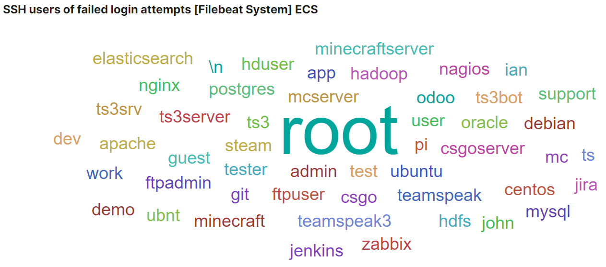

这是一个对于简单尝试、探索k8s概念的记录。从准备轻量级 kubernetes - k3s 的节点环境开始，到最后启动入口控制器、监控、日志收集等几个集群基础服务。

## 为什么想要尝试？

在开始之前，我知道这不会容易。我去年夏天在写一篇关于微服务的论文时，我知道了有一个叫Kubernetes的东西，它还有一个响亮的名字叫做*微服务的操作系统*。但经过一些基础的知识查阅，发现它是一个庞大的话题，需要学习的概念太多（[官方文档](https://kubernetes.io/docs/)非常的可怕），所以当时就放弃了尝试。

现在，机会又来了。先要说明的是，在两个月前偶然的机会，我注册了 Oracle Cloud 并且收获了两个免费的服务器，这使我再次相信了爱情（笑），更多的信息可以在 [Oracle Cloud Free Tier](https://www.oracle.com/cloud/free/) 了解。从那时起，我就一直想着可以如何利用它，发挥它的价值。一开始我用 Docker Compose 尝试了一些应用，我非常高兴——直到我有了一个想法，我应该尝试 Kubernetes 。很可惜，Oracle 免费计划的计算资源太有限了，无法支持一个真正可用的集群（我是在多次杀死死掉的实例后才知道的）。幸运的是，我找到了 Civo，它提供了限时的免费计划！更多信息可以在 [Kube 100 计划](https://www.civo.com/kube100)上找到。我尝试了他们提供的自建和托管集群。事实上，最好使用托管的集群，这个选择可以节省很多时间。虽然如此，本文将集中介绍自建集群的搭建过程（ nerd 特征，有简单的不用）。我使用的是 Ubuntu ，所以下面提到的命令都是针对 Ubuntu 的环境，其他系统可能会有出入。

经过一番搜索，我决定在两个现成的集群中选择一个，k3s和microk8s。使用它们的原因有两个。第一，它们将承担集群的基础设施建立和维护，这并不是一个简单的部分；另一个是它们消耗的资源较少（他们是这么说的，我自己没有做比较）。经过几次的尝试，最后我选择使用k3s。原因有几个，重要的一个原因是，k3s相比microk8s更容易调试，因为日志都收集在一个地方，用一个命令 `service k3s-agent status` 就可以轻松检查节点的健康状况，比较省事。

## 条件和环境

首先，如上所述，我一共有2个oracle实例、1个civo实例和另一个服务商的实例。所以在我的情况下，我运行的是4个节点，它们位于3个不同的地理位置。我给它们的命名和相应的规格如下：

- `master`, 2核, 2G, Ubuntu 18.04
- `oracle-1`, `oracle-2`, 1核, 1G, Ubuntu 18.04
- `civo-1`, 2核, 4G, Ubuntu 18.04

为了便于管理，我按照上面列出的名称调整了他们的主机名和域名。

但是，这个多云结构原来竟然是一个需要先解决的大问题，我经过了长时间的探索和尝试才终于找到了更满意的解决方案。所以我觉得很值得分享我的经验。作为穷人只能好好利用手头的的资源 😣😕😛。好了，从头开始吧。

### Ansible

首先设置ansible。拥有的机器越多，使用ansible可以节省的时间就越多。我利用节点 `master` 作为ansible服务端。

```shell
apt update && apt install software-properties-common
apt-add-repository --yes --update ppa:ansible/ansible
apt install --yes ansible
```

然后我们设置一下全局的ansible主机，如果你使用nano，那么只要输入 `nano /etc/ansible/hosts` ，然后输入类似下面这样的内容，让ansible从现在开始知道我们的主机。

```toml
[master]
localhost

[master:vars]
ansible_connection=local

[workers]
oracle-[1:2].your.host.name
civo-1.your.host.name
```

调整一些ansible全局配置:

```shell
sed -i '/\[defaults\]/a deprecation_warnings = Flase' /etc/ansible/ansible.cfg
sed -i '/\[defaults\]/a host_key_checking = False' /etc/ansible/ansible.cfg
```

测试配置后所有节点的连接性:

```shell
ansible all -m ping
```

#### 升级所有软件包

这可以是我们要使用的第一个ansible命令，它将把所有服务器上已经安装的包升级到最新版本。（根据自己的情况使用）

```shell
ansible all -m apt -a 'update_cache=yes name=* state=latest autoremove=yes'
```

#### 在所有节点上安装网络调试工具

当我们要调试网络问题时，这些工具是非常重要的，它们可能已经包含在你所使用的系统的发布版本中。需要用到的时候发现没有安装也可，放在这里作为记录。

```shell
ansible all -m apt -a 'name=iputils-ping,dnsutils,traceroute update_cache=yes state=latest'
```

### 交换空间（虚拟内存）

虽然kubernetes不鼓励使用交换空间，但我还是觉得使用swap空间未尝不可，尤其是对于我这种小内存的机器。通过将一些不重要的应用交换到交换空间，我们在RAM中能获得更多可用空间？（猜测）这让我们离完全占用内存也更远一些。但是，我们还是不希望我们的工作负载跑到交换空间里去的。为了避免节点依赖过多的交换空间，我们会在后面设置所有节点的内存使用限制和驱逐策略。

下面的命令是来自 [linuxize 上的一篇教程](https://linuxize.com/post/how-to-add-swap-space-on-ubuntu-18-04/)的简要记录，很有帮助的一篇文章。

```shell
fallocate -l 1G /swap
dd if=/dev/zero of=/swap bs=1024 count=1048576
chmod 600 /swap
mkswap /swap
swapon /swap
echo "/swap swap swap defaults 0 0" >> /etc/fstab 
```

<center><small>打开交换空间功能</small></center>

```shell
sed -i '/^\/swap swap swap defaults 0 0/d' /etc/fstab
swapoff -v /swap && rm -f /swap && reboot
```

<center><small>关闭交换空间功能</small></center>

### Helm

[Helm](https://helm.sh/)是kubernetes的一个包管理工具，它对安装发布的应用很有帮助。用于安装应用的 [Charts](https://helm.sh/docs/topics/charts/) 可以在[Helm hub](https://hub.helm.sh/)上找到。

```shell
snap install helm --classic
```

## K3s 集群部署

### 克隆/创建资源文件

为了初始化集群，需要用许多 YAML 源文件来安装应用（YAML在kubernetes中高度使用）。为了方便起见，我在GitHub上创建了一个仓库。你可以自由地克隆它或fork它，或者直接基于它制作自己的版本。

```shell
git clone https://github.com/orangejuice/cluster.git /app/
```

<center><small>克隆我的资源文件仓库</small></center>

### 建立集群网络

> 本章只针对多云部署，如果你没有这方面的顾虑，可以跳过。

在部署了节点后不久，我发现kubernetes并没有完美的互联网使用支持，有一些参数选项看起来非常诱人，它们在某些条件下是可以使用的。那么我首先需要解决网络连接的问题，否则就集群无法正常工作。让我们试一试，看看会发生什么。

#### 尝试的方案

为了解决子网间的通信问题，我探讨了几种不同的方案:

1. **直接使用互联网通信**  
   首先我想到的是通过互联网直接暴露节点。广播API服务器地址到公有IP这可以很容易的做到。工作节点也需要用他们的公有IP进行注册，这样所有的通信自然就可以通过互联网进行。但是这里出现了一个问题，kubelet不接受注册没有在机器网络接口中列出的IP。而我的所有运行实例都是虚拟化的，网络接口只拥有一个内部IP，所以无法注册公网IP。这个问题可以在 [kubernetes/kubernetes #58516](https://github.com/kubernetes/kubernetes/pull/58516) 查看。目前这个问题好像解决不了，或者不容易解决，我没有找到一个简单的方法把公有ip加到网络接口里，所以我就继续找其他办法了。  
   **结果**: 不起作用

2. **配置 flannel IP**  
   好吧，我们不能用公网IP注册节点，那就用内部IP注册吧。由于Flannel是我们的CNI实现，它管理pod的覆盖网络。所以只要我们让falnnel使用正确的IP，Pod之间就可以相互通信了。我们可以改变flannel使用的公网IP来实现这个需求。Flannel确实提供了这个功能，我们可以用`flannel.alpha.coreos.com/public-ip-overwrite=xx.xx.xx.xx`来注释节点，那么当pods向其他pods发送请求时，就可以转发到我们配置的正确的公有ip上。  
   **结果**: 这是一个折衷方案，它解决了pods之间的通信问题，但节点的IP仍然是错误的。发送到节点IP或节点主机名的请求将无法接受到。

3. **VPN**  
   通过使用VPN，我们在不同地理位置之间建立一个覆盖的私有网络，并在这个网络中拥有一个与网络接口绑定的IP，因此它可以用于让k3s节点注册自己。在这种情况下，一切都很好，除了——一个中央VPN服务器参与转发所有的集群通信流量。这听起来并不好，这是一个不好的策略，我们必须要避免。  
   **结果**: 这样就引入了一个中心节点进行通信转发，效率低。

4. **Kilo**  
   [Kilo](https://github.com/squat/kilo) 的介绍看起来很不错。只要能用，应该是一个很好的解决方法。我试了几次，但每次都一定有节点没有正确设置好wireguard。而且我从日志中也搞不清楚为什么，没有打印出明显的错误。很奇怪，但这启发了我一点——所以我没有花很长的时间在这上面——尝试自己构造网状网络。  
   **结果**: 看起来不错，但它不工作。而我可以用原生的更简单的方式部署一个mesh网络。

除了这些尝试之外，最近我知道有一些名为多云和多集群的话题，它们的目标是为包括我的案例在内的一些情况提供一个网络方案，但这个话题似乎并不那么受欢迎（直到我写下这行字，官方kubefed仓库只保留了不到1000个star，但也不算太差），而且有些在我的情况中走得太远了。我发现[这篇文章](https://learnk8s.io/bite-sized/connecting-multiple-kubernetes-clusters)是对这些题目的一个很好的概述，但我没有进一步去研究这些解决方案。我们需要的只是一个简单、稳定、无干扰的网络联通。

#### 创建网状网络

总的来说，在经历了失败的尝试后，我转而使用wireguard来实现这样一个虚拟网络。我已经把这个ansible playbook放到了资源仓库中。在使用它之前，请修改主机配置。

```shell
nano /app/mesh/hosts.ini
```

<center><small>修改主机列表</small></center>

```shell
cd /app/mesh/
ansible-playbook up.mesh.1.yml
```

<center><small>一条命令启动mesh网络</small></center>

### 部署master和worker节点

下面是我们要用来启动k3s的主节点和工节点的命令。这些参数很简单明了，说明了它们是用来做什么的。

```shell
ansible master -m raw -a "curl -sfL https://get.k3s.io | sh -s - server \
  --write-kubeconfig ~/.kube/config \
  --default-local-storage-path /app/storage/ \
  --no-deploy traefik \
  --kubelet-arg system-reserved=memory=200Mi \
  --kubelet-arg eviction-hard=memory.available\<200Mi"
```

```shell
SERVER=$(ansible master -a "dig +short myip.opendns.com @resolver1.opendns.com" | tail -n 1)
TOKEN=$(ansible master -a "cat /var/lib/rancher/k3s/server/token" | tail -n 1)

ansible workers -m raw -a "curl -sfL https://get.k3s.io | sh -s - agent \
  --server https://$SERVER:6443 \
  --token $TOKEN \
  --kubelet-arg system-reserved=memory=200Mi \
  --kubelet-arg eviction-hard=memory.available\<200Mi"
```

检查所有节点状态 `kubectl get nodes`.

```shell-session
root@master:~$ kubectl get nodes
NAME       STATUS   ROLES    AGE     VERSIONmaster     Ready    master   15m     v1.17.4+k3s1civo-1     Ready    <none>   9m6s    v1.17.4+k3s1oracle-1   Ready    <none>   14m     v1.17.4+k3s1oracle-2   Ready    <none>   9m43s   v1.17.4+k3s1
```

决定抹掉集群的时候，只需执行：

```shell
ansible workers -m raw -a "k3s-agent-uninstall.sh; \
  rm -rf /var/lib/{rancher,efk-*,filebeat,longhorn*,edgefs*}"

ansible master -m raw -a "k3s-uninstall.sh; \
  rm -rf /var/lib/{rancher,efk-*,filebeat,longhorn*,edgefs*}"
```

如果你想删除更多的路径，也可以添加到命令中。

使用这个命令(来自[Jerub](https://serverfault.com/a/200642))将所有的iptables规则恢复到默认。

```shell
ansible all -m raw -a "iptables-save | awk '/^[*]/ { print \$1 }
                      /^:[A-Z]+ [^-]/ { print \$1 \" ACCEPT\" ; }
                     /COMMIT/ { print \$0; }' | iptables-restore"
```

### 查看日志

```shell
journalctl -u k3s -o cat --follow
journalctl -u k3s --reverse -o cat
service k3s status

journalctl -u k3s-agent -o cat --follow
journalctl -u k3s-agent --reverse -o cat
service k3s-agent status
```

我们有时可能会想把所有的系统日志抹掉:

```shell
journalctl --rotate
journalctl --vacuum-time=1s
```

这些命令也可以与ansible相结合，以便远程操作。

## 安装集群基本应用程序

### Ingress controller

#### Nginx

这是最常用的Ingress控制器。它的功能非常强大，虽然[docs](https://kubernetes.github.io/ingress-nginx/user-guide/nginx-configuration/configmap/)真的不是那么友好。经过多次搜索和尝试我才发现了一种将指定的header作为真实客户端IP的方法，其实很容易做到。

```shell
helm repo add stable https://kubernetes-charts.storage.googleapis.com/
helm repo update
```

<center><small>添加 helm 仓库</small></center>

使用 helm chart 和自定义的资源文件安装 nginx：

```shell
kubectl create namespace nginx
helm install nginx-ingress stable/nginx-ingress -n nginx -f /app/nginx.yml
```

移除安装：

```shell
helm uninstall nginx-ingress -n nginx
kubectl delete namespace nginx
```

#### Traefik

我挺喜欢Traefik，中间件创造了很多可能性，比如简单实现BasicAuth。然而，根据我的几次尝试，2.2.0版本在k8s上似乎不能很好地应对Ingress资源类型，自有的IngressRoute类型是没问题的。

```shell
helm repo add traefik https://containous.github.io/traefik-helm-chart
helm repo update
```

<center><small>添加 helm 仓库</small></center>

虽然Traefik图里面没有集成ConfigMap，但我还是喜欢使用它，而不是提供一长串的运行参数或使用PV。官方chart也没有提供dashboard的basicAuth，而是直接限制为内部访问。所以要想让外部可访问dashboard，我们需要自己去解决这些问题。

```shell
# https://docs.traefik.io/middlewares/basicauth/#general
# Note: in a kubernetes secret the string (e.g. generated by htpasswd) must be base64-encoded first.
# To create an encoded user:password pair, the following command can be used:
# htpasswd -nb user password | openssl base64
nano /app/traefik/traefik-dashboard.yaml
```

<center><small>设置管理员用户名和密码</small></center>

```shell
# for setting image version 
# --set image.tag=2.1.9 \

kubectl create -f /app/traefik/traefik-config.yaml
helm install traefik traefik/traefik -n traefik\
  --set ingressRoute.dashboard.enabled=false \
  --set volumes[0].name=traefik-config,volumes[0].mountPath=/config,volumes[0].type=configMap \
  --set additionalArguments[0]=--configfile=/config/traefik.yaml \
  --set nodeSelector."kubernetes\.io/hostname"="oracle-2"
kubectl create -f /app/traefik/traefik-dashboard.yaml
```

<center><small>安装 Traefik</small></center>

卸载应用：

```shell
kubectl delete -f /app/traefik/traefik-dashboard.yaml
helm uninstall traefik -n traefik
kubectl delete -f /app/traefik/traefik-config.yaml
```

### Rancher

[Rancher](https://rancher.com/) 是一个非常好的可视化集群管理工具。

当我部署Rancher的时候，官网的安装指南没有告诉如何自己解决证书问题的方法（还有关闭高可用性）。这让我一开始的安装非常复杂，因为我不需要应用担心证书的问题，使用CloudFlare 代理集群流量自动获得https支持。就在前两天，我找到了[官方的仓库](https://github.com/rancher/rancher/tree/master/chart)，这才发现其实也是支持安装的时候不处理证书，关闭replicas。

```shell
helm repo add rancher-latest https://releases.rancher.com/server-charts/latest
helm repo update
```

<center><small>添加 helm 仓库</small></center>

```shell
kubectl create namespace cattle-system
helm install rancher rancher-latest/rancher \
  --namespace cattle-system \
  --set hostname=[Your-host-name] \
  --set replicas=1 \
  --set tls=external
```

<center><small>安装 Rancher</small></center>

卸载方面，官方文档可以在[这里](https://rancher.com/docs/rancher/v2.x/en/faq/removing-rancher/#what-if-i-don-t-want-rancher-anymore)查看。根据我的经验，即使是工具有时也无法将rancher删除干净，遇到这种情况我只能将集群抹掉，重新部署。

```shell
wget -O /app/system-tools https://github.com/rancher/system-tools/releases/download/v0.1.1-rc7/system-tools_linux-amd64
chmod +x /app/system-tools
/app/system-tools remove -c [kubeconfig-file-path]
```

<center><small>卸载</small></center>

### 持久化存储

如果你打算将集群中某些节点作为存储使用，为了使得节点的管理更容易，最好给用作存储的节点打上标签。

```shell
for node in 'oracle-1 oracle-2 civo-1'; \
do \
    kubectl label node $node persistence-storage=true; \
done
```

#### Longhorn

既然我们已经安装了Rancher，那么利用Rancher安装longhorn也不失为一个好的选择。这种方式longhorn仪表盘可以通过Rancher来认证和保证安全性。使用traefik时，我们也可以使用它的中间件功能为我们提供认证。

另一方面，Longhorn 还没有释出正式的 helm chart，所以我没有试过 helm chart 部署。你可以通过[官方指南](https://longhorn.io/docs/)了解详情。通过kubectl安装只需要一个命令，如果你愿意的话，可以查看并修改一些数值。

```shell
kubectl apply -f https://raw.githubusercontent.com/longhorn/longhorn/master/deploy/longhorn.yaml
```

卸载起来有点复杂。最新的[官方指南](https://longhorn.io/docs/install/uninstall-longhorn/)可以作为一个很好的参考。以下是0.8.0版本给出的代码。

```shell
kubectl create -f https://raw.githubusercontent.com/longhorn/longhorn/master/uninstall/uninstall.yaml
kubectl get job/longhorn-uninstall -w

kubectl delete -f https://raw.githubusercontent.com/longhorn/longhorn/master/deploy/longhorn.yaml
kubectl delete -f https://raw.githubusercontent.com/longhorn/longhorn/master/uninstall/uninstall.yaml
```

清理用户数据之前，确保不再需要卷的数据。

```shell
ansible all -a "rm -rf /var/lib/{rancher/longhorn,longhorn}"
```

#### Rook

Rook是作为一个分布式存储系统的管理员，它的目的是为用户自动完成所有的部署和维护工作。官方网站在[这里](https://rook.io/)。正如他们的文档所描述的那样，Ceph和EdgeFS是两个稳定的存储提供商。不过，我花了一些时间在部署这两种存储上，两者都不能为我所用🙁。

#### Ceph

为了使用主机磁盘，我们现在只能坚持使用1.2版本。从1.3版本开始，主机路径上的存储已被废弃，不允许再使用。 

首先，从官方示例中下载 ingress 文件，并将主机名修改为自己的。

```shell
wget -O /app/ingress/ceph.yaml \
  https://raw.githubusercontent.com/rook/rook/release-1.2/cluster/examples/kubernetes/ceph/dashboard-ingress-https.yaml
```

更改自己的主机名并通过运行`kubectl create -f /app/ingress/ceph.yaml`使其生效。

```shell
kubectl create -f https://raw.githubusercontent.com/rook/rook/release-1.2/cluster/examples/kubernetes/ceph/common.yaml
kubectl create -f https://raw.githubusercontent.com/rook/rook/release-1.2/cluster/examples/kubernetes/ceph/operator.yaml
```

<center><small>安装 Rook operator</small></center>

```shel
kubectl create -f \
  https://raw.githubusercontent.com/rook/rook/release-1.2/cluster/examples/kubernetes/ceph/cluster-test.yaml
kubectl create -f /app/ingress/ceph.yaml
```

<center><small>启动 Ceph 集群并应用 ingress</small></center>

```shell
kubectl create -f \
  https://raw.githubusercontent.com/rook/rook/release-1.2/cluster/examples/kubernetes/ceph/filesystem-test.yaml
kubectl create -f \
  https://raw.githubusercontent.com/rook/rook/release-1.2/cluster/examples/kubernetes/ceph/csi/cephfs/storageclass.yaml
```

在这些步骤之后，一个Ceph文件系统应该就搭建好了，并且能够提供存储供应服务。

**输出Ceph仪表盘密码**

```shell
kubectl -n rook-ceph get secret rook-ceph-dashboard-password -o jsonpath="{['data']['password']}" | base64 --decode && echo
```

卸载：

```shell
kubectl delete -f https://raw.githubusercontent.com/rook/rook/release-1.2/cluster/examples/kubernetes/ceph/csi/cephfs/storageclass.yaml
kubectl delete -f https://raw.githubusercontent.com/rook/rook/release-1.2/cluster/examples/kubernetes/ceph/filesystem-test.yaml
kubectl delete -f /app/civo/ceph-ingress.yaml
kubectl delete -f https://raw.githubusercontent.com/rook/rook/release-1.2/cluster/examples/kubernetes/ceph/cluster-test.yaml
kubectl delete -f https://raw.githubusercontent.com/rook/rook/release-1.2/cluster/examples/kubernetes/ceph/operator.yaml
kubectl delete -f https://raw.githubusercontent.com/rook/rook/release-1.2/cluster/examples/kubernetes/ceph/common.yaml
```

> 这里有两个我遇到的典型的错误，当我启动一个请求Ceph CSI存储空间的应用程序时。

```
MountVolume.MountDevice failed for volume "pvc-bcf02d41-2504-4620-b8c6-33d35bd29b98" : 
rpc error: code = Internal desc = fscID (1) not found in Ceph cluster    
```

```
MountVolume.MountDevice failed for volume "pvc-c9f4c562-398f-4253-ab7a-095991f27e19" : 
rpc error: code = Internal desc = an error occurred while running (796) mount 
[-t ceph 192.168.147.57:6789:/volumes/csi/csi-vol-3faca6e8-866e-11ea-82b8-a644e160ad8e 
/var/lib/kubelet/plugins/kubernetes.io/csi/pv/pvc-c9f4c562-398f-4253-ab7a-095991f27e19/globalmount 
-o name=csi-cephfs-node,secretfile=/tmp/csi/keys/keyfile-435551254,mds_namespace=myfs]: exit status 22:    
```

#### EdgeFS

从所有的云原生存储解决方案中，我认为EdgeFS最符合我的要求——一个支持主机本地卷的分布式文件系统（这对我这个初学者来说很重要，但正在被Rook/Ceph抛弃）。然而，我尝试了几次都无法让它工作。和Ceph一样，当一个应用程序请求存储时，OCI provisioner也不能工作，显示错误信息  `mount volume failed，exit status 32` 并且超时。我放弃了继续尝试，因为使用CLI调试和挖掘问题源头是一个时间黑洞，无论你想做什么，一开始都需要输入很长的命令。这让我感觉是在浪费时间。

总之你可以自己试一试，看看会发生什么。[Rook EdgeFS](https://rook.io/docs/rook/v1.3/edgefs-quickstart.html)。我就不再列举这些命令了。

### 数据库 - MariaDB

我使用的是mariadb数据库，是MySQL的替代品，我把它和其他工作负载应用一样，放在默认的命名空间里。

```shell
helm repo add bitnami https://charts.bitnami.com/bitnami
helm repo update
```

你可以看看我一直使用的配置，然后根据你的期望改变它们。

```shell
helm install mariadb bitnami/mariadb -f /app/mariadb.yml
```

卸载

```shell
helm uninstall mariadb
```

#### 访问数据库

要访问数据库的控制台，我们可以：

\- 直接跑一个新的pod，连接数据库会话

```shell
kubectl run mariadb-client --rm -it --image bitnami/mariadb \
  --overrides='{"apiVersion": "v1", "spec": {"nodeSelector": { "kubernetes.io/hostname": "master" }}}' -- \
  mysql -h mariadb.default.svc.cluster.local -u root -proot
```

\- 或运行一个新的pod，然后连接到我们的数据库服务。

```shell
kubectl run mariadb-client --rm -it --image bitnami/mariadb -- bash  
mysql -h mariadb.default.svc.cluster.local -u root -proot
```

可能有帮助的命令:

```shell
kubectl get svc -l app=mariadb -o jsonpath='{.items[0].spec.clusterIP}' | xargs echo
```

<center><small>访问数据库的内部ip</small></center>

```shell
kubectl get secret --namespace default mariadb \
  -o jsonpath="{.data.mariadb-root-password}" | base64 --decode && echo
```

<center><small>数据库 root 密码</small></center>

以及，创建用户和数据库的命令

```mysql
CREATE DATABASE nextcloud;
GRANT ALL PRIVILEGES ON nextcloud.* TO 'nextcloud'@'%' IDENTIFIED BY 'nextcloud';
```

### 监控 - Prometheus operator

我们使用[Prometheus operator](https://github.com/helm/charts/tree/master/stable/prometheus-operator)来帮助在Kubernetes上创建Prometheus集群。这让部署变得更加容易。

```shell
helm repo add stable https://kubernetes-charts.storage.googleapis.com/
helm repo update
```

只要把你的主机名和grafana密码放在下面的命令中就可以了（这个长长的命令参数列表看起来不是很好，其实用一个值文件会更好，保留这个是因为它可以在之后作为设置那些不同类型的值的语法参考）。列出的命令会启动一个监控栈，带有用于外部访问的主机名设置，每个服务都会用他们的名字作为url后缀。

```shell
kubectl create namespace monitoring
helm install prometheus stable/prometheus-operator -n monitoring \
  --set prometheus.ingress.enabled=true \
  --set prometheus.ingress.hosts[0]='[your.host.name]' \
  --set prometheus.ingress.paths[0]=/prometheus \
  --set prometheus.prometheusSpec.routePrefix=/prometheus \
  --set alertmanager.ingress.enabled=true \
  --set alertmanager.ingress.hosts[0]='[your.host.name]' \
  --set alertmanager.ingress.paths[0]=/alertmanager \
  --set alertmanager.alertmanagerSpec.routePrefix=/alertmanager \
  --set grafana.ingress.enabled=true \
  --set grafana.ingress.hosts[0]='[your.host.name]' \
  --set grafana.ingress.path=/grafana \
  --set grafana.'grafana\.ini'.server.root_url='[your-full-grafana-url]' \
  --set grafana.'grafana\.ini'.server.serve_from_sub_path=true \
  --set grafana.adminPassword='[your-password]' \
  --set grafana.plugins[0]=grafana-piechart-panel
```

卸载

```shell
helm uninstall prometheus -n monitoring
```

### 日志管理 - ECK Filebeat

我使用[ECK (Elastic Cloud on K8s)](https://www.elastic.co/guide/en/cloud-on-k8s/current/k8s-quickstart.html) 和Filebeat来收集、存储和可视化日志。作为一个个人集群，我想没有必要担心高可用性和日志聚合器的问题。我们还是简单点，节约资源吧。[官方](https://github.com/elastic/cloud-on-k8s/tree/master/config/samples)给出的几个例子，可以参考。

```shell
kubectl create -f https://download.elastic.co/downloads/eck/1.0.1/all-in-one.yaml

# modify the hostname of kibana to your own one before apply this file
kubectl create -f /app/eck.yaml
```

为了捕获系统日志，我们需要一个系统服务在节点上运行。我花了半天的时间，才知道为什么我的一个节点上没有采集到日志，原因只是因为系统中缺少日志服务包。

```shell
ansible all -m apt -a "name=rsyslog state=latest"
```

访问[官方网站](https://www.elastic.co/guide/en/beats/filebeat/current/running-on-kubernetes.html)可以找到最新的资源定义文件。我的安装脚本基于的版本是7.6，只启用了syslog、Nginx和MariaDB的日志收集。

```shell
kubectl create -f /app/filebeat.yaml
```

卸载

```shell
kubectl delete -f /app/filebeat.yaml
ansible all -m raw -a "rm -rf /var/lib/filebeat*"

kubectl delete -f /app/eck.yaml
kubectl delete -f https://download.elastic.co/downloads/eck/1.0.1/all-in-one.yaml
```

#### 输出 Kibana 密码

```shell
kubectl get secret quickstart-es-elastic-user -n elastic-system \
  -o=jsonpath='{.data.elastic}' | base64 --decode && echo
```

#### Elastic 栈学习参考

- 文档: [Filebeat docs](https://www.elastic.co/guide/en/beats/filebeat/current/filebeat-overview.html)
- 文档: [Filebeat input type - container input](https://www.elastic.co/guide/en/beats/filebeat/current/filebeat-input-container.html)
- 文档: [Filebeat - auto discover](https://www.elastic.co/guide/en/beats/filebeat/current/configuration-autodiscover.html)
- 文档: [Filebeat - monitoring kubernetes](https://github.com/elastic/examples/blob/master/MonitoringKubernetes/filebeat-kubernetes.yaml)
- 文档: [Filebeat - monitoring kubernetes with ECK](https://github.com/elastic/examples/blob/master/k8s-observability-with-eck/filebeat-kubernetes.yaml)
- [Elastic Chinese Blog: 菜鸟上手指南](https://blog.csdn.net/UbuntuTouch/article/details/102728604)
- [Elastic Chinese Blog: 运用Elastic Stack分析COVID-19数据并进行可视化分析](https://elasticstack.blog.csdn.net/article/details/105092484)

## 下一步

经过前面所有的步骤，我们终于实现了一个运行在多云上的小规模集群，Rancher作为可视化集群管理，Nginx或Traefik作为Ingress控制器，分布式/本地存储，监控能力和集中式日志收集。

正如我们所看到的，要实现所有这些东西并不是那么容易，有的简单，有的复杂。要想成功地安装我们的期望运行这些服务中的每一项，分别需要不同层次的知识。Kubernetes是一个非常巨大的玩具，图片非常好看，然而当你决定买一个，自己在家玩的时候就不是那么愉快了😛。当然，也不是每个人都需要这些功能。

在安装完上述所有服务后，已经消耗了我一半以上的计算资源--而这些只是甜点。我们可能要部署博客、GitLab、Jenkins、私有存储、开发的应用或者其他私有服务，这些才是集群用来提供服务的主菜。

值得一提的是，我在不久后学到了一件重要的事情--一台运行在云上的机器有比我大得多的魅力。




每时每刻都有来自五湖四海的问候，安全性问题不容小觑。