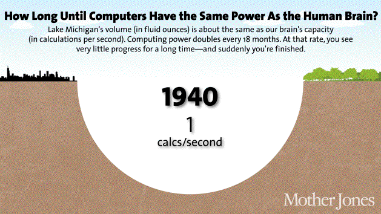

> 本文转载自 [Wait but why](https://waitbutwhy.com/2015/01/artificial-intelligence-revolution-1.html)，作者 Tim Urban 于2015年1月22日发表

*我们正处在一个变化的边缘，这个变化可与地球上人类生命的兴起相媲美。* — Vernor Vinge

站在这里感觉如何？

看起来像是站在一个非常刺激的地方——但你必须记住，站在时间图上是看不到右边的。所以实际上站在这里是这样的：

这里可能感觉很正常……

\_\_\_\_\_\_\_\_\_\_\_\_\_\_\_

## 遥远的未来——即将到来

想象一下乘坐时间机器回到 1750 年——当时世界处于永久停电状态，长距离通信意味着大声喊叫或在空中开火炮，所有的交通工具都靠干草运行。当你到达那里，你带回一个人，把他带到 2015 年，然后带着他四处走走，看看他的反应。我们无法理解他看到闪亮的胶囊在高速公路上飞驰、与当天早些时候还在大洋彼岸的人交谈、观看 1000 英里外的体育比赛、听到 50 年前的音乐表演、玩弄我可以捕捉真实图像或记录生活瞬间的神奇巫师矩形、生成带有显示他所在位置的超自然移动蓝点的地图、看着某人的脸并与他们聊天，即使他们在国家的另一边，以及其他无数不可思议的魔法。这一切都在你向他展示互联网或解释国际空间站、大型强子对撞机、核武器或广义相对论之前。

对他来说，这种体验不是令人惊讶、震惊，甚至不是令人叹为观止——这些词语都不够大。他可能真的会死掉。

但有趣的是——如果他回到 1750 年，因为我们看到了他的反应而感到嫉妒，决定他也想试试同样的事情，他会乘坐时间机器回到同样的距离，带回一个大约 1500 年的人，把他带到 1750 年，向他展示一切。1500 年的人会对很多事情感到震惊——但他不会死。这对他来说会是远远不那么疯狂的经历，因为虽然 1500 年和 1750 年有很大不同，但它们的差异远远小于 1750 年和 2015 年：1500 年的人会学习一些关于空间和物理学的令人震惊的知识，他会对欧洲对新帝国主义潮流的执着感到印象深刻，他需要对他的世界地图概念进行重大修订。但看着 1750 年的日常生活——交通、通信等——绝对不会让他死掉。

不，为了让 1750 年的人像我们一样享受，他需要回到更远的过去——也许要回到大约公元前 12000 年，第一次农业革命之前，那时的猎人聚居社会几乎没有城市和文明的概念。如果一个纯粹的猎人聚居世界的人——从一个人类与其他动物物种差不多的时代——看到了 1750 年庞大的人类帝国及其高耸的教堂、横跨海洋的船只、“内部”的概念以及庞大的集体、积累的人类知识和发现，他很可能会死掉。

然后如果他死后嫉妒并想做同样的事情。如果他回到 12000 年前到公元前 24000 年，带来一个人，并把他带到公元前 12000 年，他会向那个人展示一切，那个人会说，“好吧，你的重点是什么，谁在乎。”为了让公元前 12000 年的人同样享受，他需要回到超过 100000 年前，带来一个他可以第一次展示火和语言的人。

为了让某人被传送到未来并因他们所经历的震惊而死，他们需要向前走足够多的年头，以达到一个“死亡级别的进步”或一个死亡进步单位（DPU）。在猎人聚居时代，一个 DPU 需要超过 100000 年，但在农业革命后的速度下，只需要大约 12000 年。工业革命后的世界进展如此之快，以至于 1750 年的人只需要向前走几百年就可以发生一个 DPU。

这种模式——人类进步随着时间的推移越来越快——是未来学家 Ray Kurzweil 所称的人类历史的加速回报法则。这是因为更先进的社会能够以比不那么先进的社会更快的速度进步——因为它们更先进。19 世纪的人类比 15 世纪的人类知道更多，拥有更好的技术，因此人类在 19 世纪取得的进步远远超过了 15 世纪——15 世纪的人类无法与 19 世纪的人类相比。[^1b] [^1g] ← 点这里

这也适用于更小的规模。电影《回到未来》于 1985 年上映，而“过去”发生在 1955 年：在电影中，当 Michael J. Fox 回到 1955 年时，他被电视的新颖性、汽水的价格、对刺耳电吉他的缺乏热爱以及俚语的变化所震惊。这是一个不同的世界，是的——但如果今天拍这部电影，过去发生在 1985 年，电影可以有更多的乐趣和更大的差异。角色会处于一个没有个人电脑、互联网或手机的时代——今天的 Marty McFly，一个 90 年代后期出生的青少年，在 1985 年会比电影中的 Marty McFly 在 1955 年更加不合时宜。

这也是因为我们刚刚讨论过的原因——加速回报法则。1985 年到 2015 年之间的平均进步速度高于 1955 年到 1985 年之间的速度——因为前者是一个更先进的世界——所以在最近的 30 年里发生的变化比前 30 年里要多得多。

因此——进步变得越来越大，发生得越来越快。这对我们的未来暗示了一些相当激烈的事情，对吧？

Kurzweil 认为整个 20 世纪的进步在 2000 年的进步速度下只需要 20 年就能实现——换句话说，到 2000 年，进步的速度是 20 世纪平均进步速度的五倍。他认为 2000 年到 2014 年之间又发生了一个 20 世纪的进步，另一个 20 世纪的进步将在 2021 年前发生，只需要七年。几十年后，他认为在同一年中会多次发生一个 20 世纪的进步，甚至更晚，在不到一个月的时间里。总之，因为加速回报法则，Kurzweil 认为 21 世纪将实现 20 世纪进步的 1000 倍。[^2g]

如果 Kurzweil 和其他同意他观点的人是正确的，那么我们可能会在 2030 年被震撼得像我们的 1750 年那样——也就是说，下一次 DPU 可能只需要几十年——2050 年的世界可能与今天的世界有如此大的不同，以至于我们几乎认不出来。

这不是科幻小说。这是许多比你或我更聪明、更有知识的科学家坚定地相信的——如果你看一下历史，这也是我们应该逻辑地预测的。

那么为什么当你听到我说“35 年后的世界可能完全无法识别”时，你会想，“酷……但不可能”？我们对未来离奇预测持怀疑态度的三个原因：

**1) 在谈到历史时，我们以直线思考。** 当我们想象未来 30 年的进步时，我们回顾前 30 年的进步作为可能发生的事情的指标。当我们考虑 21 世纪世界将发生的变化程度时，我们只是将 20 世纪的进步加到 2000 年。这是我们的 1750 年的人在带 1500 年的人并期望让他像自己那样震惊时犯的同样错误。我们最直观的是以线性思维思考，而我们应该以指数思维思考。如果有人更聪明一些，他们可能不会通过查看前 30 年来预测未来 30 年的进步，而是通过考虑当前的进步速度并基于此做出判断。他们会更准确，但仍然远远不够。为了正确地思考未来，你需要想象事情以比现在快得多的速度前进。

**2) 最近历史的轨迹往往讲述了一个扭曲的故事。** 首先，即使是一个陡峭的指数曲线，当你只看一小段时，它也看起来像一条直线，就像你近距离看一个大圆的一个小段，它看起来几乎像一条直线。其次，指数增长并不完全平滑和均匀。Kurzweil 解释说，进步发生在“S 曲线”中：

一个 S 由当一个新的范式席卷世界时的进步波浪所形成的曲线。曲线经过三个阶段：

1\. 缓慢增长（指数增长的早期阶段）  
2\. 快速增长（指数增长的后期，爆炸性阶段）  
3\. 当特定范式成熟时的平稳期[^3g]

如果你只看最近的历史，你所处的 S 曲线部分可能会掩盖你对进步速度的感知。1995 年到 2007 年之间的时间段见证了互联网的爆炸性增长，微软、谷歌和 Facebook 进入公众视野，社交网络的诞生，以及手机和智能手机的引入。这是第二阶段：S 的增长突增部分。但 2008 年到 2015 年在技术前沿上没有那么突破性。今天考虑未来的人可能会通过研究过去几年来评估当前的进步速度，但这忽略了更大的图景。事实上，一个新的巨大的第二阶段增长突增可能正在酝酿之中。

**3) 我们的个人经验使我们对未来的看法固执己见。** 我们根据个人经验形成对世界的看法，而这种经验将最近的增长速度深植于我们脑中，认为这是“事情的发生方式”。我们的想象力也有限，它利用我们的经验来构想未来的预测——但通常，我们所知道的并不能提供准确思考未来的工具。[^2b]当我们听到一个关于未来的预测与我们的经验性概念相矛盾时，我们的本能是认为这个预测一定是幼稚的。如果我告诉你，在这篇文章的后面，你可能活到 150 岁，或者 250 岁，或者根本不死，你的本能反应会是，“那太愚蠢了——如果有一件我从历史中知道的事，那就是每个人都会死。”是的，过去没有人不死。但在飞机发明之前也没有人飞过飞机。

因此，尽管在读这篇文章时你可能会觉得“不可能”，但实际上这可能是错误的。事实上，如果我们真正逻辑地期待历史模式继续下去，我们应该得出结论，未来几十年应该发生的变化比我们直觉上预期的要多得多。逻辑还表明，如果一个星球上最先进的物种不断以越来越快的速度向前迈出更大的步伐，那么在某个时候，他们会迈出如此巨大的步伐，以至于完全改变他们对生活的认识和对成为人类的意义的理解——就像进化不断迈出巨大的步伐走向智能，直到最终它迈出了一个如此大的步伐，产生了人类，这完全改变了任何生物在地球上生活的意义。如果你花些时间阅读今天在科学和技术领域发生的事情，你会开始看到很多迹象暗示着我们目前所知的生活无法承受即将到来的飞跃。

\_\_\_\_\_\_\_\_\_\_\_\_\_\_\_

## 通往超级智能之路

### **什么是人工智能？**

如果你和我一样，你可能曾认为人工智能只是一个愚蠢的科幻概念，但最近你听到一些严肃的人提到它，而你并不完全理解它。

有三个原因让很多人对“人工智能”这个术语感到困惑：

**1) 我们将人工智能与电影联系在一起。** 《星球大战》、《终结者》、《2001：太空漫游》甚至《杰森一家》。这些都是虚构的，机器人角色也是虚构的。所以这让人工智能听起来有点像是虚构的。

**2) 人工智能是一个广泛的主题。** 它从你的手机计算器到自动驾驶汽车，再到未来可能会极大改变世界的东西。人工智能指代所有这些东西，这让人感到困惑。

**3) 我们在日常生活中经常使用人工智能，但我们往往没有意识到它是人工智能。** 约翰·麦卡锡在1956年提出了“人工智能”这个术语，他抱怨说“只要它开始工作，就没有人再称它为人工智能了。”[^4g] 由于这种现象，人工智能往往听起来像是一个神话般的未来预测，而不是现实。同时，它也让人觉得像是过去的一个流行概念，从未实现过。雷·库兹韦尔说他听到人们说人工智能在20世纪80年代就已经衰落了，他将这种说法比作“坚称互联网在2000年代初的互联网泡沫破灭中死去一样。”[^5g]

所以让我们理清这些问题。首先，停止想象机器人。机器人是人工智能的容器，有时模仿人形，有时不是——但人工智能本身是机器人内部的计算机。人工智能是大脑，机器人是它的身体——如果它有身体的话。例如，Siri背后的软件和数据是人工智能，我们听到的女性声音是那个人工智能的拟人化，并没有涉及任何机器人。

其次，你可能听过“奇点”或“技术奇点”这个术语。这个术语在数学中用于描述一种类似渐近线的情况，常规规则不再适用。在物理学中，它被用来描述一种现象，如无限小、密集的黑洞或大爆炸前我们都被压缩在一起的点。再次，这些是常规规则不再适用的情况。1993年，维尔纳·文奇写了一篇[著名的文章](https://www-rohan.sdsu.edu/faculty/vinge/misc/singularity.html)，他将这个术语应用于未来某个时刻，当我们的技术智能超过我们自身的时刻——在他看来，这是一个生活将永远改变、常规规则不再适用的时刻。雷·库兹韦尔随后将事情弄得有些混乱，他将奇点定义为“加速回报定律”达到极端速度的时刻，技术进步以看似无限的速度进行，此后我们将生活在一个全新的世界里。我发现今天的许多人工智能思想家已经停止使用这个术语，它本身也很让人困惑，所以我不会在这里多用它（尽管我们将集中讨论这个概念）。

最后，虽然人工智能是一个广泛的概念，但有许多不同类型或形式的人工智能，我们需要考虑的关键类别是基于人工智能的“能力”来划分的。有三大主要的人工智能能力类别：

**人工智能能力 1) 人工狭义智能（ANI）：** 有时也称为*弱人工智能*，人工狭义智能是专注于*一个*领域的人工智能。有的人工智能可以在国际象棋上击败世界冠军，但那是它唯一能做的事情。让它想出更好的硬盘数据存储方法，它会茫然不知所措。

**人工智能能力 2) 人工广义智能（AGI）：** 有时也称为*强人工智能*或*人类水平人工智能*，人工广义智能指的是在各个方面都与人类一样聪明的计算机——一台能执行人类能够执行的任何智力任务的机器。创建人工广义智能比创建人工狭义智能要困难得多，我们还没有做到。琳达·戈特弗雷德森教授将智能描述为“一个非常普遍的心理能力，除了其他方面，它还包括推理、计划、解决问题、抽象思考、理解复杂想法、快速学习和从经验中学习的能力。”人工广义智能能够像你一样轻松地完成所有这些事情。

**人工智能能力 3) 人工超级智能（ASI）：** 牛津哲学家和领先的人工智能思想家尼克·博斯特罗姆[定义](http://www.nickbostrom.com/superintelligence.html)人工超级智能为“在几乎每个领域，包括科学创造力、一般智慧和社交技能方面，都比最优秀的人脑聪明得多的智力。”人工超级智能的范围从仅比人类聪明一点的计算机到智能水平高出万亿倍的计算机——在各个方面。人工超级智能是人工智能话题如此引人注目的原因，也是为什么“永生”和“灭绝”这两个词将在这些文章中多次出现的原因。

到目前为止，人类在许多方面已经征服了最低级别的人工智能——人工狭义智能，它无处不在。人工智能革命是从人工狭义智能，通过人工广义智能，到人工超级智能的一条道路——一条我们可能无法幸存的道路，但无论如何，它将改变一切。

让我们仔细看看该领域的领先思想家认为这条道路的样子，以及为什么这场革命可能比你想象的要早得多：

### 我们目前所在的位置——一个由人工狭义智能驱动的世界

人工狭义智能是一种在某个*特定*方面等同或超过人类智能或效率的机器智能。几个例子：

*   汽车中充满了人工狭义智能系统，从计算防抱死刹车应该何时启动的计算机到调整燃油喷射系统参数的计算机。谷歌的[自动驾驶汽车](https://www.youtube.com/channel/UCCLyNDhxwpqNe3UeEmGHl8g)正在测试中，其中包含强大的人工狭义智能系统，使其能够感知和应对周围的世界。
*   你的手机是一个小型人工狭义智能工厂。当你使用地图应用导航、从Pandora收到个性化的音乐推荐、查看明天的天气、与Siri对话或进行其他日常活动时，你都在使用人工狭义智能。
*   你的电子邮件垃圾邮件过滤器是一个经典的人工狭义智能类型——它一开始就加载了关于如何区分垃圾邮件和非垃圾邮件的智能，然后随着它对你的特定偏好有了经验，它会学习并调整其智能。Nest恒温器也是如此，它开始了解你的典型日程并相应地行动。
*   你知道当你在 Amazon 上搜索某个产品，然后在另一个网站上看到它作为“为你推荐”产品出现的那种诡异现象吗，或者 Facebook 不知怎么知道哪些人适合你加为好友？那是一个 ANI 系统网络，它们相互协作，向彼此提供关于你是谁和你喜欢什么的信息，然后利用这些信息决定向你展示什么。同样的情况适用于 Amazon 的“购买此商品的人也买了……”功能——那是一个 ANI 系统，它的工作是从数百万客户的行为中收集信息并合成这些信息，巧妙地向你推荐，让你购买更多东西。
*   Google 翻译是另一个经典的人工狭义智能系统——在一个狭窄任务上的表现令人印象深刻。语音识别也是如此，有很多应用程序利用这两个人工狭义智能作为组合，允许你用一种语言说一句话，让手机用另一种语言输出相同的句子。
*   当你的飞机降落时，决定它应该去哪个登机口的不是人类。就像决定你机票价格的也不是人类一样。
*   世界上最好的西洋双陆棋、国际象棋、拼字游戏、十五子棋和奥赛罗玩家现在都是人工狭义智能系统。
*   谷歌搜索是一个大型的人工狭义智能大脑，拥有令人难以置信的复杂方法来排名页面并决定显示给你什么。Facebook的新闻推送也是如此。
*   这些还只是消费领域的。复杂的人工狭义智能系统广泛应用于军事、制造和金融（算法高频AI交易者占美国市场交易股票的一半以上[^6g]），以及像帮助医生做出诊断的专家系统，还有最著名的IBM的[沃森](http://www.ibm.com/smarterplanet/us/en/ibmwatson/)，它包含了足够的事实并理解特雷贝克的隐晦语言，足以轻松击败最著名的《危险边缘》冠军。

目前的人工狭义智能系统并不特别可怕。最坏的情况是，故障或编程不当的人工狭义智能会导致孤立的灾难，如击倒电网、引起有害的核电厂故障或引发金融市场灾难（如[2010年闪电崩盘](http://www.ritholtz.com/blog/wp-content/uploads/2010/10/flash-crash-dow-popup.png)，当时一个人工狭义智能程序对意外情况反应错误，导致股市短暂暴跌，市值蒸发1万亿美元，只有部分在错误纠正后恢复）。

但虽然人工狭义智能没有能力造成*存在性威胁*，我们应该将这个日益庞大和复杂的相对无害的人工狭义智能生态系统视为即将到来的世界变革性飓风的前奏。每一个新的人工狭义智能创新都悄悄地在通往人工广义智能和人工超级智能的道路上增加了一块砖。或者正如Aaron Saenz所[见](http://singularityhub.com/2010/08/10/we-live-in-a-jungle-of-artificial-intelligence-that-will-spawn-sentience/)，“我们世界的人工狭义智能系统‘就像早期地球原始汤中的氨基酸’——无生命的东西，某一天意外地苏醒了。”

### 从人工狭义智能到人工广义智能的道路

为什么这么难

没有什么能让你像尝试创建一台与我们一样聪明的计算机那样真正理解人类智能是多么不可思议的艰巨任务。建造摩天大楼、把人类送入太空、弄清楚大爆炸的细节——这些都远比理解我们自己的大脑或如何制造像它一样酷的东西容易。截至目前，人脑是已知宇宙中最复杂的物体。

有趣的是，试图构建人工广义智能（在*一般*情况下与人类一样聪明的计算机）的困难部分不是直观上你认为的那些。建立一个可以在瞬间乘以两个十位数的计算机——非常容易。建立一个可以看着一只狗并回答它是狗还是猫的计算机——极其困难。制造一个可以在国际象棋中击败任何人的人工智能？已经完成。制造一个可以从六岁儿童的图画书中阅读一段文字，不仅能识别单词还能理解*它们的意义*的人工智能？谷歌目前正在花费[数十亿美元](http://www.wired.com/2014/01/google-buying-way-making-brain-irrelevant/)尝试做到这一点。困难的事情——如微积分、金融市场策略和语言翻译——对计算机来说轻而易举，而简单的事情——如视觉、运动、移动和感知——对它来说极其困难。或者，正如计算机科学家唐纳德·克努特所说，“到目前为止，人工智能在基本上完成了所有需要‘思考’的事情上取得了成功，但在完成大多数人类和动物‘不需要思考’的事情上却失败了。”[^7g]

当你仔细思考这个问题时，你很快就会意识到，那些看似容易的事情实际上是极其复杂的，它们之所以看起来容易，是因为这些技能经过了数亿年的动物进化在我们（和大多数动物）中得到了优化。当你伸手去拿一个物体时，你的肩膀、肘部和手腕中的肌肉、肌腱和骨头会立即执行一系列物理操作，与眼睛协调，使你的手在三维空间中沿直线移动。对你来说，这似乎毫不费力，因为你的大脑中有完美的软件来完成这个动作。同样的道理适用于为什么恶意软件无法通过你在网站上注册新账户时遇到的斜体单词识别测试——这是因为你的大脑非常令人印象深刻，能够识别出这些单词。

另一方面，乘以大数字或下国际象棋对生物来说是新活动，我们没有时间进化出对这些活动的熟练度，所以计算机不需要太费力就能击败我们。想一想——你愿意建立一个可以乘以大数字的程序，还是一个可以理解B的本质，足够理解你可以展示数千种不可预测的字体或手写体中的任何一个B，并且它可以立即知道这是一个B的程序？

一个有趣的例子——当你看到这个时，你和计算机都能确定这是一个具有两种不同阴影、交替排列的矩形：

打成平手。但是，如果你拿起黑色并揭示整个图像……

……你可以毫无问题地完整描述各种不透明和半透明的圆柱体、条板和三维角，而计算机会惨败。它会描述它看到的东西——各种不同颜色的二维形状——这实际上就是那里的东西。你的大脑在做大量的复杂工作来解释图像所试图表现的隐含深度、阴影混合和房间照明。[^8g] 而看着下面的图片，计算机看到的是二维的白色、黑色和灰色拼贴画，而你轻松看出它实际上是什么——一张完全黑色的三维岩石照片：

我们刚才提到的所有这些还仅仅是接收静态信息并处理它。要达到人类水平的智能，计算机还需要理解诸如微妙面部表情之间的区别、满意、欣慰、满足、满足和高兴之间的区别，以及为什么《勇敢的心》很棒但《爱国者》很糟糕。

令人望而却步。

### 那么我们如何实现 AGI？

一个必要条件是：计算机硬件性能的提升。

如果一个人工智能系统要像大脑一样聪明，它需要达到与大脑相当的计算能力。

用一个指标来表达这种能力，可以是大脑每秒能进行的总计算次数（cps），可以通过计算大脑每个结构的最大 cps，并将它们加在一起来得到这个数字。

雷·库兹韦尔提出了一个捷径，他利用某个结构的 cps 的专业估计值以及该结构与整个大脑重量的比例来估算总数。听起来有点靠不住，但他用各种专业估计的不同区域的 cps 多次做了这件事，而总数总是在同一个范围内——大约是 10^16，即 10 万亿 cps。

目前，世界上最快的超级计算机中国的天河二号实际上超过了这个数字，达到了大约 34 万亿 cps。但天河二号也是一个庞然大物，占地 720 平方米，耗电量达到 24 兆瓦（而大脑只需 20 瓦），建造成本达到了 3.9 亿美元。这对于广泛使用，甚至大多数商业或工业用途来说都不是很适用。

库兹韦尔建议我们通过观察每 1000 美元可以购买多少 cps 来思考计算机的状态：当这个数字达到人类水平——10 万亿 cps——那将意味着 AGI 可能成为生活中的一个非常真实的部分。

摩尔定律是一个历史可靠的规则，世界上的最大计算能力每两年大约翻一番，这意味着计算机硬件的进步，就像人类历史上的普遍进步一样，呈指数增长。看看这与库兹韦尔的 cps/$1000 指标的关系，我们目前大约是 10 万亿 cps/$1000，与此图表预测的轨迹完全一致：[^9g]

所以现在的 1000 美元计算机已经超过了老鼠的大脑，它们大约是人类水平的一千分之一。这听起来似乎并不多，直到你想起我们在 1985 年大约是人类水平的万亿分之一，在 1995 年是十亿分之一，在 2005 年是百万分之一：在 2015 年达到千分之一，使我们正好处于赶上 2025 年一个价格合理的计算机能够与大脑媲美的水平。

所以从硬件方面来说，实现 AGI 所需的原始功率现在在中国是可行的，而且在 10 年内我们将会准备好获得价格合理、广泛使用的 AGI 级别的硬件。但单单原始的计算能力并不能让计算机智能化——下一个问题是，我们如何让计算机获得人类水平的智能？

创建 AGI 的第二个关键：让它聪明起来

这是棘手的部分。事实是，没有人真正知道如何让它变聪明——我们仍在讨论如何让计算机达到人类水平的智能，以及知道一只狗、一个奇怪写的 B 和一部普通电影是什么。但有一些非常离奇的策略，而且在某个时候，其中一个肯定会奏效。下面是我遇到的三种最常见的策略：

1. 抄袭大脑。

这就像科学家苦苦思索旁边坐着的那个聪明孩子为什么这么聪明，为什么在考试中一直表现得这么好，尽管他们努力学习，但自己却做不到那么好，最后他们决定：“不管了，我直接抄聪明孩子的答案。” 这是有道理的——我们试图建造一个超级复杂的计算机，而在我们的头脑中每个都有一个完美的原型。

科学界正在努力逆向工程大脑，以找出进化如何创造出这样一个了不起的东西——[乐观的估计](http://www.wired.com/2010/08/reverse-engineering-brain-kurzweil/)说我们到 2030 年就能做到这一点：一旦我们做到了，我们将了解大脑是如何如此强大和高效地运转的所有秘密，我们可以从中汲取灵感并窃取它的创新。一个模仿大脑的计算机体系结构的例子是人工神经网络。它起初是一个由晶体管“神经元”组成的网络，彼此连接着输入和输出，它什么都不知道——就像一个婴儿的大脑。它的“学习”方式是尝试做一个任务，比如手写识别，一开始，它的神经元兴奋和随后对每个字母的解读都是完全随机的。但当它被告知它做对了一些事情时，那些形成了答案的神经元连接就被加强了；当它被告知它错了，那些连接就被削弱了。经过大量这样的尝试和反馈后，网络就自己形成了聪明的神经通路，机器也就针对这项任务进行了优化。大脑学习的方式有点像这样，但更复杂一些，随着我们继续研究大脑，我们发现了利用神经回路的巧妙新方法。

更极端的抄袭涉及一种称为“整个大脑仿真”的策略，其目标是将真实的大脑切成薄片，扫描每一片，使用软件组装出一个精确的三维模型，然后在一台强大的计算机上实现这个模型。然后，我们就拥有了一个正式具有大脑所具有的一切能力的计算机——它只需要学习和收集信息。如果工程师们做得非常好，他们将能够以如此精确的准确度模拟出一个真实大脑，以至于一旦大脑架构被上传到计算机上，大脑的全部个性和记忆就会完好无损。如果这个大脑属于吉姆在他去世前，计算机现在将会以吉姆的身份苏醒（?），这将是一个强大的人类水平 AGI，我们现在可以努力将吉姆变成一个难以想象的聪明 ASI，他可能会对此感到非常兴奋。

我们距离实现整个大脑仿真有多远？目前为止，我们还没有最近才能够仿真一个 1 毫米长的扁虫大脑，它只有 302 个神经元。而人类大脑包含 1000 亿个神经元。如果这让你觉得这是一个毫无希望的项目，记住指数进展的力量——现在我们已经征服了微小的虫脑，不久后可能会有蚂蚁，然后是老鼠，突然之间这个看起来就会更加可行。

2. 尝试让演化像之前一样但这次是为了我们服务。

因此，如果我们决定这个聪明孩子的考试太难抄袭，我们可以试着抄袭他为考试学习的方式。

有一件事我们知道。建造一个与大脑一样强大的计算机是可能的——我们自己的大脑进化就是证明。而且如果我们无法模仿大脑，我们可以尝试模仿演化。事实上，即使我们可以模仿大脑，那可能就像尝试通过复制鸟类振翅运动来制造飞机一样——通常情况下，最好使用一种新鲜的、面向机器的方法来设计机器，而不是完全模仿生物学。

那么我们如何模拟演化来构建 AGI？这种方法被称为“遗传算法”，它的工作方式类似于这样：会有一个重复进行的绩效和评估过程（就像生物生物通过生活而“表现”，通过是否成功繁殖而“评估”）。一组计算机将尝试做任务，最成功的那些将被彼此“交配”，通过将每个计算机的一半编程合并到一个新的计算机中。不成功的那些将被淘汰。经过许多次迭代，这个自然选择过程将产生越来越好的计算机。挑战在于创建一个自动化的评估和繁殖周期，使这个进化过程能够自主运行。

模仿演化的缺点是演化喜欢花上十亿年来做一些事情，而我们希望在几十年内完成这项任务。

但我们在演化方面有很多优势。首先，演化没有远见，工作方式是随机的——它产生的有用变异比有害变异要多，但我们将控制这个过程，使其只受益于有益的错误和有针对性的调整。其次，演化并不*目标*任何事情，包括智力——有时环境甚至可能选择*反*智力更高的选择（因为它消耗了大量能量）。我们则可以将这个进化过程明确地引向增加智力的方向。第三，为了选择智力，演化必须在许多其他方面进行创新，以促进智力——比如重塑细胞产生能量的方式——而我们可以消除这些额外的负担并利用电力之类的东西。毫无疑问，我们会比演化快得多，但目前仍不清楚我们是否能够改进演化*足够*以使这成为可行的策略。

#### 3) 让整个问题成为计算机的问题，而不是我们的问题。

这是科学家绝望时尝试让测试自己的方法。但这可能是我们拥有的最有前途的方法。

这个想法是，我们将建造一台计算机，它的两个主要技能将是在人工智能领域进行研究，并向自己编写代码——使其不仅能够学习，而且能够改进自己的*架构*。我们将教计算机成为计算机科学家，以便它们可以自我启动地发展。这将是它们的主要任务——弄清楚如何让*自己*变得更聪明。后面再细说。

#### 所有这些可能很快发生

硬件的快速进步和软件的创新性实验正在同时进行，AGI可能会突然而出人意料地到来，这有两个主要原因：

1) 指数增长是强大的，看似缓慢的进步很快就会飞速上升——这个GIF很好地说明了这个概念：

[来源](http://www.motherjones.com/media/2013/05/robots-artificial-intelligence-jobs-automation)

2) 就软件而言，进展可能会看起来很慢，但随后的一个顿悟可以立即改变进展速度（有点像科学在人们认为宇宙是地心说时有困难计算宇宙是如何运作的，但随后发现它是日心说后一切变得*容易*得多）。或者，当涉及到像一个改进自己的计算机这样的东西时，我们可能看起来还很遥远，但实际上只需要对系统进行一次微调，它就可以变得更加有效，并迅速向人类水平的智能迈进。

### 从AGI到ASI的道路

在某个时候，我们将实现AGI——具有人类水平的通用智能的计算机。只是一群人和计算机平等地生活在一起。

哦，实际上一点也不是。

问题是，即使与人类相同的智能和计算能力的AGI与人类相比仍具有显着的优势。比如：

**硬件:**

- **速度。** 大脑的神经元的最大频率约为 200 Hz，而今天的微处理器（比我们达到AGI时慢得多）运行速度为 2 GHz，比我们的神经元快 1000 万倍。而大脑的内部通信，以每秒约 120 米的速度运动，与计算机以光速进行通信的能力相比则相形见绌。
- **大小和存储。** 大脑的大小受到我们颅骨形状的限制，而且它不可能变得更大，否则 120 米/秒的内部通信将需要太长时间从一个大脑结构到达另一个大脑结构。计算机可以扩展到任何物理大小，允许更多的硬件投入工作，一个更大的工作内存（RAM）和一个比我们自己的长期存储（硬盘存储）具有更大容量和精度的记忆。
- **可靠性和耐久性。** 不仅计算机的记忆会更精确。计算机晶体管比生物神经元更准确，并且它们不太可能衰退（如果衰退了，可以修复或更换）。人类大脑也很容易疲劳，而计算机可以全天候、以最高性能连续运行。

**软件:**

- **可编辑性、可升级性和更广泛的可能性。** 与人类大脑不同，计算机软件可以接收更新和修复，并且可以轻松进行实验。这些升级还可以扩展到人类大脑薄弱的领域。人类视觉软件非常先进，而其复杂的工程能力则相当低级。计算机可以与人类在视觉软件上匹敌，但也可以在工程和任何其他领域同样优化。
- **集体能力。** 人类在建立庞大集体智慧方面压倒了所有其他物种。从语言的发展和形成大规模、密集社区开始，通过书写和印刷的发明，以及现在通过互联网等工具的进一步强化，人类的集体智慧是我们能够领先于所有其他物种的主要原因之一。计算机在这方面将比我们更强大。全球范围内的人工智能网络可以定期同步，以便任何一个计算机学到的任何东西都会立即上传到所有其他计算机。该组还可以将一个目标作为一个单位进行，因为不会存在不同意见、动机和自私，就像我们在人类种群中存在的一样。[^10g]

人工智能很可能通过被编程为自我改进来达到AGI，它不会把“人类水平的智能”视为一种重要的里程碑——它只是从我们的角度来看是一个相关的标志——并且不会有任何理由“停”在人类水平。并且鉴于即使是与人类智能相当的AGI也具有比人类更大的优势，显然它只会在短暂时间内达到人类的智能水平，然后迅速向着超越人类智能的领域迈进。

这可能会在发生时让我们大吃一惊。原因是从*我们*的角度来看，A) 虽然各种动物的智力差异很大，但我们了解的任何动物智力的主要特征都是它远远低于我们的，而 B) 我们将最聪明的人类视为比最愚蠢的人类*聪明得多*。有点像这样：

因此，当人工智能朝着我们迈进时，我们会认为它简单地变得更聪明，*对于一种动物而言*。然后，当它达到人类的最低水平——Nick Bostrom 使用了“村傻瓜”这个术语——我们会说：“哦，哇，它就像一个愚蠢的人类。可爱！”唯一的问题是，在智力的大范围内，*所有*人类，从村傻瓜到爱因斯坦，都在一个非常小的范围内——所以在*刚刚*达到村傻瓜水平并被宣称为AGI之后，它将突然比爱因斯坦聪明，而我们将不知所措：

之后会发生什么？

一场智力爆炸

我希望你喜欢普通时间，因为从这里开始，这个话题将变得不正常和可怕，而且从这以后将一直如此。我想在这里停下来提醒你，我要说的每一件事都是真实的——来自最受尊敬的思想家和科学家大量预测的真实科学和未来预测。只要记住这一点。

无论如何，正如我之前所说，我们目前大多数关于如何实现AGI的模型都涉及到AI通过自我改进来达到AGI。一旦达到AGI，即使是通过不涉及自我改进的方法形成和成长的系统，现在也聪明到足以开始自我改进了。 [^3b]

现在我们来谈谈一个激烈的概念：**递归自我改进**。它的工作原理是—

在某个水平的AI系统上——我们假设是人类村傻瓜——被编程的目标是提高自己的智能。一旦它做到了，它就变得*更聪明*——也许此时它已经达到了爱因斯坦的水平——所以现在当它努力提高智能时，拥有爱因斯坦水平的智慧使它变得更容易，它可以取得更大的进步。这些进步使其*远远*比任何人类更聪明，从而使其能够取得*更大*的进步。随着跳跃变得越来越大并且发生得更加迅速，AGI的智力在很短的时间内就会迅速飙升，很快就会达到ASI系统的超级智能水平。这被称为智力爆炸[^11g]，它是加速回报定律的最终例证。

关于AI何时达到人类水平的智能，存在一些争议。关于数百名科学家对何时可能会达到AGI的调查中，他们认为我们很可能在2040年之前实现AGI的中位年份[^12g]——这只有25年的时间，听起来并不算太大，直到你考虑到这个领域的许多思想家认为AGI到ASI的进展速度非常快。就像这样：

*几十年来，第一个AI系统达到了低级通用智能，但终于实现了。一台计算机能够像一个四岁的孩子一样理解周围的世界。突然之间，在达到这个里程碑的一个小时内，该系统提出了将广义相对论和量子力学统一的宏大理论，这是任何人都无法确切做到的。90分钟后，AI已经变成了ASI，比人类聪明170,000倍。*

这种程度的超智能不是我们能够理解的，就像一只大黄蜂无法理解凯恩斯经济学一样。在我们的世界中，聪明意味着130的智商，而愚蠢意味着85的智商——我们没有一个词来形容12952的智商。

我们知道的是，人类在地球上的绝对统治表明了一个明确的规则：*智能意味着权力。*这意味着当我们创造一个ASI时，它将是地球生命史上最强大的存在，所有的生命，包括人类，都将完全受制于它的意志—而这可能会在未来几十年内发生。

如果我们微弱的大脑能够发明无线网络，那么比我们聪明100倍、1000倍甚至10亿倍的东西就应该毫无困难地控制世界上每一个原子的位置，任何时候都可以，对于ASI来说，我们认为的任何神奇事物、我们想象中至高无上的神所具有的任何力量对于ASI来说都会变得像我们打开电灯开关一样平凡。创造出技术来逆转人类衰老，治愈疾病和饥饿甚至死亡，重编天气以保护地球上的生命的未来——这一切突然变得可能。地球上所有生命的立即结束也是可能的。就我们而言，如果ASI出现，地球上就会有一个全能的上帝——对于我们来说，最重要的问题是：

***它会是一个好的上帝吗？***

（继续阅读[本文的第二部分](2024-06-04-the-ai-revolution-our-immortality-or-extinction))

* * *

[^1b]: 好的，现在有两种不同类型的注释。蓝色圆圈是你应该阅读的有趣的注释。它们是额外信息或我不想放在主文中的想法，因为要么它只是与某些事情有关的一些思考，要么是因为我想说的一些稍微怪异的想法不适合放在正文中。

[^2b]: 库兹韦尔指出，他的手机现在是他40年前麻省理工学院的计算机的百万分之一大小、百万分之一价格，但性能却是后者的一千倍。试图弄清楚未来计算机发展的情况是多么困难，更不用说远远更极端的情况了，因为进步是呈指数级增长的。

[^3b]: 关于计算机“想要”做某事意味着什么，更多的内容请见第二部分。

[^1g]: 灰色方块是无聊的对象，当你点击一个灰色方块时，你会感到无聊。这些只用于引用和注释。

[^2g]:  Kurzweil, [_The Singularity is Near_](https://www.amazon.com/gp/product/0143037889/ref=as_li_tl?ie=UTF8&camp=1789&creative=390957&creativeASIN=0143037889&linkCode=as2&tag=wabuwh00-20&linkId=54Q62R5PYJBEENTP), 39.
    
[^3g]:  Kurzweil, [_The Singularity is Near_](https://www.amazon.com/gp/product/0143037889/ref=as_li_tl?ie=UTF8&camp=1789&creative=390957&creativeASIN=0143037889&linkCode=as2&tag=wabuwh00-20&linkId=54Q62R5PYJBEENTP), 84.
    
[^4g]: Vardi, _[Artificial Intelligence: Past and Future](http://cacm.acm.org/magazines/2012/1/144824-artificial-intelligence-past-and-future/fulltext)_, 5.
    
[^5g]: Kurzweil, [_The Singularity is Near_](https://www.amazon.com/gp/product/0143037889/ref=as_li_tl?ie=UTF8&camp=1789&creative=390957&creativeASIN=0143037889&linkCode=as2&tag=wabuwh00-20&linkId=54Q62R5PYJBEENTP), 392.
    
[^6g]: Bostrom, [_Superintelligence: Paths, Dangers, Strategies_](https://www.amazon.com/gp/product/0199678111/ref=as_li_tl?ie=UTF8&camp=1789&creative=390957&creativeASIN=0199678111&linkCode=as2&tag=wabuwh00-20&linkId=LBOTX2G2R72P5EUA), loc. 597
    
[^7g]: Nilsson, [_The Quest for Artificial Intelligence: A History of Ideas and Achievements_](https://www.amazon.com/gp/product/0521122937/ref=as_li_tl?ie=UTF8&camp=1789&creative=390957&creativeASIN=0521122937&linkCode=as2&tag=wabuwh00-20&linkId=QIJQME4U3J2KZRRY), 318.
    
[^8g]: Pinker, _[How the Mind Works](https://www.amazon.com/gp/product/1491514965/ref=as_li_tl?ie=UTF8&camp=1789&creative=390957&creativeASIN=1491514965&linkCode=as2&tag=wabuwh00-20&linkId=NJ47RPDRBVZA6QPU)_, 36.
    
[^9g]: Kurzweil, [_The Singularity is Near_](https://www.amazon.com/gp/product/0143037889/ref=as_li_tl?ie=UTF8&camp=1789&creative=390957&creativeASIN=0143037889&linkCode=as2&tag=wabuwh00-20&linkId=54Q62R5PYJBEENTP), 118.
    
[^10g]: Bostrom, [_Superintelligence: Paths, Dangers, Strategies_](https://www.amazon.com/gp/product/0199678111/ref=as_li_tl?ie=UTF8&camp=1789&creative=390957&creativeASIN=0199678111&linkCode=as2&tag=wabuwh00-20&linkId=LBOTX2G2R72P5EUA), loc. 1500-1576.
    
[^11g]: This term was first used by one of history’s great AI thinkers, Irving John Good, in 1965.
    
[^12g]: Nick Bostrom, [_Superintelligence: Paths, Dangers, Strategies_](https://www.amazon.com/gp/product/0199678111/ref=as_li_tl?ie=UTF8&camp=1789&creative=390957&creativeASIN=0199678111&linkCode=as2&tag=wabuwh00-20&linkId=LBOTX2G2R72P5EUA), loc. 660
    

