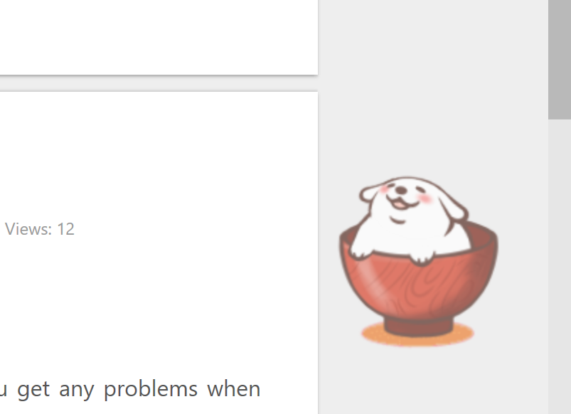
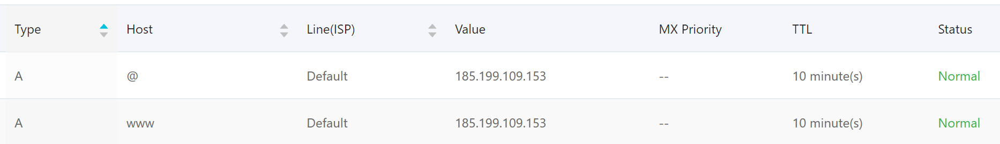
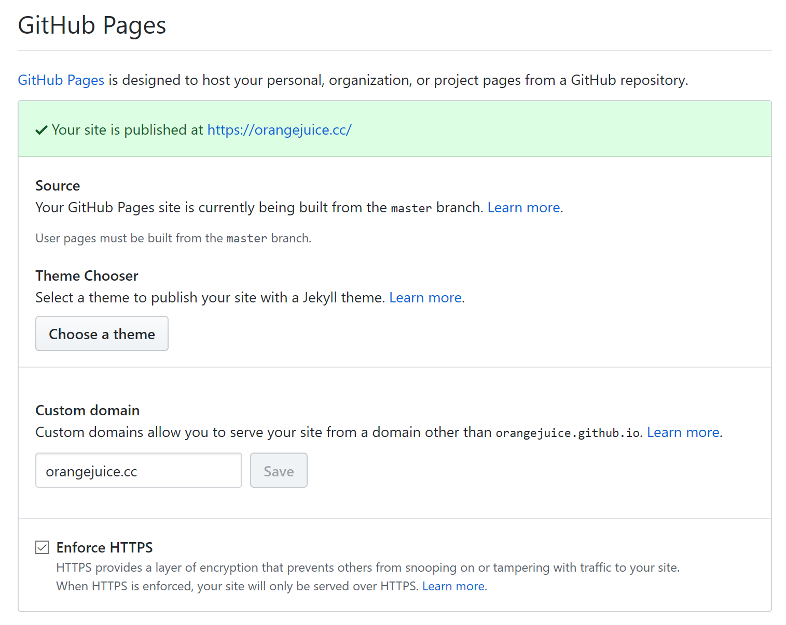

## Deploy Hexo site files & Install theme Next

Firstly, install node.js as the necessary runtime environment for javascript. Then we turn to the folder where we want to put the blog files in and run commands below:

```bash
npm install hexo-cli -g
hexo init blog
cd blog
npm install
```

Congrats! Our blog is available now, but it's running with the default theme and of course we need something different. Next is a great open source theme hosting on github. some ways to get the theme but I will download the theme files directly from [https://github.com/theme-next/hexo-theme-next/releases](https://github.com/theme-next/hexo-theme-next/releases).

then, decompress the files into the folder `themes`, which in the folder you just opened.

```
├── _config.yml
├── package.json
├── scaffolds
├── source
|   ├── _drafts
|   └── _posts
└── themes
```

Alright, now we can change the theme of Hexo to Next-Theme. In `_config.yml` file, find this line: `theme: xxx`, make it `theme: next`.

```yml
# Extensions
## Plugins: https://hexo.io/plugins/
## Themes: https://hexo.io/themes/
theme: next
```

4 theme schemes can be chose in Next-Theme, as we can see in `themes/next/_config.yml`, find this line: `scheme: xxx`, leave anyone you like without `#`.

```yml
# Schemes
#scheme: Muse
#scheme: Mist
#scheme: Pisces
scheme: Gemini
```

Done. If you want to preview the effect just run `hexo server` or `hexo s` in blog folder. 

## Customize the appearance

### Change avatar

Prepare an image of the avatar and place the image in the `source/images/` folder, then modify the config file `themes/next/_config.yml`:

```yml
# Sidebar Avatar
avatar:
# In theme directory (source/images): /images/avatar.gif
# In site directory (source/uploads): /uploads/avatar.gif
# You can also use other linking images.
url: /images/avatar.jpg
# If true, the avatar would be dispalyed in circle.
rounded: true
# The value of opacity should be choose from 0 to 1 to set the opacity of the avatar.
opacity: 1
# If true, the avatar would be rotated with the cursor.
rotated: false
```

Just change url value to the address of the image.

### Generate and add sub-pages

Hexo generates only two pages by default, namely the home page and archive page. In `themes/next/_config.yml` we can find:

```yml
menu:
  home: / || home
  about: /about/ || user
  tags: /tags/ || tags
  categories: /categories/ || th
  archives: /archives/ || archive
  #schedule: /schedule/ || calendar
  #sitemap: /sitemap.xml || sitemap
  #commonweal: /404/ || heartbeat
```

Here I have removed the comments of which page I need, and you can consider the pages you need. At this time, we can see these pages show up on our homepage navigator.

Go back to blog folder, run `hexo new page about`, `hexo new page tags`, `hexo new page categories` individually. **For tags and categories page file, you need to add one line `type: "categories"` or `type: "tags"` in Front Matter to let the Hexo know what this page it is.** 

Ok, about page can be modified freely now, but tags and categories are not our jobs because Hexo will help us to manage these pages automatically ヾ(•ω•`)o.

> Tips: `comments: false` flag can keep one page out of comment feature.

### Search feature

It's not available out-of-box, we need do some work.

Run  `npm install hexo-generator-searchdb --save` under the blog folder. Then find `search` in `_config.yml`, add the following at the end:

```yml
search:
  path: search.xml
  field: post
  format: html
  limit: 10000
```

and `local_seaerch` in `themes/next/_config.yml`:

```yml
# Local search
local_search:
  enable: true
```

### RSS feed

run `npm install --save hexo-generator-feed` in blog folder, then open and append these content in `_config.yml`:

```yml
# Extensions
## Plugins: http://hexo.io/plugins/
plugins: hexo-generate-feed
```

and then find this line and modify it in `themes/next/_config.yml`:

```yml
# Set rss to false to disable feed link.
# Leave rss as empty to use site's feed link, and install hexo-generator-feed: `npm install hexo-generator-feed --save`.
# Set rss to specific value if you have burned your feed already.
rss: /atom.xml
```

### Fork Me On Github widget

Choose a favorite icon [here (image version)](http://tholman.com/github-corners/) or [here (text version)](https://github.com/blog/273-github-ribbons), then copy the code next to the icon and put it in`themes/next/layout/_layout.swig` under `<div class="headband"></div>`.

### Word count and reading time

run `npm install hexo-symbols-count-time --save` in blog folder. Go to the site configuration file `_config.yml` and copy the following code to the end:

```yml
symbols_count_time:
symbols: true
time: true
total_symbols: true
total_time: true
```

then find these in `themes/next/_config.yml`:

```yml
# Post wordcount display settings
# Dependencies: https://github.com/theme-next/hexo-symbols-count-time
symbols_count_time:
  separated_meta: true
  item_text_post: true
  item_text_total: false
  awl: 4
  wpm: 275
```

more explains are available on github [here](https://github.com/theme-next/hexo-symbols-count-time).

### Visitors/view counter

1. total visitors number and total views.

open `themes/next/_config.yml` file and find the line `busuanzi_count`:

```yml
busuanzi_count:
  enable: true
  total_visitors: true
  total_visitors_icon: user
  total_views: true
  total_views_icon: eye
  post_views: false
  post_views_icon: eye
```

2. view number per post.

in this case we use leancloud as counter service provider. Apply an account and create a project, then put `app_id` and `app_key` here.

```yml
# Show number of visitors to each article.
# You can visit https://leancloud.cn to get AppID and AppKey.
leancloud_visitors:
  enable: true
  app_id: {leancloud_appid} #<app_id>
  app_key: {leancloud_appkey} #<app_key>
  # Dependencies: https://github.com/theme-next/hexo-leancloud-counter-security
  # If you don't care about security in leancloud counter and just want to use it directly
  # (without hexo-leancloud-counter-security plugin), set `security` to `false`.
  security: true
  betterPerformance: false
```

if security set to `true`, run `npm install hexo-symbols-count-time --save` in blog folder to install the dependency.

> Tips: hexo-leancloud-counter-security is to make sure the data cannot be modified by others intentionally. refer to their document for more information.

### Comment feature

Valine is a service based on Leancloud to provide comment storage. We use Valine in this case but you can use any other implementations freely.

```yml
# Valine
# You can get your appid and appkey from https://leancloud.cn
# More info available at https://valine.js.org
valine:
  enable: true # When enable is set to be true, leancloud_visitors is recommended to be closed for the re-initialization problem within different leancloud adk version.
  appid: {leancloud_appid} # your leancloud application appid
  appkey: {leancloud_appkey} # your leancloud application appkey
  notify: false # mail notifier, See: https://github.com/xCss/Valine/wiki
  verify: false # Verification code
  placeholder: Just go go # comment box placeholder
  avatar: mm # gravatar style
  guest_info: nick,mail,link # custom comment header
  pageSize: 10 # pagination size
  visitor: false # leancloud-counter-security is not supported for now. When visitor is set to be true, appid and appkey are recommended to be the same as leancloud_visitors' for counter compatibility. Article reading statistic https://valine.js.org/visitor.html
  comment_count: true # if false, comment count will only be displayed in post page, not in home page
```

> Tips: you don't need to apply new `leancloud_appid` and `leancloud_appkey` if you have do so in the last step.

### Copyright per post

open the file `_config.yml`, and find follow content:

```yml
# Creative Commons 4.0 International License.
# See: https://creativecommons.org/share-your-work/licensing-types-examples
# Available values of license: by | by-nc | by-nc-nd | by-nc-sa | by-nd | by-sa | zero
# You can set a language value if you prefer a translated version of CC license.
# CC licenses are available in 39 languages, where you can find the specific and correct abbreviation you need.
# Valid values of language: deed.zh, deed.fr, deed.de , etc.
creative_commons:
  license: by-nc-sa
  sidebar: false
  post: true
  language:
```

change post value from `false` to `ture` it will work.

### Live2d pet

It is a pet living on our pages and steering at the mouse cursor where you are pointing at. Very lovely.

Details can be available [here](https://github.com/EYHN/hexo-helper-live2d), we won't talk more on this.



## Setup travis-ci auto deploy

The process of registering for this website is omitted. :), here attached is the `.travis.yml` of mine blog.

```yml
language: node_js
node_js: stable

branches:
only:
- source

# Start: Build Lifecycle
install:
- npm install

cache:
directories:
- node_modules
- live2d_models

before_script:
- sed -i "s~{github_client_id}~${github_client_id}~" ./themes/next/_config.yml
- sed -i "s~{github_client_secret}~${github_client_secret}~" ./themes/next/_config.yml
- sed -i "s~{valine_appid}~${valine_appid}~" ./themes/next/_config.yml
- sed -i "s~{valine_appkey}~${valine_appkey}~" ./themes/next/_config.yml

script:
- hexo clean
- hexo generate
# - hexo lc-counter register baaas18vGYfaega ggsdfaeas12b31saY&

after_script:
- sed -i "s~https://github.com/orangejuice/orangejuice.github.io.git~https://${ACCESS_TOKEN}@github.com/orangejuice/orangejuice.github.io.git~" _config.yml
- hexo deploy
```

With the help of it, we submit and push the codes to `source` branch, and travis-ci will help us to deploy it to `master` branch.

## Custom domain name resolution

### Setup domain name resolution

First, select the domain name resolution function from your domain name registry. Record type (as shown in the figure) we can choose A or CNAME.

Tips: you can always get the ip address of one domain name by `nslookup example.com` command in windows.

> note: choose A record is better, if not there will be some problems such as the website can not forward to https site automatically.



### Config github project settings

1. modify custom domain value

2. enforce https to ensure security.



## Start writing

1. `hexo new post "your post title"`

2. modify the post content.

3. commit and push the file.

> Tips: there are some tricks to help us organize posts more efficiently. For example, how to keep out the draft out of rendering? you can find more on the docs of Hexo: [https://hexo.io/docs/writing](https://hexo.io/docs/writing)

## Reference

1. Hexo docs   https://hexo.io/docs/

2. Next-Theme Github homepage   https://github.com/theme-next/hexo-theme-next

3. summarize of hexo blog establishing process  http://eternalzttz.com/hexo-next.html

4. cloudflare https://medium.com/tool-s/將你的網站加上-https-cloudflare-6569f5365c7d

5. domain name resolution https://segmentfault.com/a/1190000011203711
