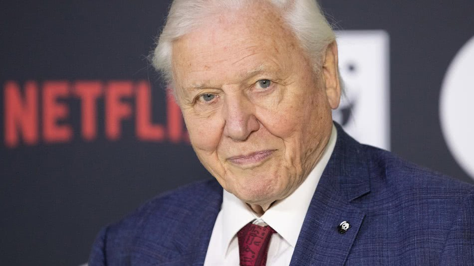

苍鹰鏖战，紧锁利爪，座头鲸捕猎，吞下鲱鱼群，还有天堂鸟、切叶蚁，四年50多个国家，涉及工作人员600余人，最新的4K摄影技术，从《我们的星球》预告片和官方公布信息看，怎么看都像《地球脉动》3，只不过制作人艾雷斯泰·法瑟吉尔认为，有了网飞的助力，《我们的星球》将吸引完全不同量级的观众数目。除此之外，他还将赋予节目更多的现实意义，即游说政治家和公众关注环境问题：从现在开始，我们必须作出改变！

至于为何要和合作多年的BBC分手，转投网飞的怀抱，法瑟吉尔解释，网飞可以在同一时刻于190个国家上线，节目可以保留数月甚至数年，而BBC只能在iPlayer上保留30天，而且也无法多国同时上线。网飞的观众多在16到30岁，他们根本不看电视，但却很关心这些（环境）问题，他们是我们星球的继承者，所以从这个角度上来说，网飞是最佳合作方。大卫·艾登堡爵士也表示非常期待网飞带来的巨大传播力，“尽管BBC非常具有影响力，可也无法做到一晚上抵达两千万观众。”爵士接受《太阳报》采访时表示，“我们要传递的讯息非常紧迫。大自然陷入了危机，我们不能再轻声细语地表达意见。再说什么‘我们要开个会商讨这个问题’毫无意义。我们希望观众们现在就知道正在发生的事情。”

网飞显然也意识到与金牌制作团队合作后产生的全球影响力，邀请来了萨尔玛·海耶克和佩内洛普·克鲁兹为西班牙版本配音。

想要影响更多更年轻的观众，唤起更多人的环保意识，法瑟吉尔和大卫·艾登堡选择了更具流量优势的网飞也在情理之中。而为了达到环境教育的目的，纪录片一而再、再而三地提醒观众，眼前的壮阔奇观正遭受人类活动的危害。

在婆罗洲，摄制组将镜头对准了红毛猩猩路易、艾登和布鲁托的温馨一家，解说词却告诉我们，每星期有100个红毛猩猩死于过度的人类活动。在延时镜头中，婆罗洲的原始丛林逐渐变成单一栽培的油棕，大卫·艾登堡那浑厚沧桑的解说此时又一次响起，提醒观众路易和艾登们已经是最后一代野生红毛猩猩了。

相比脉动系列，《我们的星球》显然没准备只给观众洗眼睛用，它还是一样壮阔恢弘，美轮美奂，只是加了负罪感和紧迫感的佐料，没那么好下咽了，唤起的情感共鸣势必更加五味杂陈。

对于那些情感上认为《我们的星球》是《地球脉动》3的观众来说，这部网飞新剧假设观众们已经长大，是时候给他们看点真相了。

BBC的自然纪录片系列曾向无数观众传递了自然的壮丽肃穆，毫无疑问是经典中的经典。不过，此前也不是没有质疑的声音发出，其中最突出的一点就是，对于消失的物种、萎缩的栖息地、污染横行、气候变化这些问题，脉动系列千言万语只有剧终时刻一句不痛不痒的点题：要么毁灭，要么现在开始珍惜，选择权在你们身上！

有观众不满这种不痛不痒，其实法瑟吉尔才是最不满的那个。他在一次采访中表示：此前我们有个习惯，那就是在前45分钟中，万物生长，岁月静好，到了最后5分钟，我们忽然提出一个严峻的问题。我觉得这个太套路了。

《地球脉动》2重复了法瑟吉尔提到的问题，自然历史纪录片制作人马丁·休斯·加梅斯也表示，这一系列“以一种错误的安全感，给全世界的观众们带来安抚和催眠”。

尽管如此，在《我们的星球》中，团队仍然保留了此前脉动系列难以复制的趣味性和王牌视觉体验。看到树鼩拿猪笼草当厕所，幼年食猿雕第一次展翅飞翔，难得一见的巨型皇带鱼仿佛从神话中游弋出来，两只幸存的阿拉伯豹谈恋爱，观众的心情想必还是很愉悦的。

除了自然生机和警示之外，人类行为对于环境有意或者无意的改善，也被考虑了进去。这可以说是《我们的星球》第一季中最为正能量的部分。比如，看到五只猎豹合力拿下一只角马时，你将被告知，之所以能看到野性十足的这一幕，是因为塞伦盖蒂已经对此物种进行了数十年如一日的保护工作。在切尔诺贝利的废墟中，野马、狐狸和野狼数量成倍增长，“辐射把我们赶走，却给这些野生动物留出了生存空间。”大卫·艾登堡用他警世恒言般的解说词念道。

“五年前，当我们开始这样做时，总是很难将环保类节目挤进黄金时段，”法瑟吉尔在采访中说，“但现在情况变了，连英国广播公司现在也说，他们希望在节目中传递环保讯息。”

转自 [澎湃新闻](https://www.thepaper.cn/newsDetail_forward_3238147)