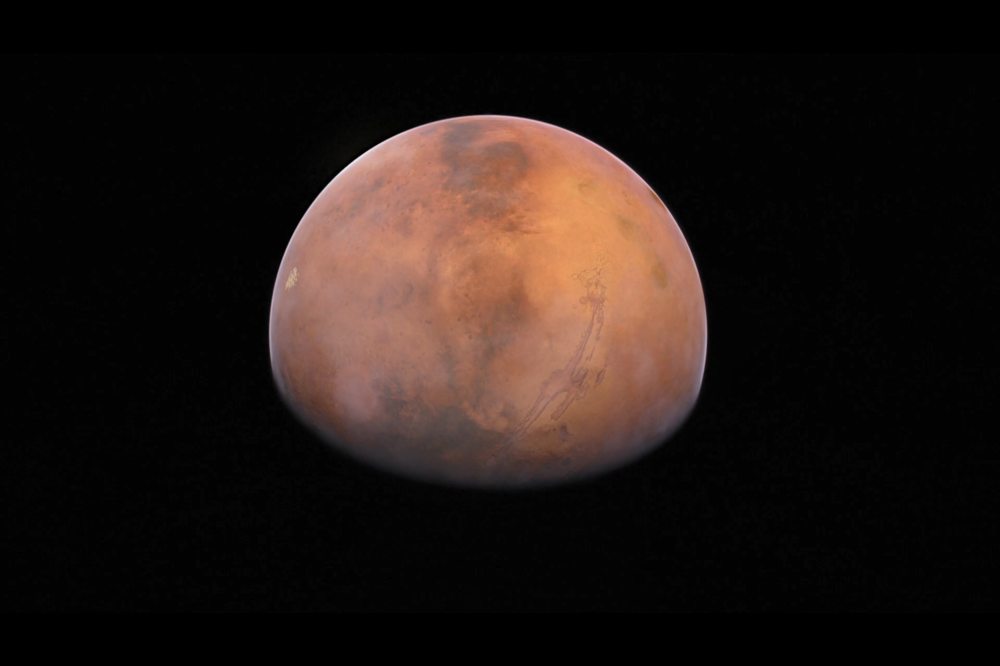
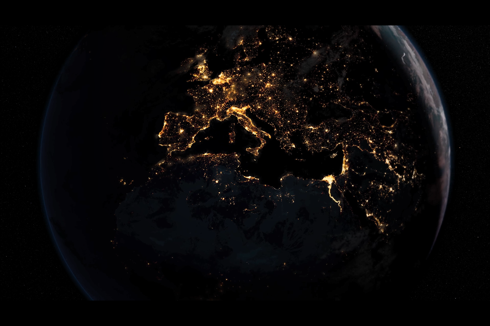

昨天一只雀落到我窗檐，今天又一只。

又读完了一个章节，感慨故事中人物的精神饱满和精明气势，那份用心和努力程度不亚于努力饰演角色的演员。所不同的是，这些人物饰演的是自己，不是刻意的假装，而是带有自己的诉求目的，带着如空气般隐秘却又鲜明无比的时代印记，度过了一天又一天。他们与风、与城市、与所有元素，因名、因性、因所有缘由相互纠缠在一起，组成一个完整的故事，不可分离。

> “一切都是茫然，茫然如我不知我生前为何物所变、死后又变何物。”

当然羡慕这些在这场生命旅程中处之泰然的芸芸人物，他们满足而潇洒，来到这世上便自动继承下逻辑和法则，仿佛金鱼终获落入水中，立刻焕发生命四处游窜。真切鲜活的物理现实，抽象虚渺的形而上。两个对立的表述，明显人类社会更喜欢第一个。可我偏掉进了后者的陷阱。对于现实物理世界，没有丝毫的参与感和欲念，发不发生在我身上都只是冷眼看着故事起落，人来人往。别人的期待最难以承受，感情期待是两倍重击。这些东西太真实了，要发生真实的心理活动和行为，如果不是自发的地情况下，太难做到。时间在模糊的意识间飞快溜走，我彷佛是在困倦的听着另一个人的故事，没有我的现在，没有我的昨天和过去。

生在地球纪年的尾巴，看着星际纪年的来袭，不知道自己有没有机会进行星际旅程，但总由衷觉得十分可惜。一步之遥就可亲历以星际旅行为思维常态的人类社会，那时人类又会是怎样无情无义，怎样兼爱宽容。我也许也不会像今生这样费尽心力和时间先是原地踏步怀疑人生，而后自我修复，探索成长。这些眼看到嘴边却要错过的美好已经够多，偏也没有好好体验现在，不免觉得懊悔。庆幸的是我依旧只是度过了预期寿命的短暂一部分，甚至还没过半。那么我就依旧有机会在未来以最优体验过活一段时间。这也便是我“虚渺”那一半的人生目的。至于现实世界那一半的目的，看来还需要一段时间去探索发现。

src: The Planets BBC 2019

>火星上资源丰富，它的地下蕴藏着丰富的冰冻水，还有矿物质，像铁、氮、碳、氧，这些东西都是文明发展所需的要素。因此我认为，在我有生之年，将出现火星人，火星人就是我们。我们将会去火星，并且在那里定居，这颗古老的红色星球将成为我们人类走出地球，实现星际漫游的第一步。
>
>Mars is rich in resources, it has vast reservoirs of water below the surface, and minerals, iron, nitrogen, carbon, oxygen, all the things you need to support a civilization. And that's why, I think, in my lifetime, there will be Martians, but the Martians will be us. We will go to Mars and make it our home, and that old red word will become our first step beyond the cradle, and out to the stars.

src: The Planets BBC 2019

>土星见证了太阳系历史上最壮观的一些场面，现在却在吞噬着讲述它非凡故事的探测器
>
>The planet that had born witness to some of the greatest dramas of the history of the solar system was now consuming the craft that had told its extraordinary story.

src: The Planets BBC 2019

>如果我们真在木卫二上发现了生命，会有意义吗？毕竟只是些微生物。是的，而且很重要。我认为我们正处在历史上的一个阶段，我们需要一种自我认可，或者说是提醒，在我们的世界之外还存在着美和知识，甚至是生命和意义。这很重要。
>
>Would it matter really if we found life on Enceladus? It would only be micros after all, yes, it would matter, we are at a time in our history, I think, where we need reassurance, or perhaps a reminder that there is beauty and knowledge, and perhaps even life and meaning beyond our shores.

src: Our Planet Netflix 2019

> 生命早已和地球构造紧密的结合在一起
>
> life has woven itself into the fabric of the planet.

> 想想看，大约40亿年前发生的所有偶然事件，只是为了创造出礁池中的这个微小生命。
>
> think about all the chance events that had to happen over four billion years, just to produce the little creatures in this rock pool.

太阳100亿年的生命，我是多么渺小。一个人走完一辈子的艰难，体会着心酸和痛苦，忍受心灵不断的煎熬，纵使一刻不停的读书，拥有举世瞩目的成就，目光所及的范围相比太阳仍不值一提，地球上的热闹搅不动这万籁俱寂的宁静。

看过5集BBC纪录片《星球》和30万字《废都》后有感。
