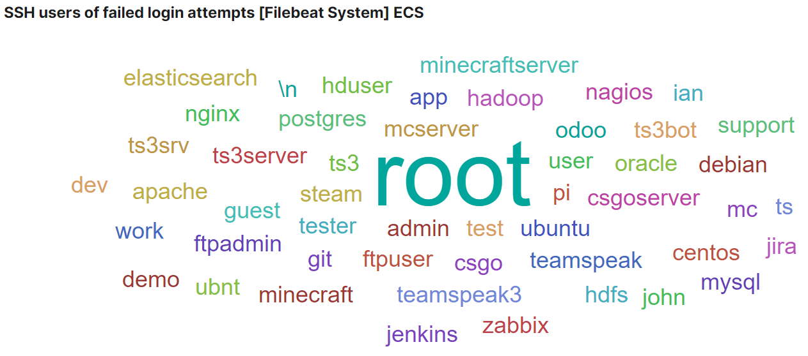

This is a record of simply trying out and exploring the concepts of k8s. Starting from preparing the node environment for k3s lightweight kubernetes, and finally launching several cluster base services such as ingress controller, monitoring, log collection, etc.

## The story of why?

Before beginning with this journey, I know it would not be easy. It's last summer, when I was managed to write a dissertation about microservices, I got to know that there is a thing called Kubernetes that has been called *the operating system for microservices*. But after some basic researches, it turned out to be such a broad topic and so many concepts need to learn (The intimidating docs are [standing there](https://kubernetes.io/docs/)), so I gave up trying it out at that time.

Now, the chance comes again - a fair point that I have to figure out is that, just two months ago, I got two free Virtual Machines from Oracle, which made me believe in love again (lol). More information is available on [Oracle Cloud Free Tier](https://www.oracle.com/cloud/free/). From then on, I have kept thinking of how can I make use of it, to exert its value. At first I used Docker Compose to attempt some applications for the first time, I was very happy - until I got an idea that I should try Kubernetes. But sadly, the computing resources of Oracle is too limited to support a cluster that is usable (I learnt this after killed the died instance many times). Luckily again, I found Civo which is providing limited time free plan! More information is available at [Kube100 Plan](https://www.civo.com/kube100). I tried it out for both self managed and hosted clusters. Indeed, it's best to use the managed cluster, this choice can save lots of time. Although so, this article will concentrate on the building up process of a self managed cluster, which is geek (just like me) 's choice. And I use Ubuntu, so the commands mentioned below are all aimed and has been tested for Ubuntu use only.

After some searching, I decided to choose one between two ready-to-use clusters, k3s and microk8s. Two reasons of using them: Firstly, they will take up the infrastructure establishing and maintenance duty of the cluster, which is not an easy part; the other one is they consume less resources (They said so, I didn't do comparisons myself). After several times of attempting, at last I choose to use k3s. There are several reasons for that, the most important one is, k3s is much easier to debug compared to microk8s because logs are all collected in one place, easily check the health of a node by using one command `service k3s-agent status` which saves life.

## **Prerequisites and environments**

Firstly, as mentioned above, 2 oracle instances, 1 civo instance, and another self owned instance, are all I have. So in my case I am running 4 nodes and they are located in 3 different geolocations. I named them just as below, with corresponding specs as well:

- `master`, 2 cores, 2G, Ubuntu 18.04
- `oracle-1`, `oracle-2`, 1 core, 1G, Ubuntu 18.04
- `civo-1`, 2 cores, 4G, Ubuntu 18.04

To make the management easier, I aligned the name listed above with their hostname and domain name prefix.

However, this multi-cloud structure turns out to be a major issue need to be solved at first, and finally I find out a (maybe?) best solution after a long time exploring. So I think it's pretty worthy to share my experience. Poor guys like me can only make good use of the resources that we have 😣😕😛. Let's begin from the scratch though.

### Ansible

We will setup the ansible at first. The more machines we have, the more amount of time we can save from using ansible. I reuse the node `master` as the ansible server.

```shell Install Ansible
apt update && apt install software-properties-common
apt-add-repository --yes --update ppa:ansible/ansible
apt install --yes ansible
```

Then we go set up the global ansible hosts, if you would like to use nano, then just type `nano /etc/ansible/hosts`, and put something like below to make sure ansible know our hosts from now on:

Then we go set up the global ansible hosts, if you would like to use nano, then just type `nano /etc/ansible/hosts`, and put something like below to make sure ansible know our hosts from now on:

```toml Example contents in /etc/ansible/hosts, [1:n] presents n hostnames from 1 to n
[master]
localhost

[master:vars]
ansible_connection=local

[workers]
oracle-[1:2].your.host.name
civo-1.your.host.name
```

Set up some ansible global configs:

```shell
sed -i '/\[defaults\]/a deprecation_warnings = Flase' /etc/ansible/ansible.cfg
sed -i '/\[defaults\]/a host_key_checking = False' /etc/ansible/ansible.cfg
```

to test the connectivity of all nodes after configuration:

```shell
ansible master -m ping
ansible workers -m ping
```

#### Upgrade all packages

This can be our very first ansible command to use, which will upgrade all the installed packages to the latest version.

```shell
ansible all -m apt -a 'update_cache=yes name=* state=latest autoremove=yes'
```

#### Install network debug tools on all nodes

There tools are so important when we want to debug the network issues and they might be already included in the release version of system you are using. It's optional anyway, can be installed whenever it's needed. Just put here as a record.

```shell
ansible all -m apt -a 'name=iputils-ping,dnsutils,traceroute update_cache=yes state=latest'
```

### Swap space operation

Although kubernetes don't encourage people using swap spaces, I still think use swap space is a good idea especially for small memory machines. By swapping some unimportant apps into swap space, we get a bit more spaces in the RAM, and that keep us a bit further from getting a fully occupied memory as well. However, we don't want our pods run into the swap spaces. To avoid the nodes from consuming too much swap space, we will set up the memory usage limitation and eviction strategy for all nodes later.

The below commands are a brief record of [this article](https://linuxize.com/post/how-to-add-swap-space-on-ubuntu-18-04/), which is very helpful and working like a charm.

```shell Turn on the swap space
fallocate -l 1G /swap
dd if=/dev/zero of=/swap bs=1024 count=1048576
chmod 600 /swap
mkswap /swap
swapon /swap
echo "/swap swap swap defaults 0 0" >> /etc/fstab 
```


```shell Turn off the swap space
sed -i '/^\/swap swap swap defaults 0 0/d' /etc/fstab
swapoff -v /swap && rm -f /swap && reboot
```


### Helm

[Helm](https://helm.sh/) is a package management tool for kubernetes, it's very helpful for installing released apps. [Charts](https://helm.sh/docs/topics/charts/) can be found on [helm hub](https://hub.helm.sh/).

```shell
snap install helm --classic
```

## K3s cluster deployment

### Clone the resources files

For initialization the cluster, many source definitions (YAML is highly used in kubernetes stack) are needed. For convenience purposes, I have created a repository on GitHub. You can freely clone it or fork it or just make your own version based on it.

```shell Clone the repo
git clone https://github.com/orangejuice/cluster.git /app/
```


### Establish cluster network

> This chapter is for multi-cloud deployment only, can be skipped if you have no worries about that.

Soon after beginning deploying the nodes, I found that kubernetes doesn't come with perfect Internet use support, although there are several options which look very tempting and can be used in some cases. So network connectivity need to be solved at first. Otherwise it won't work. Let's try it out and see what happens.

#### Attempted schemas

In order to solve the inter-subnet communication issue, I have explored several different schemes:

1. **Exposing all nodes on the Internet**  
   Firstly what comes to my mind is exposing the nodes directly through the Internet. by advertising API server address to public IP this can be easily done. Worker nodes also need to registering with their public IP, so that all the communication can go through the Internet naturally. But a problem occurs here, kubelet do not accept registering the IP not listing in machine's network interfaces. And all mine running instances are virtualized and the network interface only owns a internal IP. So this will never work out. This issue can be checked at: [kubernetes/kubernetes #58516](https://github.com/kubernetes/kubernetes/pull/58516). I didn't find out an easy way to add the public ip into the network interface, so I just move on.  
   **Result**: Not work

2. **Config flannel IP**  
   Fine, we cannot register a node by using a public IP, then let's just register with the internal IP. As Flannel is our CNI implementation, it manages the overlay pod network. So as long as we made falnnel use the right IP, the pods are communicatable to each other. We can change the public IP used by flannel to achieve this demand. Flannel did provide this feature, we can annotate nodes with `flannel.alpha.coreos.com/public-ip-overwrite=xx.xx.xx.xx`, then when pods send a request to other pods, it can be forwarded to the correct public ip we configed.  
   **Result**: This is a compromise schema, it solved the interpods communication issue, but nodes' IP will be still wrong. Requests sending to node IP or node hostname won't work.

3. **VPN**  
   By using VPN, we establish an overlay private network among the geolocations, and a IP in this network that being binded to the network interface, so it can be used for nodes to register themsleves. In this case, everything is working fine, except - a central VPN server is involved in to forward all the cluster communication traffic. That sounds not good, it is a bad strategy that we must want to avoid.  
   **Result**: This introduced a redundant central node for communication, bad efficiency.

4. **Kilo**  
   The introduction of [Kilo](https://github.com/squat/kilo) is very promising. It should be a very good resolution as long as it works. I tried it several times but every time there must be nodes that didn't setup the wireguard correctly. And I couldn't figure out why from the logs, no errors are printed out. It's very weird, but it spired me, so I didn't spend long time on it, instead, I try to constructure the mesh network myself.  
   **Result**: It looks great, but it didn't work. And I can deploy a mesh network in a native simpler way.

Apart from those attempts, lately I got to know that there are subjects named multi-cloud and multi-cluster that kind of aiming at providing a schema for some cases include my one, but this topic seems not that popular (the official kubefed repository holds less than 1000 starts until I write this line, it's not too bad though), and some schemas are going way too much in our case. I found [this post](https://learnk8s.io/bite-sized/connecting-multiple-kubernetes-clusters) as a good overview of these subjects, but I didn't go further on any of those solutions. What we need is just a simple, stable, non-intrusive connectivity.

#### Create mesh network

Overall, after serval failing attempts, I turn to use wireguard to realize such a virtual network. I have put the playbook on Github. Before using it, make sure the host configs fit your scenario.

```shell
nano /app/mesh/hosts.ini
```

Modify hosts

```shell
cd /app/mesh/
ansible-playbook up.mesh.1.yml
```

Start up the mesh network

### Deploy master and worker nodes

Here are the commands we are going to use for starting up the master and worker nodes for k3s. The parameters are very self-explained, to indicate what they are used for.

```shell Deploy cluster master node
ansible master -m raw -a "curl -sfL https://get.k3s.io | sh -s - server \
  --write-kubeconfig ~/.kube/config \
  --default-local-storage-path /app/storage/ \
  --no-deploy traefik \
  --kubelet-arg system-reserved=memory=200Mi \
  --kubelet-arg eviction-hard=memory.available\<200Mi"
```


```shell Deploy cluster agents (workers)
SERVER=$(ansible master -a "dig +short myip.opendns.com @resolver1.opendns.com" | tail -n 1)
TOKEN=$(ansible master -a "cat /var/lib/rancher/k3s/server/token" | tail -n 1)

ansible workers -m raw -a "curl -sfL https://get.k3s.io | sh -s - agent \
  --server https://$SERVER:6443 \
  --token $TOKEN \
  --kubelet-arg system-reserved=memory=200Mi \
  --kubelet-arg eviction-hard=memory.available\<200Mi"
```


check the cluster status by `kubectl get nodes`.

```shell-session
root@master:~$ kubectl get nodes
NAME       STATUS   ROLES    AGE     VERSIONmaster     Ready    master   15m     v1.17.4+k3s1civo-1     Ready    <none>   9m6s    v1.17.4+k3s1oracle-1   Ready    <none>   14m     v1.17.4+k3s1oracle-2   Ready    <none>   9m43s   v1.17.4+k3s1
```

If you decide to wipe out the cluster, simply run:

```shell
ansible workers -m raw -a "k3s-agent-uninstall.sh; \
  rm -rf /var/lib/{rancher,efk-*,filebeat,longhorn*,edgefs*}"

ansible master -m raw -a "k3s-uninstall.sh; \
  rm -rf /var/lib/{rancher,efk-*,filebeat,longhorn*,edgefs*}"
```

Add more paths if you want to remove them as well 

Use this command (from [Jerub](https://serverfault.com/a/200642)) to recover all the iptable rules to default

```shell
ansible all -m raw -a "iptables-save | awk '/^[*]/ { print \$1 }
                      /^:[A-Z]+ [^-]/ { print \$1 \" ACCEPT\" ; }
                     /COMMIT/ { print \$0; }' | iptables-restore"
```


### Check logs

```shell
journalctl -u k3s -o cat --follow
journalctl -u k3s --reverse -o cat
service k3s status

journalctl -u k3s-agent -o cat --follow
journalctl -u k3s-agent --reverse -o cat
service k3s-agent status
```

We may want to wipe out all the system logs sometimes:

```shell
journalctl --rotate
journalctl --vacuum-time=1s
```

These commands can be combined with ansible as well in order to check logs remotely.

## Install cluster basic applications

### Ingress controller

#### Nginx

This is the most commonly used Ingress controller. It is very powerful, although the [docs](https://kubernetes.github.io/ingress-nginx/user-guide/nginx-configuration/configmap/) are really not that friendly. Only after searching and trying for several time, I found out a way of using specified header value as the real client IP, and actually it's very easy.

```shell add helm repo
helm repo add stable https://kubernetes-charts.storage.googleapis.com/
helm repo update
```


Install nginx by using our helm chart values file.

```shell
kubectl create namespace nginx
helm install nginx-ingress stable/nginx-ingress -n nginx -f /app/nginx.yml
```

When you want to remove the installation.

```shell
helm uninstall nginx-ingress -n nginx
kubectl delete namespace nginx
```

#### Traefik

I like the middleware part of Traefik most, it creates many possibilities such as BasicAuth. However, 2.2.0 version doesn't seem working well on k8s to cope with Ingress resources type, based on my several times of attempts.

```shell Add traefik chart repo
helm repo add traefik https://containous.github.io/traefik-helm-chart
helm repo update
```

Although Traefik chart inside doesn't integrate a config map, I still prefer to use it instead of providing a long list of running arguments or PV. The official chart doesn't provide a basicAuth for dashboard, so as an external accessible dashboard. So we need to figure out these ourselves:

```shell
# https://docs.traefik.io/middlewares/basicauth/#general
# Note: in a kubernetes secret the string (e.g. generated by htpasswd) must be base64-encoded first.
# To create an encoded user:password pair, the following command can be used:
# htpasswd -nb user password | openssl base64
nano /app/traefik/traefik-dashboard.yaml
```

Set up the admin username and password

```shell Install traefik
# for setting image version 
# --set image.tag=2.1.9 \

kubectl create -f /app/traefik/traefik-config.yaml
helm install traefik traefik/traefik -n traefik\
  --set ingressRoute.dashboard.enabled=false \
  --set volumes[0].name=traefik-config,volumes[0].mountPath=/config,volumes[0].type=configMap \
  --set additionalArguments[0]=--configfile=/config/traefik.yaml \
  --set nodeSelector."kubernetes\.io/hostname"="oracle-2"
kubectl create -f /app/traefik/traefik-dashboard.yaml
```

For uninstalling

```shell
kubectl delete -f /app/traefik/traefik-dashboard.yaml
helm uninstall traefik -n traefik
kubectl delete -f /app/traefik/traefik-config.yaml
```


### Rancher

[Rancher](https://rancher.com/) is a very good tool for visualized cluster management.

When I deploy Rancher, the installation guide on the official website didn't tell a way to solve the certificates externally (and high availability as well). That make it more complicated for me at first, as I don't need the apps to worry about certificate, I am using Cloudflare to proxy all the cluster traffics. Just two days ago, I found the [official chart repo](https://github.com/rancher/rancher/tree/master/chart), and it shows up the support for installing without dealing with the certificates, and setting up the replicas number.

```shell Add rancher repo
helm repo add rancher-latest https://releases.rancher.com/server-charts/latest
helm repo update
```


```shell Install rancher
kubectl create namespace cattle-system
helm install rancher rancher-latest/rancher \
  --namespace cattle-system \
  --set hostname=[Your-host-name] \
  --set replicas=1 \
  --set tls=external
```


For uninstalling, official docs are available [here](https://rancher.com/docs/rancher/v2.x/en/faq/removing-rancher/#what-if-i-don-t-want-rancher-anymore). From my experience, even the tool sometimes cannot remove rancher cleanly, I can only wipe out and redeploy the cluster when in that situation.

```shell uninstalling
wget -O /app/system-tools https://github.com/rancher/system-tools/releases/download/v0.1.1-rc7/system-tools_linux-amd64
chmod +x /app/system-tools
/app/system-tools remove -c [kubeconfig-file-path]
```

### Persistence storage

In order to make the management of multi-node easier, it's a good idea to label the nodes that you may only want them to be consumed as storage spaces.

```shell Mark storage nodes
for node in 'oracle-1 oracle-2 civo-1'; \
do \
    kubectl label node $node persistence-storage=true; \
done
```

#### Longhorn

As we have installed Rancher, it's not a bad choice to install longhorn from Rancher catalog, on which the longhorn dashboard can be secured by rancher's authentication. When using traefik, we can also use its middleware functionality to provide us with authentication.

On the other head, longhorn hasn't published the helm chart anywhere yet, So I didn't try the chart. You can go through the [official guide](https://longhorn.io/docs/) for details. Install by kubectl only requires one command, check out and modify some values if you would like to:

```shell Install longhorn
kubectl apply -f https://raw.githubusercontent.com/longhorn/longhorn/master/deploy/longhorn.yaml
```


It's a little complicated to uninstall it. The latest [official guide](https://longhorn.io/docs/install/uninstall-longhorn/) can be a good reference. Below are the codes that has been given on version 0.8.0.

```shell Uninstalling of longhorn 
kubectl create -f https://raw.githubusercontent.com/longhorn/longhorn/master/uninstall/uninstall.yaml
kubectl get job/longhorn-uninstall -w

kubectl delete -f https://raw.githubusercontent.com/longhorn/longhorn/master/deploy/longhorn.yaml
kubectl delete -f https://raw.githubusercontent.com/longhorn/longhorn/master/uninstall/uninstall.yaml
```


Clean user data after uninstalling, make sure you don't need the volumes' data anymore.

```shell
ansible all -a "rm -rf /var/lib/{rancher/longhorn,longhorn}"
```

#### Rook

Rook is acting as an administrator of a distributed storage system, it aimed to automate the all deployment and maintenance work for the users. The official website is [available here](https://rook.io/). As their docs described, Ceph and EdgeFS are two stable storage providers. However, I spent some time on deploying both and either of them worked for me. Don't know why 🙁.

#### Ceph

In order to use host disk, we can only stick to 1.2 version for now. From version 1.3, storage on the host path is deprecated and is not allowed to use anymore.  

Firstly, download the ingress file from official example, and modify the hostname to own ones.

```shell
wget -O /app/ingress/ceph.yaml \
  https://raw.githubusercontent.com/rook/rook/release-1.2/cluster/examples/kubernetes/ceph/dashboard-ingress-https.yaml
```

Change host and make it effect by running `kubectl create -f /app/ingress/ceph.yaml`.

```shell Install rook operator
kubectl create -f https://raw.githubusercontent.com/rook/rook/release-1.2/cluster/examples/kubernetes/ceph/common.yaml
kubectl create -f https://raw.githubusercontent.com/rook/rook/release-1.2/cluster/examples/kubernetes/ceph/operator.yaml
```


```shell Bring up the ceph cluster and apply the ingress
kubectl create -f \
  https://raw.githubusercontent.com/rook/rook/release-1.2/cluster/examples/kubernetes/ceph/cluster-test.yaml
kubectl create -f /app/ingress/ceph.yaml
```


```shell Apply filesystem definition for ceph and storage class
kubectl create -f \
  https://raw.githubusercontent.com/rook/rook/release-1.2/cluster/examples/kubernetes/ceph/filesystem-test.yaml
kubectl create -f \
  https://raw.githubusercontent.com/rook/rook/release-1.2/cluster/examples/kubernetes/ceph/csi/cephfs/storageclass.yaml
```

After these steps, a working Ceph filesystem should be stood by and be capable to provide storage provisioning service.

**Output the Ceph dashboard password:**

```shell
kubectl -n rook-ceph get secret rook-ceph-dashboard-password -o jsonpath="{['data']['password']}" | base64 --decode && echo
```

For uninstalling

```shell
kubectl delete -f https://raw.githubusercontent.com/rook/rook/release-1.2/cluster/examples/kubernetes/ceph/csi/cephfs/storageclass.yaml
kubectl delete -f https://raw.githubusercontent.com/rook/rook/release-1.2/cluster/examples/kubernetes/ceph/filesystem-test.yaml
kubectl delete -f /app/civo/ceph-ingress.yaml
kubectl delete -f https://raw.githubusercontent.com/rook/rook/release-1.2/cluster/examples/kubernetes/ceph/cluster-test.yaml
kubectl delete -f https://raw.githubusercontent.com/rook/rook/release-1.2/cluster/examples/kubernetes/ceph/operator.yaml
kubectl delete -f https://raw.githubusercontent.com/rook/rook/release-1.2/cluster/examples/kubernetes/ceph/common.yaml
```

> Here is two typical errors that showing up when I boot an app with requesting Ceph CSI for storage space

```
MountVolume.MountDevice failed for volume "pvc-bcf02d41-2504-4620-b8c6-33d35bd29b98" : 
rpc error: code = Internal desc = fscID (1) not found in Ceph cluster    
```

```
MountVolume.MountDevice failed for volume "pvc-c9f4c562-398f-4253-ab7a-095991f27e19" : 
rpc error: code = Internal desc = an error occurred while running (796) mount 
[-t ceph 192.168.147.57:6789:/volumes/csi/csi-vol-3faca6e8-866e-11ea-82b8-a644e160ad8e 
/var/lib/kubelet/plugins/kubernetes.io/csi/pv/pvc-c9f4c562-398f-4253-ab7a-095991f27e19/globalmount 
-o name=csi-cephfs-node,secretfile=/tmp/csi/keys/keyfile-435551254,mds_namespace=myfs]: exit status 22:    
```

#### EdgeFS

From all the cloud native storage solutions, I think EdgeFS fit my demands best - a distributed file system with host volume support (which is important for me, a beginner, but is being abandoned by Rook/Ceph). However, I cannot even get it work after several times of attempts. Just similar to Ceph, the OCI provisioner does not work when an app requesting for storage, showing the error information `mount volume failed, exit status 32` and timeout. I gave up keeping trying on this because using CLI to debug and digging out the source of the issue is a time black hole, whatever you want to do, a long command is need to be input at first. It made me felt like a waste of time.

Anyway you can try it out yourself to see what will happen: [Rook EdgeFS](https://rook.io/docs/rook/v1.3/edgefs-quickstart.html). I will not list the commands again.

### Database - MariaDB

I use mariadb database, a substitute of MySQL, and I put it in the default namespace as well as other workload apps.

```shell Add bitnami repo
helm repo add bitnami https://charts.bitnami.com/bitnami
helm repo update
```

You may want to check out the configs I have been used and change them to suit your expectation.

```shell Install mariadb
helm install mariadb bitnami/mariadb -f /app/mariadb.yml
```

For uninstalling

```shell
helm uninstall mariadb
```

#### Access the database

To access the console of the database, we can either:

\- directly bring up a pod and dial into the MySQL client session:

```shell
kubectl run mariadb-client --rm -it --image bitnami/mariadb \
  --overrides='{"apiVersion": "v1", "spec": {"nodeSelector": { "kubernetes.io/hostname": "master" }}}' -- \
  mysql -h mariadb.default.svc.cluster.local -u root -proot
```

\- or run a new pod that you can use as a client, then connect to our database service:

```shell
kubectl run mariadb-client --rm -it --image bitnami/mariadb -- bash  
mysql -h mariadb.default.svc.cluster.local -u root -proot
```

Commands that might be helpful as well:

```shell Print the database IP
kubectl get svc -l app=mariadb -o jsonpath='{.items[0].spec.clusterIP}' | xargs echo
```


```shell Print the database password
kubectl get secret --namespace default mariadb \
  -o jsonpath="{.data.mariadb-root-password}" | base64 --decode && echo
```

And, commands for create a user and database.

```mysql
CREATE DATABASE nextcloud;
GRANT ALL PRIVILEGES ON nextcloud.* TO 'nextcloud'@'%' IDENTIFIED BY 'nextcloud';
```

Create database user and database

### Monitoring - Prometheus operator

We use [Prometheus operator](https://github.com/helm/charts/tree/master/stable/prometheus-operator) to help create Prometheus clusters on Kubernetes. It makes the deployment much easier.

```shell Add stable repo if not added already
helm repo add stable https://kubernetes-charts.storage.googleapis.com/
helm repo update
```


Simply put your host name and grafana password in the below commands (This long list of command arguments look not great, using a values file will be better. Just keep this one as it can be used as a reference to the syntaxes of setting those different types of values). The listed command will bring up a monitoring stack all with one host name and each service will use their name as the url suffix.

```shell
kubectl create namespace monitoring
helm install prometheus stable/prometheus-operator -n monitoring \
  --set prometheus.ingress.enabled=true \
  --set prometheus.ingress.hosts[0]='[your.host.name]' \
  --set prometheus.ingress.paths[0]=/prometheus \
  --set prometheus.prometheusSpec.routePrefix=/prometheus \
  --set alertmanager.ingress.enabled=true \
  --set alertmanager.ingress.hosts[0]='[your.host.name]' \
  --set alertmanager.ingress.paths[0]=/alertmanager \
  --set alertmanager.alertmanagerSpec.routePrefix=/alertmanager \
  --set grafana.ingress.enabled=true \
  --set grafana.ingress.hosts[0]='[your.host.name]' \
  --set grafana.ingress.path=/grafana \
  --set grafana.'grafana\.ini'.server.root_url='[your-full-grafana-url]' \
  --set grafana.'grafana\.ini'.server.serve_from_sub_path=true \
  --set grafana.adminPassword='[your-password]' \
  --set grafana.plugins[0]=grafana-piechart-panel
```

For uninstalling

```shell
helm uninstall prometheus -n monitoring
```

### Log management - ECK Filebeat

I use [ECK (Elastic Cloud on K8s)](https://www.elastic.co/guide/en/cloud-on-k8s/current/k8s-quickstart.html) and Filebeat to collect, store and visualize all our logs. As a personal cluster, there is no need to worry about high availability and log aggregators I suppose. Let's keep it simple and resources-saving. [Here are](https://github.com/elastic/cloud-on-k8s/tree/master/config/samples) several examples given by the official that can be referred.

```shell Install ECK operator and corresponding CRD
kubectl create -f https://download.elastic.co/downloads/eck/1.0.1/all-in-one.yaml

# modify the hostname of kibana to your own one before apply this file
kubectl create -f /app/eck.yaml
```


In order to capture the system logs, we need a system service to be running on the nodes. It spent me half a day to find out why there is no logs captured on one of my nodes. The reason is just because of lacking the logging service packages in the system.

```shell
ansible all -m apt -a "name=rsyslog state=latest"
```

Visit the [official website](https://www.elastic.co/guide/en/beats/filebeat/current/running-on-kubernetes.html) where we can find the latest resources definition files. The version my installation script based on is 7.6, and only enabled the log collection of syslog, Nginx and MariaDB.

```shell
kubectl create -f /app/filebeat.yaml
```

For uninstalling

```shell
kubectl delete -f /app/filebeat.yaml
ansible all -m raw -a "rm -rf /var/lib/filebeat*"

kubectl delete -f /app/eck.yaml
kubectl delete -f https://download.elastic.co/downloads/eck/1.0.1/all-in-one.yaml
```

#### Output the Kibana password

```shell
kubectl get secret quickstart-es-elastic-user -n elastic-system \
  -o=jsonpath='{.data.elastic}' | base64 --decode && echo
```

#### Elastic stack learning reference

- Docs: [Filebeat docs](https://www.elastic.co/guide/en/beats/filebeat/current/filebeat-overview.html)
- Docs: [Filebeat input type - container input](https://www.elastic.co/guide/en/beats/filebeat/current/filebeat-input-container.html)
- Docs: [Filebeat - auto discover](https://www.elastic.co/guide/en/beats/filebeat/current/configuration-autodiscover.html)
- Code: [Filebeat - monitoring kubernetes](https://github.com/elastic/examples/blob/master/MonitoringKubernetes/filebeat-kubernetes.yaml)
- Code: [Filebeat - monitoring kubernetes with ECK](https://github.com/elastic/examples/blob/master/k8s-observability-with-eck/filebeat-kubernetes.yaml)
- [Elastic Chinese Blog: 菜鸟上手指南](https://blog.csdn.net/UbuntuTouch/article/details/102728604)
- [Elastic Chinese Blog: 运用Elastic Stack分析COVID-19数据并进行可视化分析](https://elasticstack.blog.csdn.net/article/details/105092484)

## Next step

After all the previous steps, finally we have got there - a small size cluster running on multi-cloud, with Rancher as a visualized cluster management, Nginx or Traefik as Ingress controller, distributed/local storage, monitoring capability and centralized logging collections.

As we can see, it's not that easy to realize all these things, different layers of knowledge are required for successfully run each of those services as exactly what we expected. Kubernetes is a very huge toy with good pictures, however not that enjoyable when you decide to buy one and play it yourself at home😛. Of course, not everyone needs all those features.

After installing all the services mentioned above, it already consumed more than half of my computing resources - and these ones are just the desserts. We may want to deploy blog, GitLab, Jenkins, private storage, developed apps or any other private services, which are the main courses the cluster is used to serve.

It's also worth mentioning that, I learnt something important not many days after - a machine running on the cloud can attract much more concerns than me. 




Greetings from all over the world, how sweet you guys are. Tips for me and you, from now on, never use a weak username & password combination again.
