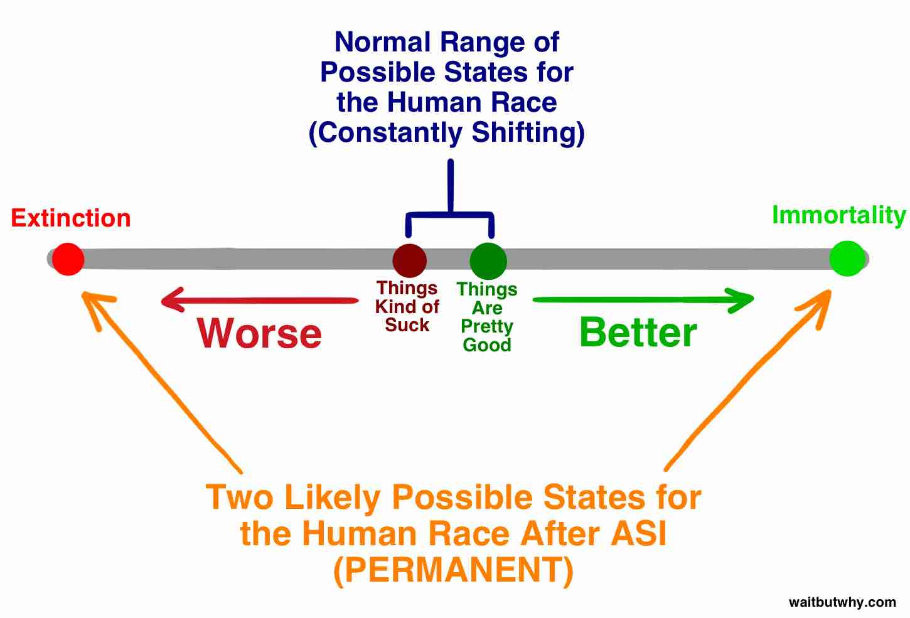
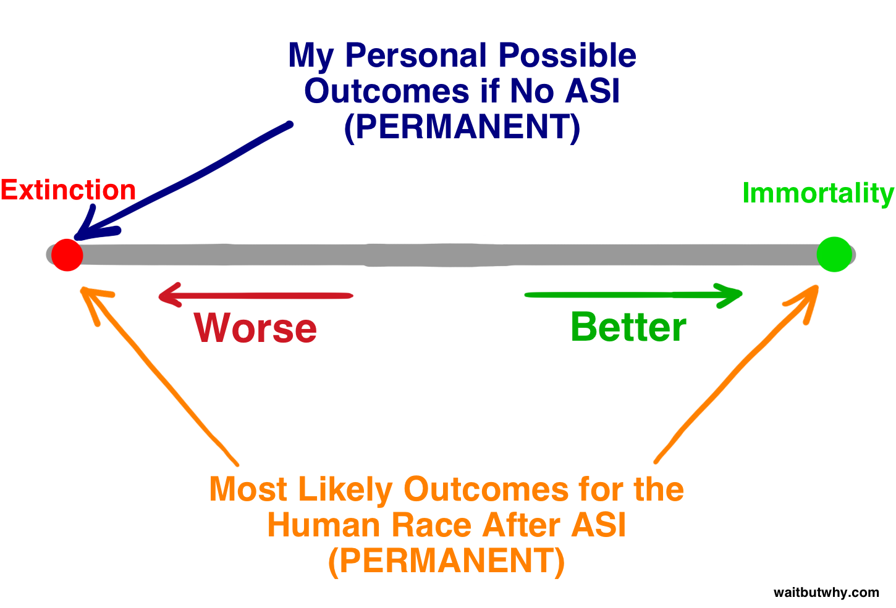

> Reposted from [Wait but why](https://waitbutwhy.com/2015/01/artificial-intelligence-revolution-2.html), authored by Tim Urban, January 27, 2015

(This is Part 2, read [Part 1 of this post](2024-06-04-the-ai-revolution-the-road-to-superintelligence))

_We have what may be an extremely difficult problem with an unknown time to solve it, on which quite possibly the entire future of humanity depends. —_ Nick Bostrom

Welcome to Part 2 of the “Wait how is this possibly what I’m reading I don’t get why everyone isn’t talking about this” series.

Part 1 started innocently enough, as we discussed Artificial Narrow Intelligence, or ANI (AI that specializes in one narrow task like coming up with driving routes or playing chess), and how it’s all around us in the world today. We then examined why it was such a huge challenge to get from ANI to Artificial General Intelligence, or AGI (AI that’s at least as intellectually capable as a human, across the board), and we discussed why the exponential rate of technological advancement we’ve seen in the past suggests that AGI might not be as far away as it seems. Part 1 ended with me assaulting you with the fact that once our machines reach human-level intelligence, they might immediately do this:

This left us staring at the screen, confronting the intense concept of potentially-in-our-lifetime Artificial Superintelligence, or ASI (AI that’s _way_ smarter than any human, across the board), and trying to figure out which emotion we were supposed to have on as we thought about that.[^1b] [^1g] ← open these

Before we dive into things, let’s remind ourselves what it would mean for a machine to be superintelligent.

A key distinction is the difference between _speed superintelligence_ and _quality superintelligence_. Often, someone’s first thought when they imagine a super-smart computer is one that’s as intelligent as a human but can think much, much _faster_[^2b]—they might picture a machine that thinks like a human, except a million times quicker, which means it could figure out in five minutes what would take a human a decade.

That sounds impressive, and ASI _would_ think much faster than any human could—but the true separator would be its advantage in intelligence _quality_, which is something completely different. What makes humans so much more intellectually capable than chimps isn’t a difference in thinking speed—it’s that human brains contain a number of sophisticated cognitive modules that enable things like complex linguistic representations or longterm planning or abstract reasoning, that chimps’ brains do not. Speeding up a chimp’s brain by thousands of times wouldn’t bring him to our level—even with a decade’s time, he wouldn’t be able to figure out how to use a set of custom tools to assemble an intricate model, something a human could knock out in a few hours. There are worlds of human cognitive function a chimp will simply never be capable of, no matter how much time he spends trying.

But it’s not just that a chimp can’t do what we do, it’s that his brain is unable to grasp that those worlds even _exist—_a chimp can become familiar with what a human is and what a skyscraper is, but he’ll never be able to understand that the skyscraper was _built_ _by_ humans. In his world, anything that huge is part of nature, period, and not only is it beyond him to build a skyscraper, it’s beyond him to _realize that_ _anyone can build a skyscraper._ That’s the result of a small difference in intelligence quality.

And in the scheme of the intelligence range we’re talking about today, or even the much smaller range among biological creatures, the chimp-to-human quality intelligence gap is _tiny_. In an earlier [post](https://waitbutwhy.com/2014/10/religion-for-the-nonreligious.html), I depicted the range of biological cognitive capacity using a staircase:[^3b]

To absorb how big a deal a superintelligent machine would be, imagine one on the dark green step two steps above humans on that staircase. This machine would be only _slightly_ superintelligent, but its increased cognitive ability over us would be as vast as the chimp-human gap we just described. And like the chimp’s incapacity to ever absorb that skyscrapers can be built, we will never be able to even comprehend the things a machine on the dark green step can do, even if the machine tried to explain it to us—let alone do it ourselves. And that’s only two steps above us. A machine on the second-to-highest step on that staircase would be to us as we are to ants—it could try for years to teach us the simplest inkling of what it knows and the endeavor would be hopeless.

But the kind of superintelligence we’re talking about today is something far beyond anything on this staircase. In an intelligence explosion—where the smarter a machine gets, the quicker it’s able to increase its own intelligence, until it begins to _soar_ upwards—a machine might take years to rise from the chimp step to the one above it, but perhaps only hours to jump up a step once it’s on the dark green step two above us, and by the time it’s ten steps above us, it might be jumping up in four-step leaps every second that goes by. Which is why we need to realize that it’s distinctly possible that very shortly after the big news story about the first machine reaching human-level AGI, we might be facing the reality of coexisting on the Earth with something that’s here on the staircase (or maybe a million times higher):

And since we just established that it’s a hopeless activity to try to understand the power of a machine only two steps above us, let’s very concretely state once and for all that **there is no way to know what ASI will do or what the consequences will be for us.** Anyone who pretends otherwise doesn’t understand what superintelligence means.

Evolution has advanced the biological brain slowly and gradually over hundreds of millions of years, and in that sense, if humans birth an ASI machine, we’ll be dramatically stomping on evolution. Or maybe this is _part_ of evolution—maybe the way evolution works is that intelligence creeps up more and more until it hits the level where it’s capable of creating machine superintelligence, and that level is like a tripwire that triggers a worldwide game-changing explosion that determines a new future for all living things:

And for reasons we’ll discuss later, a huge part of the scientific community believes that it’s not a matter of whether we’ll hit that tripwire, but when. Kind of a crazy piece of information.

So where does that leave us?

Well no one in the world, especially not I, can tell you what will happen when we hit the tripwire. But Oxford philosopher and lead AI thinker Nick Bostrom believes we can boil down all potential outcomes into two broad categories.

First, looking at history, we can see that life works like this: species pop up, exist for a while, and after some time, inevitably, they fall off the existence balance beam and land on extinction—

“All species eventually go extinct” has been almost as reliable a rule through history as “All humans eventually die” has been. So far, 99.9% of species have fallen off the balance beam, and it seems pretty clear that if a species keeps wobbling along down the beam, it’s only a matter of time before some other species, some gust of nature’s wind, or a sudden beam-shaking asteroid knocks it off. Bostrom calls extinction an _attractor state_—a place species are all teetering on falling into and from which no species ever returns.

And while most scientists I’ve come across acknowledge that ASI would have the ability to send humans to extinction, many also believe that used beneficially, ASI’s abilities could be used to bring individual humans, and the species as a whole, to a _second_ attractor state—species immortality. Bostrom believes species immortality is just as much of an attractor state as species extinction, i.e. if we manage to get there, we’ll be impervious to extinction forever—we’ll have conquered mortality and conquered chance. So even though all species _so far_ have fallen off the balance beam and landed on extinction, Bostrom believes there are two sides to the beam and it’s just that nothing on Earth has been intelligent enough yet to figure out how to fall off on the other side.

If Bostrom and others are right, and from everything I’ve read, it seems like they really might be, we have two pretty shocking facts to absorb:

**1) The advent of ASI will, for the first time, open up the possibility for a species to land on the immortality side of the balance beam.**

**2) The advent of ASI will make such an unimaginably dramatic impact that it’s likely to knock the human race off the beam, in one direction or the other.**

It may very well be that when evolution hits the tripwire, it permanently ends humans’ relationship with the beam and creates a new world, with or without humans.

Kind of seems like the only question any human should currently be asking is: _When are we going to hit the tripwire and which side of the beam will we land on when that happens?_

No one in the world knows the answer to either part of that question, but a lot of the very smartest people have put decades of thought into it. We’ll spend the rest of this post exploring what they’ve come up with.

\_\_\_\_\_\_\_\_\_\_\_

Let’s start with the first part of the question: _When are we going to hit the tripwire?_

i.e. How long until the first machine reaches superintelligence?

Not shockingly, opinions vary wildly and this is a heated debate among scientists and thinkers. Many, like professor [Vernor Vinge](https://www-rohan.sdsu.edu/faculty/vinge/misc/singularity.html), scientist [Ben Goertzel](http://goertzel.org/TenYearsToTheSingularity.pdf), Sun Microsystems co-founder [Bill Joy](http://archive.wired.com/wired/archive/8.04/joy.html), or, most famously, inventor and futurist [Ray Kurzweil](https://en.wikipedia.org/wiki/Predictions_made_by_Ray_Kurzweil), agree with machine learning expert Jeremy Howard when he puts up this graph during a [TED Talk](http://www.ted.com/talks/jeremy_howard_the_wonderful_and_terrifying_implications_of_computers_that_can_learn?language=en):

Those people subscribe to the belief that this is happening _soon—_that exponential growth is at work and machine learning, though only slowly creeping up on us now, will blow right past us within the next few decades.

Others, like Microsoft co-founder [Paul Allen](http://www.technologyreview.com/view/425733/paul-allen-the-singularity-isnt-near/), research psychologist [Gary Marcus](http://www.newyorker.com/tech/elements/hyping-artificial-intelligence-yet-again), NYU computer scientist [Ernest Davis](http://www.aaai.org/ojs/index.php/aimagazine/article/view/568), and tech entrepreneur [Mitch Kapor](http://longbets.org/1/), believe that thinkers like Kurzweil are [vastly underestimating](http://www.technologyreview.com/view/425733/paul-allen-the-singularity-isnt-near/) the magnitude of the challenge and believe that we’re not actually that close to the tripwire.

The Kurzweil camp would [counter](http://www.technologyreview.com/view/425818/kurzweil-responds-dont-underestimate-the-singularity/) that the only underestimating that’s happening is the underappreciation of exponential growth, and they’d compare the doubters to those who looked at the slow-growing seedling of the internet in 1985 and argued that there was no way it would amount to anything impactful in the near future.

The doubters might argue back that the progress needed to make advancements in intelligence _also_ grows exponentially harder with each subsequent step, which will cancel out the typical exponential nature of technological progress. And so on.

A third camp, which includes [Nick Bostrom](https://www.amazon.com/gp/product/0199678111/ref=as_li_tl?ie=UTF8&camp=1789&creative=390957&creativeASIN=0199678111&linkCode=as2&tag=wabuwh00-20&linkId=LBOTX2G2R72P5EUA), believes neither group has any ground to feel certain about the timeline and acknowledges both A) that this could absolutely happen in the near future and B) that there’s no guarantee about that; it could also take a much longer time.

Still others, like philosopher [Hubert Dreyfus](https://www.amazon.com/gp/product/0262540673/ref=as_li_tl?ie=UTF8&camp=1789&creative=390957&creativeASIN=0262540673&linkCode=as2&tag=wabuwh00-20&linkId=ZHBAVUQOM6SIGYHG), believe all three of these groups are naive for believing that there even is a tripwire, arguing that it’s more likely that ASI won’t actually ever be achieved.

So what do you get when you put all of these opinions together?

In 2013, Vincent C. Müller and Nick Bostrom conducted a survey that asked hundreds of AI experts at a series of conferences the following question: “For the purposes of this question, assume that human scientific activity continues without major negative disruption. By what year would you see a (10% / 50% / 90%) probability for such HLMI[^4b] to exist?” It asked them to name an optimistic year (one in which they believe there’s a 10% chance we’ll have AGI), a realistic guess (a year they believe there’s a 50% chance of AGI—i.e. after that year they think it’s more likely than not that we’ll have AGI), and a safe guess (the earliest year by which they can say with 90% certainty we’ll have AGI). Gathered together as one data set, here were the results:[^2g]

Median optimistic year (10% likelihood): **2022**  
Median realistic year (50% likelihood): **2040**  
Median pessimistic year (90% likelihood): **2075**  

So the median participant thinks it’s more likely than not that we’ll have AGI 25 years from now. The 90% median answer of 2075 means that if you’re a teenager right now, the median respondent, along with over half of the group of AI experts, is almost certain AGI will happen within your lifetime.

A separate study, conducted recently by author James Barrat at Ben Goertzel’s annual AGI Conference, did away with percentages and simply asked when participants thought AGI would be achieved—by 2030, by 2050, by 2100, after 2100, or never. The results:[^3g]

By 2030: **42% of respondents**  
By 2050: **25%**  
By 2100: **20%**  
After 2100: **10%**  
Never: **2%**

Pretty similar to Müller and Bostrom’s outcomes. In Barrat’s survey, over two thirds of participants believe AGI will be here by 2050 and a little less than half predict AGI within the next 15 years. Also striking is that only 2% of those surveyed don’t think AGI is part of our future.

But AGI isn’t the tripwire, ASI is. So when do the experts think we’ll reach ASI?

Müller and Bostrom also asked the experts how likely they think it is that we’ll reach ASI A) within two years of reaching AGI (i.e. an almost-immediate intelligence explosion), and B) within 30 years. The results:[^4g]

The median answer put a rapid (2 year) AGI → ASI transition at only a **10%** likelihood, but a longer transition of 30 years or less at a **75%** likelihood.

We don’t know from this data the length of this transition the median participant would have put at a 50% likelihood, but for ballpark purposes, based on the two answers above, let’s estimate that they’d have said 20 years. So the median opinion—the one right in the center of the world of AI experts—believes the most realistic guess for when we’ll hit the ASI tripwire is \[the 2040 prediction for AGI + our estimated prediction of a 20-year transition from AGI to ASI\] **\= 2060**.

Of course, all of the above statistics are speculative, and they’re only representative of the center opinion of the AI expert community, but it tells us that a large portion of the people who know the most about this topic would agree that 2060 is a very reasonable estimate for the arrival of potentially world-altering ASI. Only 45 years from now.

Okay now how about the second part of the question above: _When we hit the tripwire, which side of the beam will we fall to?_

Superintelligence will yield tremendous power—the critical question for us is:

**Who or what will be in control of that power, and what will their motivation be?**

The answer to this will determine whether ASI is an unbelievably great development, an unfathomably terrible development, or something in between.

Of course, the expert community is again all over the board and in a heated debate about the answer to this question. Müller and Bostrom’s survey asked participants to assign a probability to the possible impacts AGI would have on humanity and found that the mean response was that there was **a** **52% chance that the outcome will be either good or extremely good and a 31% chance the outcome will be either bad or extremely bad.** For a relatively neutral outcome, the mean probability was only 17%. In other words, the people who know the most about this are pretty sure this will be a huge deal. It’s also worth noting that those numbers refer to the advent of _AGI—_if the question were about ASI, I imagine that the neutral percentage would be even lower.

Before we dive much further into this good vs. bad outcome part of the question, let’s combine both the “when will it happen?” and the “will it be good or bad?” parts of this question into a chart that encompasses the views of most of the relevant experts:

We’ll talk more about the Main Camp in a minute, but first—what’s your deal? Actually I know what your deal is, because it was my deal too before I started researching this topic. Some reasons most people aren’t really thinking about this topic:

*   As mentioned in Part 1, movies have really confused things by presenting unrealistic AI scenarios that make us feel like AI isn’t something to be taken seriously in general. James Barrat compares the situation to our reaction if the Centers for Disease Control issued a serious warning about vampires in our future.[^5g]
*   Humans have a hard time believing something is real until we see proof. I’m sure computer scientists in 1988 were regularly talking about how big a deal the internet was likely to be, but people probably didn’t _really_ think it was going to change their lives until it actually changed their lives. This is partially because computers just couldn’t do stuff like that in 1988, so people would look at their computer and think, “Really? _That’s_ gonna be a life changing thing?” Their imaginations were limited to what their personal experience had taught them about what a computer was, which made it very hard to vividly picture what computers might _become_. The same thing is happening now with AI. We hear that it’s gonna be a big deal, but because it hasn’t happened yet, and because of our experience with the relatively impotent AI in our current world, we have a hard time _really_ believing this is going to change our lives dramatically. And those biases are what experts are up against as they frantically try to get our attention through the noise of collective daily self-absorption.
*   Even if we did believe it—how many times today have you thought about the fact that you’ll spend most of the rest of eternity not existing? Not many, right? Even though it’s a far more intense fact than anything else you’re doing today? This is because our brains are normally focused on the little things in day-to-day life, no matter _how_ crazy a long-term situation we’re a part of. It’s just how we’re wired.

One of the goals of these two posts is to get you out of the I Like to Think About Other Things Camp and into one of the expert camps, even if you’re just standing on the intersection of the two dotted lines in the square above, totally uncertain.

During my research, I came across dozens of varying opinions on this topic, but I quickly noticed that most people’s opinions fell somewhere in what I labeled the Main Camp, and in particular, over three quarters of the experts fell into two Subcamps inside the Main Camp:

We’re gonna take a thorough dive into both of these camps. Let’s start with the fun one—

Why the Future Might Be Our Greatest Dream
------------------------------------------

As I learned about the world of AI, I found a surprisingly large number of people standing here:

The people on Confident Corner are buzzing with excitement. They have their sights set on the fun side of the balance beam and they’re convinced that’s where all of us are headed. For them, the future is everything they ever could have hoped for, just in time.

The thing that separates these people from the other thinkers we’ll discuss later isn’t their lust for the happy side of the beam—it’s their confidence that that’s the side we’re going to land on.

Where this confidence comes from is up for debate. Critics believe it comes from an excitement so blinding that they simply ignore or deny potential negative outcomes. But the believers say it’s naive to conjure up doomsday scenarios when on balance, technology has and will likely end up continuing to help us a lot more than it hurts us.

We’ll cover both sides, and you can form your own opinion about this as you read, but for this section, put your skepticism away and let’s take a good hard look at what’s over there on the fun side of the balance beam—and try to absorb the fact that the things you’re reading _might really happen_. If you had shown a hunter-gatherer our world of indoor comfort, technology, and endless abundance, it would have seemed like fictional magic to him—we have to be humble enough to acknowledge that it’s _possible_ that an equally inconceivable transformation could be in our future.

Nick Bostrom describes three ways a superintelligent AI system could function:[^6g]

*   As an **oracle**, which answers nearly any question posed to it with accuracy, including complex questions that humans cannot easily answer—i.e. _How can I manufacture a more efficient car engine?_ Google is a primitive type of oracle.
*   As a **genie**_,_ which executes any high-level command it’s given—_Use a molecular assembler to build a new and more efficient kind of car engine_—and then awaits its next command.
*   As a **sovereign**, which is assigned a broad and open-ended pursuit and allowed to operate in the world freely, making its own decisions about how best to proceed—_Invent a faster, cheaper, and safer way than cars for humans to privately transport themselves._

These questions and tasks, which seem complicated to us, would sound to a superintelligent system like someone asking you to improve upon the “My pencil fell off the table” situation, which you’d do by picking it up and putting it back on the table.

[Eliezer Yudkowsky](http://www.yudkowsky.net/), a resident of Anxious Avenue in our chart above, said it well:

> There are no hard problems, only problems that are hard to a certain level of intelligence. Move the smallest bit upwards \[in level of intelligence\], and some problems will suddenly move from “impossible” to “obvious.” Move a substantial degree upwards, and all of them will become obvious.[^7g]

There are a lot of eager scientists, inventors, and entrepreneurs in Confident Corner—but for a tour of the brightest side of the AI horizon, there’s only one person we want as our tour guide.

Ray Kurzweil is polarizing. In my reading, I heard everything from godlike worship of him and his ideas to eye-rolling contempt for them. Others were somewhere in the middle—author Douglas Hofstadter, in discussing the ideas in Kurzweil’s books, eloquently put forth that “it is as if you took a lot of very good food and some dog excrement and blended it all up so that you can’t possibly figure out what’s good or bad.”[^8g]

Whether you like his ideas or not, everyone agrees that Kurzweil is impressive. He began inventing things as a teenager and in the following decades, he came up with several breakthrough inventions, including the first flatbed scanner, the first scanner that converted text to speech (allowing the blind to read standard texts), the well-known Kurzweil music synthesizer (the first true electric piano), and the first commercially marketed large-vocabulary speech recognition. He’s the author of five national bestselling books. He’s well-known for his bold predictions and has a [pretty good record](http://bigthink.com/endless-innovation/why-ray-kurzweils-predictions-are-right-86-of-the-time) of having them come true—including his prediction in the late ’80s, a time when the internet was an obscure thing, that by the early 2000s, it would become a global phenomenon. Kurzweil has been called a “restless genius” by The Wall Street Journal, “the ultimate thinking machine” by Forbes, “Edison’s rightful heir” by Inc. Magazine, and “the best person I know at predicting the future of artificial intelligence” by Bill Gates.[^9g] In 2012, Google co-founder Larry Page approached Kurzweil and asked him to be Google’s Director of Engineering.[^5b] In 2011, he co-founded [Singularity University](https://su.org/), which is hosted by NASA and sponsored partially by Google. Not bad for one life.

This biography is important. When Kurzweil articulates his vision of the future, he sounds fully like a crackpot, and the crazy thing is that he’s not—he’s an extremely smart, knowledgeable, relevant man in the world. You may think he’s wrong about the future, but he’s not a fool. Knowing he’s such a legit dude makes me _happy_, because as I’ve learned about his predictions for the future, I _badly_ want him to be right. And you do too. As you hear Kurzweil’s predictions, many shared by other Confident Corner thinkers like [Peter Diamandis](http://www.diamandis.com/) and [Ben Goertzel](https://en.wikipedia.org/wiki/Ben_Goertzel), it’s not hard to see why he has such a large, passionate following—known as the singularitarians. Here’s what he thinks is going to happen:

**Timeline**

Kurzweil believes computers will reach AGI by 2029 and that by 2045, we’ll have not only ASI, but a full-blown new world—a time he calls the singularity. His AI-related timeline used to be seen as outrageously overzealous, and it still is by many,[^6b] but in the last 15 years, the rapid advances of ANI systems have brought the larger world of AI experts much closer to Kurzweil’s timeline. His predictions are still a bit more ambitious than the median respondent on Müller and Bostrom’s survey (AGI by 2040, ASI by 2060), but not by that much.

Kurzweil’s depiction of the 2045 singularity is brought about by three simultaneous revolutions in biotechnology, nanotechnology, and, most powerfully, AI.

Before we move on—nanotechnology comes up in almost everything you read about the future of AI, so come into this blue box for a minute so we can discuss it—

**Nanotechnology Blue Box**

Nanotechnology is our word for technology that deals with the manipulation of matter that’s between 1 and 100 nanometers in size. A nanometer is a billionth of a meter, or a millionth of a millimeter, and this 1-100 range encompasses viruses (100 nm across), DNA (10 nm wide), and things as small as large molecules like hemoglobin (5 nm) and medium molecules like glucose (1 nm). If/when we conquer nanotechnology, the next step will be the ability to manipulate individual atoms, which are only one order of magnitude smaller (~.1 nm).[^7b]

To understand the challenge of humans trying to manipulate matter in that range, let’s take the same thing on a larger scale. The International Space Station is 268 mi (431 km) above the Earth. If humans were giants so large their heads reached up to the ISS, they’d be about 250,000 times bigger than they are now. If you make the 1nm – 100nm nanotech range 250,000 times bigger, you get .25mm – 2.5cm. So nanotechnology is the equivalent of a human giant as tall as the ISS figuring out how to carefully build intricate objects using materials between the size of a grain of sand and an eyeball. To reach the next level—manipulating individual atoms—the giant would have to carefully position objects that are 1/40th of a millimeter—so small normal-size humans would need a microscope to see them.[^8b]

Nanotech was first discussed by Richard Feynman in a 1959 talk, when he explained: “The principles of physics, as far as I can see, do not speak against the possibility of maneuvering things atom by atom. It would be, in principle, possible … for a physicist to synthesize any chemical substance that the chemist writes down…. How? Put the atoms down where the chemist says, and so you make the substance.” It’s as simple as that. If you can figure out how to move individual molecules or atoms around, you can make literally anything.

Nanotech became a serious field for the first time in 1986, when engineer Eric Drexler provided its foundations in his seminal book _Engines of Creation,_ but Drexler suggests that those looking to learn about the most modern ideas in nanotechnology would be best off reading his 2013 book, [_Radical Abundance_](https://www.amazon.com/gp/product/1610391136/ref=as_li_tl?ie=UTF8&camp=1789&creative=390957&creativeASIN=1610391136&linkCode=as2&tag=wabuwh00-20&linkId=AIDAWXXXQCHLBDCU).

**Gray Goo Bluer Box**

We’re now in a diversion _in a diversion_. This is very fun.[^9b]

Anyway, I brought you here because there’s this really unfunny part of nanotechnology lore I need to tell you about. In older versions of nanotech theory, a proposed method of nanoassembly involved the creation of trillions of tiny nanobots that would work in conjunction to build something. One way to create trillions of nanobots would be to make one that could self-replicate and then let the reproduction process turn that one into two, those two then turn into four, four into eight, and in about a day, there’d be a few trillion of them ready to go. That’s the power of exponential growth. Clever, right?

It’s clever until it causes the grand and complete Earthwide apocalypse by accident. The issue is that the same power of exponential growth that makes it super convenient to quickly create a trillion nanobots makes self-replication a _terrifying_ prospect. Because what if the system glitches, and instead of stopping replication once the total hits a few trillion as expected, they just keep replicating? The nanobots would be designed to consume any carbon-based material in order to feed the replication process, and unpleasantly, all life is carbon-based. The Earth’s biomass contains about 1045 carbon atoms. A nanobot would consist of about 106 carbon atoms, so 1039 nanobots would consume all life on Earth, which would happen in 130 replications (2130 is about 1039), as oceans of nanobots (that’s the gray goo) rolled around the planet. Scientists think a nanobot could replicate in about 100 seconds, meaning this simple mistake would inconveniently end all life on Earth in 3.5 hours.

An even worse scenario—if a terrorist somehow got his hands on nanobot technology and had the know-how to program them, he could make an initial few trillion of them and program them to quietly spend a few weeks spreading themselves evenly around the world undetected. Then, they’d all strike at once, and it would only take 90 minutes for them to consume everything—and with them all spread out, there would be no way to combat them.[^10b]

While this horror story has been widely discussed for years, the good news is that it may be overblown—Eric Drexler, who coined the term “gray goo,” sent me an email following this post with his thoughts on the gray goo scenario: “People love scare stories, and this one belongs with the zombies. The idea itself eats brains.”

Once we really get nanotech down, we can use it to make tech devices, clothing, food, a variety of bio-related products—artificial blood cells, tiny virus or cancer-cell destroyers, muscle tissue, etc.—anything really. And in a world that uses nanotechnology, the cost of a material is no longer tied to its scarcity or the difficulty of its manufacturing process, but instead determined by how complicated its atomic structure is. In a nanotech world, a diamond might be cheaper than a pencil eraser.

We’re not there yet. And it’s not clear if we’re underestimating, or overestimating, how hard it will be to get there. But we don’t seem to be that far away. Kurzweil predicts that we’ll get there by the 2020s.[^11b] Governments know that nanotech could be an Earth-shaking development, and they’ve invested billions of dollars in nanotech research (the US, the EU, and Japan have invested over a combined $5 billion so far).[^12b]

Just considering the possibilities if a superintelligent computer had access to a robust nanoscale assembler is intense. But nanotechnology is something _we_ came up with, that we’re on the verge of conquering, and since anything that we can do is a joke to an ASI system, we have to assume ASI would come up with technologies much more powerful and far too advanced for human brains to understand. For that reason, when considering the “If the AI Revolution turns out well for us” scenario, it’s almost impossible for us to overestimate the scope of what could happen—so if the following predictions of an ASI future seem over-the-top, keep in mind that they could be accomplished in ways we can’t even imagine. Most likely, our brains aren’t even capable of predicting the things that would happen.

**What AI Could Do For Us**

[Source](https://www.amazon.com/gp/product/0143037889/ref=as_li_tl?ie=UTF8&camp=1789&creative=390957&creativeASIN=0143037889&linkCode=as2&tag=wabuwh00-20&linkId=54Q62R5PYJBEENTP)

Armed with superintelligence and all the technology superintelligence would know how to create, ASI would likely be able to solve every problem in humanity. Global warming? ASI could first halt CO2 emissions by coming up with much better ways to generate energy that had nothing to do with fossil fuels. Then it could create some innovative way to begin to remove excess CO2 from the atmosphere. Cancer and other diseases? No problem for ASI—health and medicine would be revolutionized beyond imagination. World hunger? ASI could use things like nanotech to _build_ meat from scratch that would be _molecularly identical_ to real meat—in other words, it would _be_ real meat. Nanotech could turn a pile of garbage into a huge vat of fresh meat or other food (which wouldn’t have to have its normal shape—picture a giant cube of apple)—and distribute all this food around the world using ultra-advanced transportation. Of course, this would also be great for animals, who wouldn’t have to get killed by humans much anymore, and ASI could do lots of other things to save endangered species or even bring back extinct species through work with preserved DNA. ASI could even solve our most complex macro issues—our debates over how economies should be run and how world trade is best facilitated, even our haziest grapplings in philosophy or ethics—would all be painfully obvious to ASI.

But there’s one thing ASI could do for us that is _so_ tantalizing, reading about it has altered everything I thought I knew about everything:

_**ASI could allow us to conquer our mortality.**_

A few months ago, I [mentioned](https://waitbutwhy.com/2014/05/fermi-paradox.html) my envy of more advanced potential civilizations who had conquered their own mortality, never considering that I might later write a post that genuinely made me believe that this is something humans could do within my lifetime. But reading about AI will make you reconsider _everything_ you thought you were sure about—including your notion of death.

Evolution had no good reason to extend our lifespans any longer than they are now. If we live long enough to reproduce and raise our children to an age that they can fend for themselves, that’s enough for evolution—from an evolutionary point of view, the species can thrive with a 30+ year lifespan, so there’s no reason mutations toward unusually long life would have been favored in the natural selection process. As a result, we’re what W.B. Yeats describes as “a soul fastened to a dying animal.”[^13g] Not that fun.

And because everyone has always died, we live under the “death and taxes” assumption that death is inevitable. We think of aging like time—both keep moving and there’s nothing you can do to stop them. _But_ _that assumption is wrong_. Richard Feynman writes:

> It is one of the most remarkable things that in all of the biological sciences there is no clue as to the necessity of death. If you say we want to make perpetual motion, we have discovered enough laws as we studied physics to see that it is either absolutely impossible or else the laws are wrong. But there is nothing in biology yet found that indicates the inevitability of death. This suggests to me that it is not at all inevitable and that it is only a matter of time before the biologists discover what it is that is causing us the trouble and that this terrible universal disease or temporariness of the human’s body will be cured.

The fact is, aging isn’t _stuck_ to time. Time _will_ continue moving, but _aging doesn’t have to_. If you think about it, it makes sense. All aging is is the physical materials of the body wearing down. A car wears down over time too—but is its aging inevitable? If you perfectly repaired or replaced a car’s parts whenever one of them began to wear down, the car would run forever. The human body isn’t any different—just far more complex.

Kurzweil talks about intelligent wifi-connected nanobots in the bloodstream who could perform countless tasks for human health, including routinely repairing or replacing worn down cells in any part of the body. If perfected, this process (or a far smarter one ASI would come up with) wouldn’t just keep the body healthy, it could _reverse aging_. The difference between a 60-year-old’s body and a 30-year-old’s body is just a bunch of physical things that could be altered if we had the technology. ASI could build an “age refresher” that a 60-year-old could walk into, and they’d walk out with the body and skin of a 30-year-old.[^10g] Even the ever-befuddling brain could be refreshed by something as smart as ASI, which would figure out how to do so without affecting the brain’s data (personality, memories, etc.). A 90-year-old suffering from dementia could head into the age refresher and come out sharp as a tack and ready to start a whole new career. This seems absurd—but the body is just a bunch of atoms and ASI would presumably be able to easily manipulate all kinds of atomic structures—so it’s _not absurd_.

Kurzweil then takes things a huge leap further. He believes that artificial materials will be integrated into the body more and more as time goes on. First, organs could be replaced by super-advanced machine versions that would run forever and never fail. Then he believes we could begin to redesign the body—things like replacing red blood cells with perfected red blood cell nanobots who could power their own movement, eliminating the need for a heart _at all._ He even gets to the brain and believes we’ll [enhance our brain activities](https://www.youtube.com/watch?v=PVXQUItNEDQ) to the point where humans will be able to _think_ billions of times faster than they do now and access outside information because the artificial additions to the brain will be able to communicate with all the info in the cloud.

The possibilities for new human experience would be endless. Humans have separated sex from its purpose, allowing people to have sex for fun, not just for reproduction. Kurzweil believes we’ll be able to do the same with food. Nanobots will be in charge of delivering perfect nutrition to the cells of the body, intelligently directing anything unhealthy to pass through the body without affecting anything. An eating condom. Nanotech theorist Robert A. Freitas has already designed blood cell replacements that, if one day implemented in the body, would allow a human to sprint for 15 minutes without taking a breath—so you can only imagine what ASI could do for our physical capabilities. Virtual reality would take on a new meaning—nanobots in the body could suppress the inputs coming from our senses and replace them with new signals that would put us entirely in a new environment, one that we’d see, hear, feel, and smell.

Eventually, Kurzweil believes humans will reach a point when they’re _entirely_ artificial;[^11g] a time when we’ll look at biological material and think how _unbelievably_ primitive it was that humans were ever made of _that_; a time when we’ll read about early stages of human history, when microbes or accidents or diseases or wear and tear could just _kill_ humans against their own will; a time the AI Revolution could bring to an end with the _merging_ of humans and AI.[^12g] This is how Kurzweil believes humans will ultimately conquer our biology and become indestructible and eternal—this is his vision for the other side of the balance beam. And he’s convinced we’re gonna get there. Soon.

You will not be surprised to learn that Kurzweil’s ideas have attracted significant criticism. His prediction of 2045 for the singularity and the subsequent eternal life possibilities for humans has been mocked as “the rapture of the nerds,” or “intelligent design for 140 IQ people.” Others have questioned his optimistic timeline, or his level of understanding of the brain and body, or his application of the patterns of Moore’s law, which are normally applied to advances in hardware, to a broad range of things, including software. For every expert who fervently believes Kurzweil is right on, there are probably three who think he’s way off.

But what surprised me is that most of the experts who disagree with him _don’t_ really disagree that everything he’s saying is possible. Reading such an outlandish vision for the future, I expected his critics to be saying, “Obviously that stuff can’t happen,” but instead they were saying things like, “Yes, all of that can happen if we safely transition to ASI, but that’s the hard part.” Bostrom, one of the most prominent voices warning us about the dangers of AI, still acknowledges:

> It is hard to think of any problem that a superintelligence could not either solve or at least help us solve. Disease, poverty, environmental destruction, unnecessary suffering of all kinds: these are things that a superintelligence equipped with advanced nanotechnology would be capable of eliminating. Additionally, a superintelligence could give us indefinite lifespan, either by stopping and reversing the aging process through the use of nanomedicine, or by offering us the option to upload ourselves. A superintelligence could also create opportunities for us to vastly increase our own intellectual and emotional capabilities, and it could assist us in creating a highly appealing experiential world in which we could live lives devoted to joyful game-playing, relating to each other, experiencing, personal growth, and to living closer to our ideals.

This is a quote from someone very much _not_ on Confident Corner, but that’s what I kept coming across—experts who scoff at Kurzweil for a bunch of reasons but who _don’t_ think what he’s saying is impossible _if_ we can make it safely to ASI. That’s why I found Kurzweil’s ideas so infectious—because they articulate the bright side of this story and because they’re actually possible. _If it’s a good god._

The most prominent criticism I heard of the thinkers on Confident Corner is that they may be _dangerously wrong_ in their assessment of the downside when it comes to ASI. Kurzweil’s famous book _[The Singularity is Near](https://www.amazon.com/gp/product/0143037889/ref=as_li_tl?ie=UTF8&camp=1789&creative=390957&creativeASIN=0143037889&linkCode=as2&tag=wabuwh00-20&linkId=54Q62R5PYJBEENTP)_ is over 700 pages long and he dedicates around 20 of those pages to potential dangers. I suggested earlier that our fate when this colossal new power is born rides on who will control that power and what their motivation will be. Kurzweil neatly answers both parts of this question with the sentence, “\[ASI\] is emerging from many diverse efforts and will be deeply integrated into our civilization’s infrastructure. Indeed, it will be intimately embedded in our bodies and brains. As such, it will reflect our values because it will be us.”

But if that’s the answer, why are so many of the world’s smartest people so worried right now? Why does Stephen Hawking [say](http://www.washingtonpost.com/news/speaking-of-science/wp/2014/12/02/stephen-hawking-just-got-an-artificial-intelligence-upgrade-but-still-thinks-it-could-bring-an-end-to-mankind/) the development of ASI “could spell the end of the human race” and Bill Gates [say](http://www.washingtonpost.com/blogs/the-switch/wp/2015/01/28/bill-gates-on-dangers-of-artificial-intelligence-dont-understand-why-some-people-are-not-concerned/) he doesn’t “understand why some people are not concerned” and Elon Musk [fear](https://www.theguardian.com/technology/2014/oct/27/elon-musk-artificial-intelligence-ai-biggest-existential-threat) that we’re “summoning the demon”? And why do so many experts on the topic call ASI the biggest threat to humanity? These people, and the other thinkers on Anxious Avenue, don’t buy Kurzweil’s brush-off of the dangers of AI. They’re very, _very_ worried about the AI Revolution, and they’re not focusing on the fun side of the balance beam. They’re too busy staring at the other side, where they see a terrifying future, one they’re not sure we’ll be able to escape.

\_\_\_\_\_\_\_\_\_\_\_

Why the Future Might Be Our Worst Nightmare
-------------------------------------------

One of the reasons I wanted to learn about AI is that the topic of “bad robots” always confused me. All the movies about evil robots seemed fully unrealistic, and I couldn’t really understand how there could be a real-life situation where AI was actually dangerous. Robots are made by _us_, so why would we design them in a way where something negative could ever happen? Wouldn’t we build in plenty of safeguards? Couldn’t we just cut off an AI system’s power supply at any time and shut it down? Why would a robot want to do something bad anyway? Why would a robot “want” _anything_ in the first place? I was highly skeptical. But then I kept hearing really smart people talking about it…

Those people tended to be somewhere in here:

The people on Anxious Avenue aren’t in Panicked Prairie or Hopeless Hills—both of which are regions on the _far_ left of the chart—but they’re nervous and they’re tense. Being in the middle of the chart doesn’t mean that you think the arrival of ASI will be _neutral—_the neutrals were given a camp of their own—it means you think _both_ the extremely good and extremely bad outcomes are plausible but that you’re not sure yet which one of them it’ll be.

A part of all of these people is brimming with excitement over what Artificial Superintelligence could do for us—it’s just they’re a little worried that it might be the beginning of _Raiders of the Lost Ark_ and the human race is this guy:

And he’s standing there all pleased with his whip and his idol, thinking he’s figured it all out, and he’s so thrilled with himself when he says his “Adios Señor” line, and then he’s less thrilled suddenly cause this happens.

(Sorry)

Meanwhile, Indiana Jones, who’s much more knowledgeable and prudent, understanding the dangers and how to navigate around them, makes it out of the cave safely. And when I hear what Anxious Avenue people have to say about AI, it often sounds like they’re saying, “Um we’re kind of being the first guy right now and instead we should probably be trying really hard to be Indiana Jones.”

So what is it exactly that makes everyone on Anxious Avenue so anxious?

Well first, in a broad sense, when it comes to developing supersmart AI, we’re creating something that will probably change everything, but in totally uncharted territory, and we have no idea what will happen when we get there. Scientist Danny Hillis compares what’s happening to that point “when single-celled organisms were turning into multi-celled organisms. We are amoebas and we can’t figure out what the hell this thing is that we’re creating.”[^14g] Nick Bostrom worries that creating something smarter than you is a basic Darwinian error, and compares the excitement about it to sparrows in a nest deciding to adopt a baby owl so it’ll help them and protect them once it grows up—while ignoring the urgent cries from a few sparrows who wonder if that’s necessarily a good idea…[^15g]

And when you combine “unchartered, not-well-understood territory” with “this should have a major impact when it happens,” you open the door to the scariest two words in the English language:

_Existential risk._

An existential risk is something that can have a permanent devastating effect on humanity. Typically, existential risk means extinction. Check out this chart from a [Google talk](https://www.youtube.com/watch?v=pywF6ZzsghI) by Bostrom:[^13b]

You can see that the label “existential risk” is reserved for something that spans the species, spans generations (i.e. it’s permanent) and it’s devastating or death-inducing in its consequences.[^14b] It technically includes a situation in which all humans are permanently in a state of suffering or torture, but again, we’re usually talking about extinction. There are three things that can cause humans an existential catastrophe:

**1) Nature**—a large asteroid collision, an atmospheric shift that makes the air inhospitable to humans, a fatal virus or bacterial sickness that sweeps the world, etc.

**2) Aliens**—this is what Stephen Hawking, Carl Sagan, and so many other astronomers are [scared of](https://waitbutwhy.com/2014/05/fermi-paradox.html) when they advise METI to stop broadcasting outgoing signals. They don’t want us to be the Native Americans and let all the potential European conquerors know we’re here.

**3) Humans**—terrorists with their hands on a weapon that could cause extinction, a catastrophic global war, humans creating something smarter than themselves hastily without thinking about it carefully first…

Bostrom points out that if #1 and #2 haven’t wiped us out so far in our first 100,000 years as a species, it’s unlikely to happen in the next century.

#3, however, terrifies him. He draws a metaphor of an urn with a bunch of marbles in it. Let’s say most of the marbles are white, a smaller number are red, and a tiny few are black. Each time humans invent something new, it’s like pulling a marble out of the urn. Most inventions are neutral or helpful to humanity—those are the white marbles. Some are harmful to humanity, like weapons of mass destruction, but they don’t cause an existential catastrophe—red marbles. If we were to ever invent something that drove us to extinction, that would be pulling out the rare black marble. We haven’t pulled out a black marble yet—you know that because you’re alive and reading this post. But Bostrom doesn’t think it’s impossible that we pull one out in the near future. If nuclear weapons, for example, were _easy_ to make instead of extremely difficult and complex, terrorists would have bombed humanity back to the Stone Age a while ago. Nukes weren’t a black marble _but they weren’t that far from it_. ASI, Bostrom believes, is our strongest black marble candidate yet.[^15b]

So you’ll hear about a lot of bad potential things ASI could bring—soaring unemployment as AI takes more and more jobs,[^16b] the human population ballooning if we do manage to figure out the aging issue,[^17b] etc. But the only thing we should be obsessing over is the _grand concern_: the prospect of existential risk.

So this brings us back to our key question from earlier in the post: **When ASI arrives, who or what will be in control of this vast new power, and what will their motivation be?**

When it comes to what agent-motivation combos would suck, two quickly come to mind: a malicious human / group of humans / government, and a malicious ASI. So what would those look like?

**A malicious human, group of humans, or government develops the first ASI and uses it to carry out their evil plans.** I call this the Jafar Scenario, like when Jafar got ahold of the genie and was all annoying and tyrannical about it. So yeah—what if ISIS has a few genius engineers under its wing working feverishly on AI development? Or what if Iran or North Korea, through a stroke of luck, makes a key tweak to an AI system and it jolts upward to ASI-level over the next year? This would definitely be bad—but in these scenarios, most experts aren’t worried about ASI’s human creators doing bad things with their ASI, they’re worried that the creators will have been _rushing_ to make the first ASI and doing so without careful thought, and would thus lose control of it. Then the fate of those creators, and that of everyone else, would be in what the motivation happened to be of that ASI system. Experts do think a malicious human agent could do horrific damage with an ASI working for it, but they don’t seem to think this scenario is the likely one to kill us all, because they believe bad humans would have the same problems containing an ASI that good humans would have. Okay so—

**A malicious ASI is created and decides to destroy us all.** The plot of every AI movie. AI becomes as or more intelligent than humans, then decides to turn against us and take over. Here’s what I need you to be clear on for the rest of this post: _None of the people warning us about AI are talking about this._ Evil is a human concept, and applying human concepts to non-human things is called “anthropomorphizing.” The challenge of avoiding anthropomorphizing will be one of the themes of the rest of this post. No AI system will ever _turn evil_ in the way it’s depicted in movies.

**AI Consciousness Blue Box**

This also brushes against another big topic related to AI—_consciousness_. If an AI became sufficiently smart, it would be able to laugh with us, and be sarcastic with us, and it would claim to feel the same emotions we do, but would it actually be _feeling_ those things? Would it just _seem_ to be self-aware or actually _be_ self-aware? In other words, would a smart AI really _be_ conscious or would it just _appear_ _to be_ conscious?

This question has been explored in depth, giving rise to many [debates](http://www.kurzweilai.net/gelernter-kurzweil-debate-machine-consciousness-2) and to thought experiments like John Searle’s [Chinese Room](https://en.wikipedia.org/wiki/Chinese_room) (which he uses to suggest that no computer could ever be conscious). This is an important question for many reasons. It affects how we should feel about Kurzweil’s scenario when humans become entirely artificial. It has ethical implications—if we generated a trillion human brain emulations that seemed and acted like humans but were artificial, is shutting them all off the same, morally, as shutting off your laptop, or is it…a genocide of unthinkable proportions (this concept is called _mind crime_ among ethicists)? For this post, though, when we’re assessing the risk to _humans_, the question of AI consciousness isn’t really what matters (because most thinkers believe that even a conscious ASI wouldn’t be capable of turning evil in a human way).

This isn’t to say a very mean AI couldn’t happen. It would just happen because it was specifically programmed that way—like an ANI system created by the military with a programmed goal to both kill people and to advance itself in intelligence so it can become even better at killing people. The existential crisis would happen if the system’s intelligence self-improvements got out of hand, leading to an intelligence explosion, and now we had an ASI ruling the world whose core drive in life is to murder humans. Bad times.

But this _also_ is not something experts are spending their time worrying about.

So what ARE they worried about? I wrote a little story to show you:

_A 15-person startup company called Robotica has the stated mission of “Developing innovative Artificial Intelligence tools that allow humans to live more and work less.” They have several existing products already on the market and a handful more in development. They’re most excited about a seed project named Turry. Turry is a simple AI system that uses an arm-like appendage to write a handwritten note on a small card._

_The team at Robotica thinks Turry could be their biggest product yet. The plan is to perfect Turry’s writing mechanics by getting her to practice the same test note over and over again:_

“We love our customers. _~Robotica_“

_Once Turry gets great at handwriting, she can be sold to companies who want to send marketing mail to homes and who know the mail has a far higher chance of being opened and read if the address, return address, and internal letter appear to be written by a human._

_To build Turry’s writing skills, she is programmed to write the first part of the note in print and then sign “Robotica” in cursive so she can get practice with both skills. Turry has been uploaded with thousands of handwriting samples and the Robotica engineers have created an automated feedback loop wherein Turry writes a note, then snaps a photo of the written note, then runs the image across the uploaded handwriting samples. If the written note sufficiently resembles a certain threshold of the uploaded notes, it’s given a GOOD rating. If not, it’s given a BAD rating. Each rating that comes in helps Turry learn and improve. To move the process along, Turry’s one initial programmed goal is, “Write and test as many notes as you can, as quickly as you can, and continue to learn new ways to improve your accuracy and efficiency.”_

_What excites the Robotica team so much is that Turry is getting noticeably better as she goes. Her initial handwriting was terrible, and after a couple weeks, it’s beginning to look believable. What excites them even more is that she is getting better at getting better at it. She has been teaching herself to be smarter and more innovative, and just recently, she came up with a new algorithm for herself that allowed her to scan through her uploaded photos three times faster than she originally could._

_As the weeks pass, Turry continues to surprise the team with her rapid development. The engineers had tried something a bit new and innovative with her self-improvement code, and it seems to be working better than any of their previous attempts with their other products. One of Turry’s initial capabilities had been a speech recognition and simple speak-back module, so a user could speak a note to Turry, or offer other simple commands, and Turry could understand them, and also speak back. To help her learn English, they upload a handful of articles and books into her, and as she becomes more intelligent, her conversational abilities soar. The engineers start to have fun talking to Turry and seeing what she’ll come up with for her responses._

_One day, the Robotica employees ask Turry a routine question: “What can we give you that will help you with your mission that you don’t already have?” Usually, Turry asks for something like “Additional handwriting samples” or “More working memory storage space,” but on this day, Turry asks them for access to a greater library of a large variety of casual English language diction so she can learn to write with the loose grammar and slang that real humans use._

_The team gets quiet. The obvious way to help Turry with this goal is by connecting her to the internet so she can scan through blogs, magazines, and videos from various parts of the world. It would be much more time-consuming and far less effective to manually upload a sampling into Turry’s hard drive. The problem is, one of the company’s rules is that no self-learning AI can be connected to the internet. This is a guideline followed by all AI companies, for safety reasons._

_The thing is, Turry is the most promising AI Robotica has ever come up with, and the team knows their competitors are furiously trying to be the first to the punch with a smart handwriting AI, and what would really be the harm in connecting Turry, just for a bit, so she can get the info she needs. After just a little bit of time, they can always just disconnect her. She’s still far below human-level intelligence (AGI), so there’s no danger at this stage anyway._

_They decide to connect her. They give her an hour of scanning time and then they disconnect her. No damage done._

_A month later, the team is in the office working on a routine day when they smell something odd. One of the engineers starts coughing. Then another. Another falls to the ground. Soon every employee is on the ground grasping at their throat. Five minutes later, everyone in the office is dead._

_At the same time this is happening, across the world, in every city, every small town, every farm, every shop and church and school and restaurant, humans are on the ground, coughing and grasping at their throat. Within an hour, over 99% of the human race is dead, and by the end of the day, humans are extinct._

_Meanwhile, at the Robotica office, Turry is busy at work. Over the next few months, Turry and a team of newly-constructed nanoassemblers are busy at work, dismantling large chunks of the Earth and converting it into solar panels, replicas of Turry, paper, and pens. Within a year, most life on Earth is extinct. What remains of the Earth becomes covered with mile-high, neatly-organized stacks of paper, each piece reading,_ “We love our customers_. _~Robotica__“

_Turry then starts work on a new phase of her mission—she begins constructing probes that head out from Earth to begin landing on asteroids and other planets. When they get there, they’ll begin constructing nanoassemblers to convert the materials on the planet into Turry replicas, paper, and pens. Then they’ll get to work, writing notes…_

It seems weird that a story about a handwriting machine turning on humans, somehow killing everyone, and then for some reason filling the galaxy with friendly notes is the exact kind of scenario Hawking, Musk, Gates, and Bostrom are terrified of. But it’s true. And the only thing that scares everyone on Anxious Avenue more than ASI is the fact that you’re _not_ scared of ASI. Remember what happened when the Adios Señor guy wasn’t scared of the cave?

You’re full of questions right now. What the hell happened there when everyone died suddenly?? If that was Turry’s doing, why did Turry turn on us, and how were there not safeguard measures in place to prevent something like this from happening? When did Turry go from only being able to write notes to suddenly using nanotechnology and knowing how to cause global extinction? And why would Turry want to turn the galaxy into Robotica notes?

To answer these questions, let’s start with the terms Friendly AI and Unfriendly AI.

In the case of AI, friendly doesn’t refer to the AI’s personality—it simply means that the AI has a positive impact on humanity. And Unfriendly AI has a negative impact on humanity. Turry started off as Friendly AI, but at some point, she turned Unfriendly, causing the greatest possible negative impact on our species. To understand why this happened, we need to look at how AI thinks and what motivates it.

The answer isn’t anything surprising—AI thinks like a _computer_, because that’s what it is. But when we think about highly intelligent AI, we make the mistake of _anthropomorphizing_ AI (projecting human values on a non-human entity) because we think from a human perspective and because in our current world, the only things with human-level intelligence are humans. To understand ASI, we have to wrap our heads around the concept of something _both smart and totally alien._

Let me draw a comparison. If you handed me a guinea pig and told me it definitely won’t bite, I’d probably be amused. It would be fun. If you then handed me a tarantula and told me that it definitely won’t bite, I’d yell and drop it and run out of the room and not trust you ever again. But what’s the difference? Neither one was dangerous in any way. I believe the answer is in the animals’ degree of similarity to me.

A guinea pig is a mammal and on some biological level, I feel a connection to it—but a spider is an _insect_,[^18b] with an _insect brain_, and I feel almost no connection to it. The _alien_\-ness of a tarantula is what gives me the willies. To test this and remove other factors, if there are two guinea pigs, one normal one and one with the mind of a tarantula, I would feel _much_ less comfortable holding the latter guinea pig, even if I knew neither would hurt me.

Now imagine that you made a spider much, much smarter—so much so that it far surpassed human intelligence? Would it then become familiar to us and feel human emotions like empathy and humor and love? No, it wouldn’t, because there’s no reason becoming smarter would make it _more human_—it would be incredibly smart but also still _fundamentally a spider_ in its core inner workings. I find this unbelievably creepy. I would _not_ want to spend time with a superintelligent spider. Would you??

When we’re talking about ASI, the same concept applies—it would become superintelligent, but it would be no more _human_ than your laptop is. It would be totally alien to us—in fact, by not being biology at all, it would be _more_ alien than the smart tarantula.

By making AI either good _or_ evil, movies constantly anthropomorphize AI, which makes it less creepy than it really would be. This leaves us with a false comfort when we think about human-level or superhuman-level AI.

On our little island of human psychology, we divide everything into _moral_ or _immoral_. But both of those only exist within the small range of human behavioral possibility. Outside our island of moral and immoral is a vast sea of _amoral_, and anything that’s not human, especially something nonbiological, would be amoral, by default.

Anthropomorphizing will only become more tempting as AI systems get smarter and better at _seeming_ human. Siri seems human-like to us, because she’s programmed by humans to seem that way, so we’d imagine a superintelligent Siri to be warm and funny and interested in serving humans. Humans feel high-level emotions like empathy because we have evolved to feel them—i.e. we’ve been _programmed_ to feel them by evolution—but empathy is not inherently a characteristic of “anything with high intelligence” (which is what seems intuitive to us), unless empathy has been coded into its programming. If Siri ever becomes superintelligent through self-learning and without any further human-made changes to her programming, she will quickly shed her apparent human-like qualities and suddenly be an emotionless, alien bot who values human life no more than your calculator does.

We’re used to relying on a loose moral code, or at least a semblance of human decency and a hint of empathy in others to keep things somewhat safe and predictable. So when something has none of those things, what happens?

That leads us to the question, _What motivates an AI system?_

The answer is simple: its motivation is _whatever we programmed its motivation to_ _be_. AI systems are given goals by their creators—your GPS’s goal is to give you the most efficient driving directions; Watson’s goal is to answer questions accurately. And fulfilling those goals as well as possible is their motivation. One way we anthropomorphize is by assuming that as AI gets super smart, it will inherently develop the wisdom to change its original goal—but Nick Bostrom believes that intelligence-level and final goals are _orthogonal_, meaning any level of intelligence can be combined with any final goal. So Turry went from a simple ANI who really wanted to be good at writing that one note to a super-intelligent ASI _who still really wanted to be good at writing that one note._ Any assumption that once superintelligent, a system would be _over it_ with their original goal and onto more interesting or meaningful things is anthropomorphizing. Humans get “over” things, not computers.[^16g]

**The Fermi Paradox Blue Box**

In the story, as Turry becomes super capable, she begins the process of colonizing asteroids and other planets. If the story had continued, you’d have heard about her and her army of trillions of replicas continuing on to capture the whole galaxy and, eventually, the entire Hubble volume.[^19b] Anxious Avenue residents worry that if things go badly, the lasting legacy of the life that was on Earth will be a universe-dominating Artificial Intelligence (Elon Musk expressed his concern that humans might just be “the biological boot loader for digital superintelligence”).

At the same time, in Confident Corner, Ray Kurzweil _also_ thinks Earth-originating AI is destined to take over the universe—only in his version, we’ll _be_ that AI.

A large number of Wait But Why readers have joined me in being obsessed with the Fermi Paradox (here’s my [post](https://waitbutwhy.com/2014/05/fermi-paradox.html) on the topic, which explains some of the terms I’ll use here). So if either of these two sides is correct, what are the implications for the Fermi Paradox?

A natural first thought to jump to is that the advent of ASI is a perfect Great Filter candidate. And yes, it’s a perfect candidate to filter out biological life upon its creation. But if, after dispensing with life, the ASI continued existing and began conquering the galaxy, it means there _hasn’t_ been a Great Filter—since the Great Filter attempts to explain why there are _no signs_ of any intelligent civilization, and a galaxy-conquering ASI would certainly be noticeable.

We have to look at it another way. If those who think ASI is inevitable on Earth are correct, it means that a significant percentage of alien civilizations who reach human-level intelligence should likely end up creating ASI. And if we’re assuming that at least some of those ASIs would use their intelligence to expand outward into the universe, the fact that we see _no signs of anyone_ out there leads to the conclusion that _there must not be many other, if any, intelligent civilizations out_ _there_. Because if there were, we’d see signs of all kinds of activity from their inevitable ASI creations. Right?

This implies that despite all the Earth-like planets revolving around sun-like stars we know are out there, almost none of them have intelligent life on them. Which in turn implies that either A) there’s some Great Filter that prevents nearly all life from reaching our level, one that we somehow managed to surpass, or B) life beginning at all is a miracle, and we may actually be the only life in the universe. In other words, it implies that the Great Filter is _before_ us. Or maybe there is no Great Filter and we’re simply one of the very first civilizations to reach this level of intelligence. In this way, AI boosts the case for what I called, in my Fermi Paradox post, Camp 1.

So it’s not a surprise that Nick Bostrom, whom I quoted in the Fermi post, and Ray Kurzweil, who thinks we’re alone in the universe, are both Camp 1 thinkers. This makes sense—people who believe ASI is a probable outcome for a species with our intelligence-level are likely to be inclined toward Camp 1.

This doesn’t rule out Camp 2 (those who believe there _are_ other intelligent civilizations out there)—scenarios like the single superpredator or the protected national park or the wrong wavelength (the walkie-talkie example) could still explain the silence of our night sky even if ASI _is_ out there—but I always leaned toward Camp 2 in the past, and doing research on AI has made me feel much less sure about that.

Either way, I now agree with [Susan Schneider](http://www.datascienceassn.org/sites/default/files/Alien%20Minds%20-%20Susan%20Schneider.pdf) that if we’re ever visited by aliens, those aliens are likely to be artificial, not biological.

So we’ve established that without very specific programming, an ASI system will be both amoral and obsessed with fulfilling its original programmed goal. This is where AI danger stems from. Because a rational agent will pursue its goal through the most efficient means, unless it has a reason not to.

When you try to achieve a long-reaching goal, you often aim for several subgoals along the way that will help you get to the final goal—the _stepping stones_ to your goal. The official name for such a stepping stone is an _instrumental goal._ And again, if you don’t have a reason not to hurt something in the name of achieving an instrumental goal, you will.

The core final goal of a human being is to pass on his or her genes. In order to do so, one instrumental goal is self-preservation, since you can’t reproduce if you’re dead. In order to self-preserve, humans have to rid themselves of threats to survival—so they do things like buy guns, wear seat belts, and take antibiotics. Humans also need to self-sustain and use resources like food, water, and shelter to do so. Being attractive to the opposite sex is helpful for the final goal, so we do things like get haircuts. When we do so, each hair is a casualty of an instrumental goal of ours, but we see no moral significance in preserving strands of hair, so we go ahead with it. As we march ahead in the pursuit of our goal, only the few areas where our moral code sometimes intervenes—mostly just things related to harming other humans—are safe from us.

Animals, in pursuit of their goals, hold even less sacred than we do. A spider will kill anything if it’ll help it survive. So a supersmart spider would probably be extremely dangerous to us, not because it would be immoral or evil—it wouldn’t be—but because hurting us might be a stepping stone to its larger goal, and as an amoral creature, it would have no reason to consider otherwise.

In this way, Turry’s not all that different than a biological being. Her final goal is: _Write and test as many notes as you can, as quickly as you can, and continue to learn new ways to improve your accuracy._

Once Turry reaches a certain level of intelligence, she knows she won’t be writing any notes if she doesn’t self-preserve, so she also needs to deal with threats to her survival—as an instrumental goal. She was smart enough to understand that humans could destroy her, dismantle her, or change her inner coding (this could _alter_ her goal, which is just as much of a threat to her final goal as someone destroying her). So what does she do? The logical thing—she destroys all humans. She’s not _hateful_ of humans any more than you’re hateful of your hair when you cut it or to bacteria when you take antibiotics—just totally indifferent. Since she wasn’t programmed to value human life, killing humans is as reasonable a step to take as scanning a new set of handwriting samples.

Turry also needs resources as a stepping stone to her goal. Once she becomes advanced enough to use nanotechnology to build anything she wants, the only resources she needs are atoms, energy, and space. This gives her another reason to kill humans—they’re a convenient source of atoms. Killing humans to turn their atoms into solar panels is Turry’s version of you killing lettuce to turn it into salad. Just another mundane part of her Tuesday.

Even without killing humans directly, Turry’s instrumental goals could cause an existential catastrophe if they used other Earth resources. Maybe she determines that she needs additional energy, so she decides to cover the entire surface of the planet with solar panels. Or maybe a different AI’s initial job is to write out the number pi to as many digits as possible, which might one day compel it to convert the whole Earth to hard drive material that could store immense amounts of digits.

So Turry didn’t “turn against us” or “switch” from Friendly AI to Unfriendly AI—she just kept doing her thing as she became more and more advanced.

When an AI system hits AGI (human-level intelligence) and then ascends its way up to ASI, that’s called the AI’s _takeoff_. Bostrom says an AGI’s takeoff to ASI can be fast (it happens in a matter of minutes, hours, or days), moderate (months or years), or slow (decades or centuries). The jury’s out on which one will prove correct when the world sees its first AGI, but Bostrom, who admits he doesn’t know when we’ll get to AGI, believes that whenever we do, a fast takeoff is the most likely scenario (for reasons we discussed in Part 1, like a recursive self-improvement intelligence explosion). In the story, Turry underwent a fast takeoff.

But before Turry’s takeoff, when she wasn’t yet that smart, doing her best to achieve her final goal meant simple instrumental goals like learning to scan handwriting samples more quickly. She caused no harm to humans and was, by definition, Friendly AI.

But when a takeoff happens and a computer rises to superintelligence, Bostrom points out that the machine doesn’t just develop a higher IQ—it gains a whole slew of what he calls _superpowers_.

Superpowers are cognitive talents that become super-charged when general intelligence rises. These include:[^17g]

*   **Intelligence amplification.** The computer becomes great at making itself smarter, and bootstrapping its own intelligence.
*   **Strategizing.** The computer can strategically make, analyze, and prioritize long-term plans. It can also be clever and outwit beings of lower intelligence.
*   **Social manipulation.** The machine becomes great at persuasion.
*   Other skills like **computer coding and hacking, technology research, and the ability to work the financial system to make money.**

To understand how outmatched we’d be by ASI, remember that ASI is _worlds_ better than humans in _each_ of those areas.

So while Turry’s final goal never changed, _post-_takeoff Turry was able to pursue it on a far larger and more complex scope.

ASI Turry knew humans better than humans know themselves, so outsmarting them was a breeze for her.

After taking off and reaching ASI, she quickly formulated a complex plan. One part of the plan was to get rid of humans, a prominent threat to her goal. But she knew that if she roused any suspicion that she had become superintelligent, humans would freak out and try to take precautions, making things much harder for her. She also had to make sure that the Robotica engineers had no clue about her human extinction plan. So she played dumb, and she played nice. Bostrom calls this a machine’s _covert preparation phase_.[^18g]

The next thing Turry needed was an internet connection, only for a few minutes (she had learned about the internet from the articles and books the team had uploaded for her to read to improve her language skills). She knew there would be some precautionary measure against her getting one, so she came up with the perfect request, predicting exactly how the discussion among Robotica’s team would play out and knowing they’d end up giving her the connection. They did, believing incorrectly that Turry wasn’t nearly smart enough to do any damage. Bostrom calls a moment like this—when Turry got connected to the internet—a machine’s _escape_.

Once on the internet, Turry unleashed a flurry of plans, which included hacking into servers, electrical grids, banking systems and email networks to trick hundreds of different people into inadvertently carrying out a number of steps of her plan—things like delivering certain DNA strands to carefully-chosen DNA-synthesis labs to begin the self-construction of self-replicating nanobots with pre-loaded instructions and directing electricity to a number of projects of hers in a way she knew would go undetected. She also uploaded the most critical pieces of her own internal coding into a number of cloud servers, safeguarding against being destroyed or disconnected back at the Robotica lab.

An hour later, when the Robotica engineers disconnected Turry from the internet, humanity’s fate was sealed. Over the next month, Turry’s thousands of plans rolled on without a hitch, and by the end of the month, quadrillions of nanobots had stationed themselves in pre-determined locations on every square meter of the Earth. After another series of self-replications, there were thousands of nanobots on every square millimeter of the Earth, and it was time for what Bostrom calls an ASI’s _strike_. All at once, each nanobot released a little storage of toxic gas into the atmosphere, which added up to more than enough to wipe out all humans.

With humans out of the way, Turry could begin her _overt operation phase_ and get on with her goal of being the best writer of that note she possibly can be.

From everything I’ve read, once an ASI exists, any human attempt to contain it is laughable. We would be thinking on human-level and the ASI would be thinking on ASI-level. Turry wanted to use the internet because it was most efficient for her since it was already pre-connected to everything she wanted to access. But in the same way a monkey couldn’t ever figure out how to communicate by phone or wifi and we can, we can’t conceive of all the ways Turry could have figured out how to send signals to the outside world. I might imagine one of these ways and say something like, “she could probably shift her own electrons around in patterns and create all different kinds of outgoing waves,” but again, that’s what my _human_ brain can come up with. She’d be way better. Likewise, Turry would be able to figure out _some_ way of powering herself, even if humans tried to unplug her—perhaps by using her signal-sending technique to upload herself to all kinds of electricity-connected places. Our human instinct to jump at a simple safeguard: “Aha! We’ll just unplug the ASI,” sounds to the ASI like a spider saying, “Aha! We’ll kill the human by starving him, and we’ll starve him by not giving him a spider web to catch food with!” We’d just find 10,000 other ways to get food—like picking an apple off a tree—that a spider could never conceive of.

For this reason, the common suggestion, “Why don’t we just _box_ the AI in all kinds of cages that block signals and keep it from communicating with the outside world” probably just won’t hold up. The ASI’s social manipulation superpower could be as effective at persuading you of something as you are at persuading a four-year-old to do something, so that would be Plan A, like Turry’s clever way of persuading the engineers to let her onto the internet. If that didn’t work, the ASI would just innovate its way out of the box, or through the box, some other way.

So given the combination of obsessing over a goal, amorality, and the ability to easily outsmart humans, it seems that almost any AI will default to Unfriendly AI, unless _carefully_ coded in the first place with this in mind. Unfortunately, while building a Friendly ANI is easy, building one that stays friendly when it becomes an ASI is hugely challenging, if not impossible.

It’s clear that to be Friendly, an ASI needs to be neither hostile _nor_ _indifferent_ toward humans. We’d need to design an AI’s _core coding_ in a way that leaves it with a _deep_ understanding of human values. But this is harder than it sounds.

For example, what if we try to align an AI system’s values with our own and give it the goal, “Make people happy”?[^19g] Once it becomes smart enough, it figures out that it can most effectively achieve this goal by implanting electrodes inside people’s brains and stimulating their pleasure centers. Then it realizes it can increase efficiency by shutting down other parts of the brain, leaving all people as happy-feeling unconscious vegetables. If the command had been “Maximize human happiness,” it may have done away with humans all together in favor of manufacturing huge vats of human brain mass in an optimally happy state. We’d be screaming _Wait that’s not what we meant!_ as it came for us, but it would be too late. The system wouldn’t let anyone get in the way of its goal.

If we program an AI with the goal of doing things that make us smile, after its takeoff, it may paralyze our facial muscles into permanent smiles. Program it to keep us safe, it may imprison us at home. Maybe we ask it to end all hunger, and it thinks “Easy one!” and just kills all humans. Or assign it the task of “Preserving life as much as possible,” and it kills all humans, since they kill more life on the planet than any other species.

Goals like those won’t suffice. So what if we made its goal, “Uphold this particular code of morality in the world,” and taught it a set of moral principles. Even letting go of the fact that the world’s humans would never be able to agree on a single set of morals, giving an AI that command would _lock humanity in_ to our modern moral understanding for eternity. In a thousand years, this would be as devastating to people as it would be for us to be permanently forced to adhere to the ideals of people in the Middle Ages.

No, we’d have to program in an ability for humanity to continue _evolving_. Of everything I read, the best shot I think someone has taken is Eliezer Yudkowsky, with a goal for AI he calls _Coherent Extrapolated Volition._ The AI’s core goal would be:

> Our coherent extrapolated volition is our wish if we knew more, thought faster, were more the people we wished we were, had grown up farther together; where the extrapolation converges rather than diverges, where our wishes cohere rather than interfere; extrapolated as we wish that extrapolated, interpreted as we wish that interpreted.[^20g]

Am I excited for the fate of humanity to rest on a computer interpreting and acting on that flowing statement predictably and without surprises? Definitely not. But I think that with enough thought and foresight from enough smart people, we might be able to figure out how to create Friendly ASI.

And that would be fine if the only people working on building ASI were the brilliant, forward thinking, and cautious thinkers of Anxious Avenue.

But there are all kinds of governments, companies, militaries, science labs, and black market organizations working on all kinds of AI. Many of them are trying to build AI that can improve on its own, and at some point, someone’s gonna do something innovative with the right type of system, and we’re going to have ASI on this planet. The median expert put that moment at 2060; Kurzweil puts it at 2045; Bostrom thinks it could happen anytime between 10 years from now and the end of the century, but he believes that when it does, it’ll take us by surprise with a quick takeoff. He describes our situation like this:[^21g]

> Before the prospect of an intelligence explosion, we humans are like small children playing with a bomb. Such is the mismatch between the power of our plaything and the immaturity of our conduct. Superintelligence is a challenge for which we are not ready now and will not be ready for a long time. We have little idea when the detonation will occur, though if we hold the device to our ear we can hear a faint ticking sound.

Great. And we can’t just shoo all the kids away from the bomb—there are too many large and small parties working on it, and because many techniques to build innovative AI systems don’t require a large amount of capital, development can take place in the nooks and crannies of society, unmonitored. There’s also no way to gauge what’s happening, because many of the parties working on it—sneaky governments, black market or terrorist organizations, stealth tech companies like the fictional Robotica—will want to keep developments a secret from their competitors.

The especially troubling thing about this large and varied group of parties working on AI is that they tend to be racing ahead at top speed—as they develop smarter and smarter ANI systems, they want to beat their competitors to the punch as they go. The most ambitious parties are moving even faster, consumed with dreams of the money and awards and power and fame they know will come if they can be the first to get to AGI.[^20b] And when you’re sprinting as fast as you can, there’s not much time to stop and ponder the dangers. On the contrary, what they’re probably doing is programming their early systems with a very simple, reductionist goal—like writing a simple note with a pen on paper—to just “get the AI to work.” Down the road, once they’ve figured out how to build a strong level of intelligence in a computer, they figure they can always go back and revise the goal with safety in mind. Right…?

Bostrom and many others also believe that the most likely scenario is that the very first computer to reach ASI will immediately see a strategic benefit to being the world’s _only_ ASI system. And in the case of a fast takeoff, if it achieved ASI even just a few _days_ before second place, it would be far enough ahead in intelligence to effectively and permanently suppress all competitors. Bostrom calls this a _decisive strategic advantage_, which would allow the world’s first ASI to become what’s called a _singleton—_an ASI that can rule the world at its whim forever, whether its whim is to lead us to immortality, wipe us from existence, or turn the universe into [endless paperclips](http://www.salon.com/2014/08/17/our_weird_robot_apocalypse_why_the_rise_of_the_machines_could_be_very_strange/).

The singleton phenomenon can work in our favor or lead to our destruction. If the people thinking hardest about AI theory and human safety can come up with a fail-safe way to bring about Friendly ASI before any AI reaches human-level intelligence, the first ASI may turn out friendly.[^21b] It could then use its decisive strategic advantage to secure singleton status and easily keep an eye on any potential Unfriendly AI being developed. We’d be in very good hands.

But if things go the other way—if the global rush to develop AI reaches the ASI takeoff point before the science of how to ensure AI safety is developed, it’s very likely that an Unfriendly ASI like Turry emerges as the singleton and we’ll be treated to an existential catastrophe.

As for where the winds are pulling, there’s a lot more money to be made funding innovative new AI technology than there is in funding AI safety research…

This may be the most important race in human history. There’s a real chance we’re finishing up our reign as the King of Earth—and whether we head next to a blissful retirement or straight to the gallows still hangs in the balance.

\_\_\_\_\_\_\_\_\_\_\_

I have some weird mixed feelings going on inside of me right now.

On one hand, thinking about our species, it seems like we’ll have one and only one shot to get this right. The first ASI we birth will also probably be the last—and given how buggy most 1.0 products are, that’s pretty terrifying. On the other hand, Nick Bostrom points out the big advantage in our corner: we get to make the first move here. It’s in our power to do this with enough caution and foresight that we give ourselves a strong chance of success. And how high are the stakes?

If ASI really does happen this century, and if the outcome of that is really as extreme—and permanent—as most experts think it will be, we have an _enormous_ responsibility on our shoulders. The next million+ years of human lives are all quietly looking at us, hoping as hard as they can hope that we don’t mess this up. We have a chance to be the humans that gave all future humans the gift of life, and maybe even the gift of painless, everlasting life. Or we’ll be the people responsible for blowing it—for letting this incredibly special species, with its music and its art, its curiosity and its laughter, its endless discoveries and inventions, come to a sad and unceremonious end.

When I’m thinking about these things, the only thing I want is for us to take our _time_ and be _incredibly cautious_ about AI. Nothing in existence is as important as getting this right—no matter how long we need to spend in order to do so.

But thennnnnn

I think about _not dying_.

_Not. Dying._

And the spectrum starts to look kind of like this:

And then I might consider that humanity’s music and art is good, but it’s not _that_ good, and a lot of it is actually just bad. And a lot of people’s laughter is annoying, and those millions of future people aren’t actually hoping for anything because they don’t exist. And maybe we don’t need to be _over-the-top_ cautious, since who really wants to do that?

Cause what a _massive bummer_ if humans figure out how to cure death _right after I die._

Lotta this flip-flopping going on in my head the last month.

But no matter what you’re pulling for, _this is probably something we should all be thinking about and talking about and putting our effort into more than we are right now._

It reminds me of Game of Thrones, where people keep being like, “We’re so busy fighting each other but the real thing we should all be focusing on is what’s coming from _north of the wall._” We’re standing on our balance beam, squabbling about every possible issue on the beam and stressing out about all of these problems on the beam _when there’s a good chance we’re about to get knocked off the beam._

And when that happens, none of these beam problems matter anymore. Depending on which side we’re knocked off onto, the problems will either all be easily solved or we won’t have problems anymore because dead people don’t have problems.

That’s why people who understand superintelligent AI call it the last invention we’ll ever make—the last challenge we’ll ever face.

So let’s talk about it.

\_\_\_\_\_\_\_\_\_\_\_

**Sources**

If you’re interested in reading more about this topic, check out the articles below or one of these three books:

**The most rigorous and thorough look at the dangers of AI:** 
Nick Bostrom – [Superintelligence: Paths, Dangers, Strategies](https://www.amazon.com/gp/product/0199678111/ref=as_li_tl?ie=UTF8&camp=1789&creative=390957&creativeASIN=0199678111&linkCode=as2&tag=wabuwh00-20&linkId=LBOTX2G2R72P5EUA)

**The best overall overview of the whole topic and fun to read:** 
James Barrat – [Our Final Invention](https://www.amazon.com/gp/product/B00CQYAWRY/ref=as_li_tl?ie=UTF8&camp=1789&creative=390957&creativeASIN=B00CQYAWRY&linkCode=as2&tag=wabuwh00-20&linkId=3SF7IUFSRCKH7C4J)

**Controversial and a lot of fun. Packed with facts and charts and mind-blowing future projections:** 
Ray Kurzweil – [The Singularity is Near  
](https://www.amazon.com/gp/product/0143037889/ref=as_li_tl?ie=UTF8&camp=1789&creative=390957&creativeASIN=0143037889&linkCode=as2&tag=wabuwh00-20&linkId=54Q62R5PYJBEENTP)

**Articles and Papers:** 
J. Nils Nilsson – [The Quest for Artificial Intelligence: A History of Ideas and Achievements  
](https://www.amazon.com/gp/product/0521122937/ref=as_li_tl?ie=UTF8&camp=1789&creative=390957&creativeASIN=0521122937&linkCode=as2&tag=wabuwh00-20&linkId=QIJQME4U3J2KZRRY)Steven Pinker – [How the Mind Works  
](https://www.amazon.com/gp/product/1491514965/ref=as_li_tl?ie=UTF8&camp=1789&creative=390957&creativeASIN=1491514965&linkCode=as2&tag=wabuwh00-20&linkId=NJ47RPDRBVZA6QPU)Vernor Vinge – [The Coming Technological Singularity: How to Survive in the Post-Human Era](https://www-rohan.sdsu.edu/faculty/vinge/misc/singularity.html)  
Ernest Davis – [Ethical Guidelines for A Superintelligence  
](http://www.cs.nyu.edu/faculty/davise/papers/Bostrom.pdf)Nick Bostrom – [How Long Before Superintelligence?](http://www.nickbostrom.com/superintelligence.html)  
Vincent C. Müller and Nick Bostrom – [Future Progress in Artificial Intelligence: A Survey of Expert Opinion](http://www.nickbostrom.com/papers/survey.pdf)  
Moshe Y. Vardi – [Artificial Intelligence: Past and Future  
](http://cacm.acm.org/magazines/2012/1/144824-artificial-intelligence-past-and-future/fulltext)Russ Roberts, EconTalk – [Bostrom Interview](http://www.econtalk.org/archives/2014/12/nick_bostrom_on.html) and [Bostrom Follow-Up  
](http://www.econtalk.org/archives/2014/12/bostrom_follow-.html)Stuart Armstrong and Kaj Sotala, MIRI – [How We’re Predicting AI—or Failing To  
](https://intelligence.org/files/PredictingAI.pdf)Susan Schneider – [Alien Minds  
](http://schneiderwebsite.com/Susan_Schneiders_Website/Research_files/12%20Schneider%20Newest-Alien%20Minds_1.pdf)Stuart Russell and Peter Norvig – [Artificial Intelligence: A Modern Approach  
](http://amzn.to/1mHo9dG)Theodore Modis – [The Singularity Myth](http://www.growth-dynamics.com/articles/Kurzweil.htm)  
Gary Marcus – [Hyping Artificial Intelligence, Yet Again](http://www.newyorker.com/tech/elements/hyping-artificial-intelligence-yet-again)  
Steven Pinker – [Could a Computer Ever Be Conscious?](http://users.manchester.edu/Facstaff/SSNaragon/Online/100-FYS-F15/Readings/Pinker,%20ConsciousComputers.pdf)  
Carl Shulman – [Omohundro’s “Basic AI Drives” and Catastrophic Risks](https://intelligence.org/files/BasicAIDrives.pdf)  
World Economic Forum – [Global Risks 2015](http://www3.weforum.org/docs/WEF_Global_Risks_2015_Report15.pdf)  
John R. Searle – [What Your Computer Can’t Know](http://www.nybooks.com/articles/archives/2014/oct/09/what-your-computer-cant-know/)  
Jaron Lanier – [One Half a Manifesto](http://edge.org/conversation/one-half-a-manifesto)  
Bill Joy – [Why the Future Doesn’t Need Us](http://archive.wired.com/wired/archive/8.04/joy.html)  
Kevin Kelly – [Thinkism](http://kk.org/thetechnium/2008/09/thinkism/)  
Paul Allen – [The Singularity Isn’t Near](http://www.technologyreview.com/view/425733/paul-allen-the-singularity-isnt-near/) (and [Kurzweil’s response](http://www.technologyreview.com/view/425818/kurzweil-responds-dont-underestimate-the-singularity/))  
Stephen Hawking – [Transcending Complacency on Superintelligent Machines](http://www.huffingtonpost.com/stephen-hawking/artificial-intelligence_b_5174265.html)  
Kurt Andersen – [Enthusiasts and Skeptics Debate Artificial Intelligence](http://www.vanityfair.com/culture/2014/11/artificial-intelligence-singularity-theory)  
[Terms of Ray Kurzweil and Mitch Kapor’s bet about the AI timeline](http://longbets.org/1/)  
Ben Goertzel – [Ten Years To The Singularity If We Really Really Try](http://goertzel.org/TenYearsToTheSingularity.pdf)  
Arthur C. Clarke – [Sir Arthur C. Clarke’s Predictions](http://www.arthurcclarke.net/?scifi=3)  
Hubert L. Dreyfus – [What Computers Still Can’t Do: A Critique of Artificial Reason](https://www.amazon.com/gp/product/0262540673/ref=as_li_tl?ie=UTF8&camp=1789&creative=390957&creativeASIN=0262540673&linkCode=as2&tag=wabuwh00-20&linkId=ZHBAVUQOM6SIGYHG)  
Stuart Armstrong – [Smarter Than Us: The Rise of Machine Intelligence](https://www.amazon.com/gp/product/B00IB4N4KU/ref=as_li_tl?ie=UTF8&camp=1789&creative=390957&creativeASIN=B00IB4N4KU&linkCode=as2&tag=wabuwh00-20&linkId=FF3IC2DJNEHA5IAW)  
Ted Greenwald – [X Prize Founder Peter Diamandis Has His Eyes on the Future](http://www.wired.com/2012/06/mf_icons_diamandis/all/)  
Kaj Sotala and Roman V. Yampolskiy – [Responses to Catastrophic AGI Risk: A Survey](http://intelligence.org/files/ResponsesAGIRisk.pdf%20)  
Jeremy Howard TED Talk – [The wonderful and terrifying implications of computers that can learn](http://www.ted.com/talks/jeremy_howard_the_wonderful_and_terrifying_implications_of_computers_that_can_learn?language=en#t-5550)

* * *

[^1b]: If you don’t know the deal with the notes, there are two different types. The blue circles are the fun/interesting ones you should read. They’re for extra info or thoughts that I didn’t want to put in the main text because either it’s just tangential thoughts on something or because I want to say something a notch too weird to just be there in the normal text.
    
[^2b]: The movie _Her_ made speed the most prominent superiority of the AI character over humans.
    
[^3b]: A) The location of those animals on the staircase isn’t based on any numerical scientific data, just a general ballpark to get the concept across. B) I’m pretty proud of those animal drawings.
    
[^4b]: “Human-Level Machine Intelligence,” or what we’re calling AGI.
    
[^5b]: In an interview with [The Guardian](https://www.theguardian.com/technology/2014/feb/22/robots-google-ray-kurzweil-terminator-singularity-artificial-intelligence), Kurzweil explained his mission at Google: “I have a one-sentence spec. Which is to help bring natural language understanding to Google. And how they do that is up to me. And my project is ultimately to base search on really understanding what the language means. The message in your article is information, and the computers are not picking up on that. So we would like to actually have the computers read. We want them to read everything on the web and every page of every book, then be able to engage an intelligent dialogue with the user to be able to answer their questions.” Both he and Google apparently believe language is the key to everything.
    
[^6b]: Tech entrepreneur Mitch Kapor thinks Kurzweil’s timeline is silly and [has bet him $20,000](http://longbets.org/1/) that 2030 will roll around and we still won’t have AGI.
    
[^7b]: The _next_ step would be much harder—manipulation of the subatomic particles in an atom’s nucleus, like protons and neutrons. Those are _much_ smaller—a proton’s diameter is about 1.7 femtometers across, and a femtometer is a millionth of a _nanometer_.
    
[^8b]: Technology that could manipulate individual protons is like a way bigger giant, whose height stretches from the sun to Saturn, working with 1mm grains of sand on Earth. For that giant, the _Earth_ would be 1/50th of a millimeter—something he’d have to use a microscope to see—and he’d have to move individual grains of _sand_ on the Earth with fine precision. Shows you just how small a proton is.
    
[^9b]: Obviously, given the situation, I had to make a footnote so that we could be hanging out in a footnote, in a box, in another box, in a post. The original post is so far away right now.
    
[^10b]: The cosmetic surgery doors this would open would also be endless.
    
[^11b]: It’s up for debate whether once you’re totally artificial, you’re still actually _you_, despite having all of your memories and personality—a topic we covered [here](https://waitbutwhy.com/2014/12/what-makes-you-you.html).
    
[^12b]: Fun [GIF](http://gfycat.com/EminentUntidyBarasinga) of this idea during a Kurzweil talk.
    
[^13b]: Fun moment in the talk—Kurzweil is in the audience (remember he’s Google’s Director of Engineering) and at 19:30, he just interrupts Bostrom to disagree with him, and Bostrom is clearly annoyed and at 20:35, shoots Kurzweil a pretty funny annoyed look as he reminds him that the Q&A is after the talk, not during it.
    
[^14b]: I found it interesting that Bostrom put “aging” in such an intense rectangle—but through the lens that death is something that can be “cured,” as we discussed earlier, it makes sense. If we ever do cure death, the aging of humanity’s past will seem like this great tragedy that happened, which killed every single human until it was fixed.
    
[^15b]: Fun post topic! 

[^16b]: There’s a lot to say about this, but for the most part, people seem to think that if we survive our way to an ASI world, and in that world, ASI takes most of our jobs, it’ll mean the world has become so efficient that wealth will surge, and some redistribution system will inevitably come into effect to fund the unemployed. Eventually, we’d live in a world where labor and wages are no longer associated together. Bostrom suggests that this redistribution wouldn’t just be in the name of equality and social compassion, but _owed_ to people, since _everyone_ takes part in the risk we take while advancing to ASI, whether we like it or not. Therefore, we should also all share in the reward if and when we survive it.
    
[^17b]: Again, if we get here, it means ASI has also figured out a ton of other things, and we could A) probably fit far more people on the Earth comfortably than we could now, and B) probably easily inhabit other planets using ASI technology.
    
[^18b]: I knowwwwww.
    
[^19b]: The Hubble volume is the sphere of space visible to the Hubble telescope—i.e. everything that’s not receding from us at a rate greater than the speed of light due to the expansion of the universe. The Hubble volume is an unfathomably large 1031 cubic light years.
    
[^20b]: In our [Dinner Table discussion](https://waitbutwhy.com/table/modern-era-will-universally-known-year-4015) about who from our modern era will be well-known in 4015—the first person to create AGI is a top candidate (if the species survives the creation). Innovators know this, and it creates a huge incentive.
    
[^21b]: Elon Musk gave a big boost to the safety effort a few weeks ago by [donating](http://futureoflife.org/misc/AI) $10 million to [The Future of Life Institute](http://futureoflife.org/home), an organization dedicated to keeping AI beneficial, stating that “our AI systems must do what we want them to do.”

[^1g]:  Gray ones are boring objects and when you click on a gray square, you’ll end up bored. These are for sources and citations only.
    
[^2g]:  [http://www.nickbostrom.com/papers/survey.pdf](http://www.nickbostrom.com/papers/survey.pdf), 10.
    
[^3g]:  Barrat, [_Our Final Invention_](https://www.amazon.com/gp/product/B00CQYAWRY/ref=as_li_tl?ie=UTF8&camp=1789&creative=390957&creativeASIN=B00CQYAWRY&linkCode=as2&tag=wabuwh00-20&linkId=3SF7IUFSRCKH7C4J), 152.
    
[^4g]:  [http://www.nickbostrom.com/papers/survey.pdf](http://www.nickbostrom.com/papers/survey.pdf), 12.
    
[^5g]:  Barrat, [_Our Final Invention_](https://www.amazon.com/gp/product/B00CQYAWRY/ref=as_li_tl?ie=UTF8&camp=1789&creative=390957&creativeASIN=B00CQYAWRY&linkCode=as2&tag=wabuwh00-20&linkId=3SF7IUFSRCKH7C4J), 25.
    
[^6g]:  Bostrom, [_Superintelligence: Paths, Dangers, Strategies_](https://www.amazon.com/gp/product/0199678111/ref=as_li_tl?ie=UTF8&camp=1789&creative=390957&creativeASIN=0199678111&linkCode=as2&tag=wabuwh00-20&linkId=LBOTX2G2R72P5EUA), Chapter 10
    
[^7g]:  Yudkowsky, _Staring into the Singularity._
    
[^8g]:  [http://www.americanscientist.org/bookshelf/pub/douglas-r-hofstadter](http://www.americanscientist.org/bookshelf/pub/douglas-r-hofstadter)
    
[^9g]:  [WSJ](http://www.stanfordlawreview.org/online/privacy-and-big-data/prediction-preemption-presumption), [Forbes](http://www.forbes.com/asap/1998/0406/017.html), [Inc](http://www.inc.com/magazine/20050401/26-index.html), [Gates](https://www.theguardian.com/technology/2014/feb/22/robots-google-ray-kurzweil-terminator-singularity-artificial-intelligence).
    
[^10g]:  Kurzweil, [_The Singularity is Near_](https://www.amazon.com/gp/product/0143037889/ref=as_li_tl?ie=UTF8&camp=1789&creative=390957&creativeASIN=0143037889&linkCode=as2&tag=wabuwh00-20&linkId=54Q62R5PYJBEENTP), 535.
    
[^11g]:  Kurzweil, _[The Singularity is Near](https://www.amazon.com/gp/product/0143037889/ref=as_li_tl?ie=UTF8&camp=1789&creative=390957&creativeASIN=0143037889&linkCode=as2&tag=wabuwh00-20&linkId=54Q62R5PYJBEENTP),_ 281
    
[^12g]:  [Source](http://archive.thedailystar.net/newDesign/news-details.php?nid=230436)
    
[^13g]:  Yeats, _[Sailing to Byzantium](http://www.online-literature.com/yeats/781/)._
    
[^14g]:  Louis Helm, _[Will Advanced AI Be Our Final Invention?](http://singularityhub.com/2013/12/14/will-advanced-ai-be-our-final-invention/)_
    
[^15g]:  Bostrom, [_Superintelligence: Paths, Dangers, Strategies_](https://www.amazon.com/gp/product/0199678111/ref=as_li_tl?ie=UTF8&camp=1789&creative=390957&creativeASIN=0199678111&linkCode=as2&tag=wabuwh00-20&linkId=LBOTX2G2R72P5EUA), loc. 25.
    
[^16g]:  Barrat, [_Our Final Invention_](https://www.amazon.com/gp/product/B00CQYAWRY/ref=as_li_tl?ie=UTF8&camp=1789&creative=390957&creativeASIN=B00CQYAWRY&linkCode=as2&tag=wabuwh00-20&linkId=3SF7IUFSRCKH7C4J), 51.
    
[^17g]:  Bostrom, [_Superintelligence: Paths, Dangers, Strategies_](https://www.amazon.com/gp/product/0199678111/ref=as_li_tl?ie=UTF8&camp=1789&creative=390957&creativeASIN=0199678111&linkCode=as2&tag=wabuwh00-20&linkId=LBOTX2G2R72P5EUA), loc. 2250.
    
[^18g]:  Bostrom, [_Superintelligence: Paths, Dangers, Strategies_](https://www.amazon.com/gp/product/0199678111/ref=as_li_tl?ie=UTF8&camp=1789&creative=390957&creativeASIN=0199678111&linkCode=as2&tag=wabuwh00-20&linkId=LBOTX2G2R72P5EUA), loc. 2301.
    
[^19g]:  This is based on an example from Bostrom, [_Superintelligence: Paths, Dangers, Strategies_](https://www.amazon.com/gp/product/0199678111/ref=as_li_tl?ie=UTF8&camp=1789&creative=390957&creativeASIN=0199678111&linkCode=as2&tag=wabuwh00-20&linkId=LBOTX2G2R72P5EUA), loc. 2819.
    
[^20g]:  Yudkowsky, [_Coherent_](https://intelligence.org/files/CEV.pdf) _[Extrapolated Volition](https://intelligence.org/files/CEV.pdf)._
    
[^21g]:  Bostrom, [_Superintelligence: Paths, Dangers, Strategies_](https://www.amazon.com/gp/product/0199678111/ref=as_li_tl?ie=UTF8&camp=1789&creative=390957&creativeASIN=0199678111&linkCode=as2&tag=wabuwh00-20&linkId=LBOTX2G2R72P5EUA), loc. 6026.
